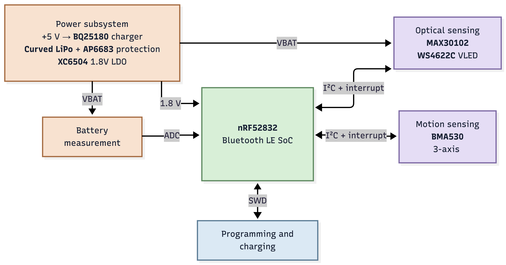
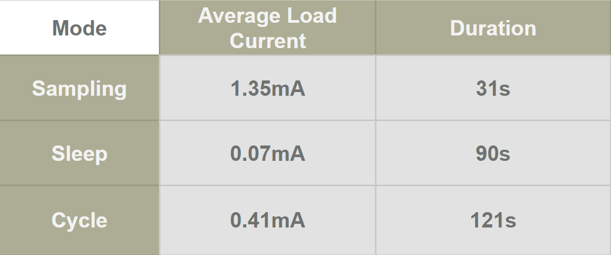
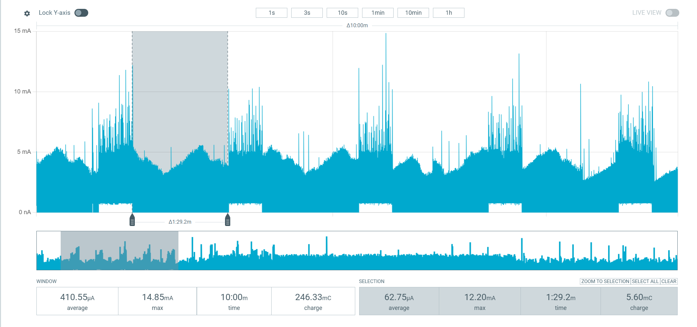

# SenseRing

**Open-source smart ring for biosensing and motion tracking, packed into a format you can build, program, and improve.**

SenseRing is a compact, finger-worn research and development platform built around the Nordic Semiconductor [nRF52832](https://www.nordicsemi.com/Products/nRF52832) Bluetooth Low Energy SoC. Its custom electronics combine optical pulse sensing, motion sensing, wireless connectivity, battery charging, and power management in a wearable form factor.

Use it to explore photoplethysmography (PPG), heart-rate and SpO₂ algorithm development, activity and gesture recognition, low-power Bluetooth applications, and new wearable interfaces. 

<p align="center">
  
</p>

> [!IMPORTANT]
> SenseRing is an experimental research platform, not a certified medical device. Do not use it for diagnosis, treatment, or safety-critical monitoring.

## Hardware features

| Function | Implementation |
| --- | --- |
| Processing and wireless | [nRF52832](https://www.nordicsemi.com/Products/nRF52832), 64 MHz Arm Cortex-M4F with Bluetooth Low Energy and a 2.4 GHz radio |
| Optical sensing | [MAX30102](https://www.analog.com/en/products/max30102.html) integrated red/IR PPG sensor for pulse-oximetry and heart-rate experiments |
| Motion sensing | [BMA530](https://www.bosch-sensortec.com/en/products/motion-sensors/accelerometers/bma530) ultra-compact, low-power 3-axis accelerometer with motion interrupts and step-counting support |
| Battery charging | [BQ25180](https://www.ti.com/product/BQ25180) single-cell Li-ion/LiPo charger with I²C control, power path, and ship mode |
| Power and protection | [AP6683](https://www.lcsc.com/datasheet/C2849565.pdf) battery protection, [XC6504A1819R-G](https://www.lcsc.com/datasheet/C5142782.pdf) 1.8 V LDO, and two [WS4622C](https://www.lcsc.com/datasheet/C2939859.pdf) load switches for the PPG LED supply and battery-measurement circuit |
| RF front end | [2450AT18B100E](https://www.lcsc.com/datasheet/C2917717.pdf) 2.4 GHz chip antenna and matching circuit |
| Debugging and test | TC2030 SWD footprint for programming and charging, compatible with [Segger J-Link 6-pin Needle Adapters](https://www.segger.com/products/debug-probes/j-link/accessories/adapters/6-pin-needle-adapter/) |
|Battery| 31mAh curved [GRP1607034](https://www.grepow.com/wearables/smart-ring.html)|
| PCB | 14.9 × 10 mm, two copper layers, mostly fine-pitch WLCSP and 0201 components |

<p align="center">
  
  
</p>

## Architecture

The nRF52832 communicates with the PPG sensor, accelerometer, and charger over a shared I²C bus. Dedicated interrupt lines allow the sensors and PMIC to wake the processor. The PPG LED supply and battery-measurement divider are independently switchable, limiting leakage when those functions are idle.

<p align="center">
  
</p>

| Signal | nRF52832 pin | Connected function |
| --- | --- | --- |
| `SDA` | `P0.29 / AIN5` | MAX30102, BMA530, and BQ25180 data |
| `SCL` | `P0.28 / AIN4` | MAX30102, BMA530, and BQ25180 clock |
| `PPG_INT` | `P0.06` | MAX30102 interrupt |
| `IMU_INT` | `P0.18` | BMA530 interrupt |
| `PMIC_INT` | `P0.15` | BQ25180 interrupt |
| `LED_EN` | `P0.01` | PPG LED-rail load switch |
| `VBAT_EN` | `P0.00` | Battery-divider load switch |
| `VBAT_MEAS` | `P0.05 / AIN3` | Battery-voltage ADC input |
| `TX` test pad | `P0.30 / AIN6` | Firmware-assignable test/UART signal |
| `RX` test pad | `P0.25` | Firmware-assignable test/UART signal |

## Battery benchmark

Measured with a Power Profiler Kit II supplying the board in place of the 31 mAh cell, running the normal cycle: 15 s window, five readings, LED rail down, 90 s pause. IMU on throughout, BLE advertising. This replaces the estimate in [`ARCHITECTURE.md`](Software/Firmware/src/ARCHITECTURE.md) §5.1.1 (~305 µA, four days).

<p align="center">
  
  
</p>

| Mode | Average load current | Duration |
| --- | --- | --- |
| Sampling (LED rail up) | 1.35 mA | 31 s |
| Sleep (IMU and BLE only) | 0.07 mA | 90 s |
| **Full cycle** | **0.41 mA** | **121 s** |

31 s of sampling against a 90 s pause is 25.6 % duty. Over ten minutes the capture reads 410.55 µA average, 246.33 mC, 14.85 mA peak. One full pause reads 62.75 µA: the BMA530 at ~15 µA, the nRF52832 idle, and both load switches open.

### Runtime on 31 mAh

| Quantity | Value |
| --- | --- |
| Charge per cycle | 13.7 µAh (~49 mC) |
| Cycles per charge | ~2,250 |
| Readings per charge | ~11,250 |
| **Runtime, default cadence** | **~75 h (3.1 days)** |
| Sampling continuously | ~23 h |
| Sleep floor only | ~440 h (18 days) |

## Repository contents

| Path | Contents |
| --- | --- |
| [`Hardware/`](Hardware/) | Autodesk Fusion Electronics/EAGLE schematic and board sources (`.fsch`, `.fbrd`, `.sch`, `.brd`) and a [schematic PDF](Hardware/SenseRing_schematic.pdf) |
| [`Mechanical/`](Mechanical/) | Complete Fusion 360 archive, STEP and OBJ assemblies, printable shell STLs, board and battery models, and two programming-fixture STLs |
| [`Images/`](Images/) | Prototype photographs and the exploded assembly render used in this README |
| [`Software/Firmware/`](Software/Firmware/) | nRF52832 firmware: sampling, the vitals estimator, the flash log, and the BLE peripheral |
| [`Software/App/`](Software/App/) | Android companion app: collects the ring's buffered log over BLE, stores it locally and charts it |

## Working with the design

### 1. Clone the repository

```bash
git clone https://github.com/Sense-Ring/Sense-Ring-1.0.git
cd Sense-Ring-1.0
```

### 2. Inspect or modify the electronics

- Open [`SenseRing.fsch`](Hardware/SenseRing.fsch) and [`SenseRing.fbrd`](Hardware/SenseRing.fbrd) in Autodesk Fusion Electronics.
- The XML [`SenseRing.sch`](Hardware/SenseRing.sch) and [`SenseRing.brd`](Hardware/SenseRing.brd) files are also included for EAGLE-compatible workflows.
- For a quick review without CAD software, open [`SenseRing_schematic.pdf`](Hardware/SenseRing_schematic.pdf).

### 3. Inspect or print the enclosure

- Open [`RingCase.f3z`](Mechanical/RingCase.f3z) for the editable Fusion 360 assembly.
- Use [`RingCase.step`](Mechanical/RingCase.step) or [`RingCase.obj`](Mechanical/RingCase.obj) for interchange with other CAD tools.
- Print [`InnerShell.stl`](Mechanical/InnerShell.stl) and [`OuterShell.stl`](Mechanical/OuterShell.stl) for the enclosure.
- The repository also provides board and battery reference models and two-piece programming-fixture STLs.

### 4. Program and debug

The PCB exposes `SWDIO`, `SWDCLK`, `RESET`, 1.8 V, +5 V, and GND through its TC2030 programming footprint. Use a compatible SWD debugger and verify the target-voltage and power configuration before connecting it to the board.


## Manufacturing notes

This is a miniaturized wearable design using WLCSP/BGA packages and 0201 passives. Professional PCB assembly and appropriate inspection equipment are strongly recommended.

The current repository does **not** include production exports such as Gerbers, drill files, a bill of materials, or pick-and-place data. Generate and verify those outputs from the hardware sources before ordering boards. Battery selection, charge settings, clearances, enclosure material, skin contact, RF performance, and optical performance must all be validated for your implementation.


## Contributing

Issues, design reviews, firmware ports, enclosure variants, measurements, and reproducibility notes are welcome. When reporting a hardware problem, please include the board revision, power source, programmer/debugger, and enough measurements or logs to reproduce it.

## License

SenseRing 1.0 is open source and distributed under the [GNU General Public License v3.0](LICENSE). It is provided as-is, without warranty.

