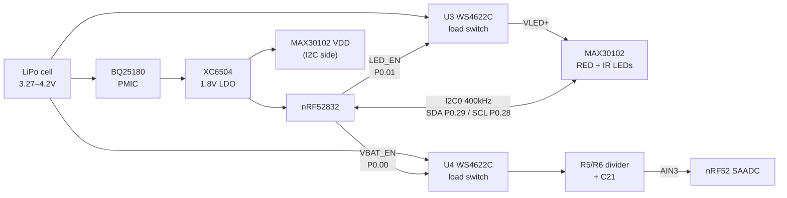
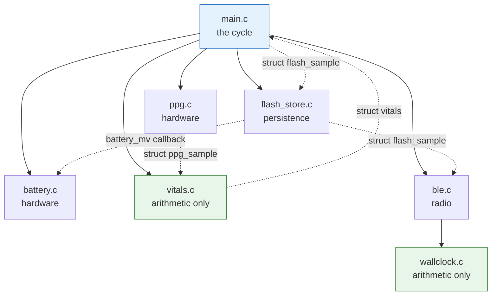
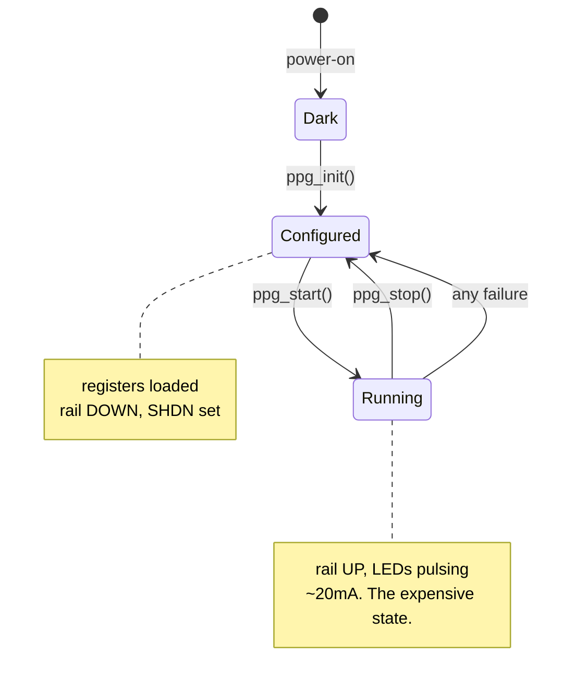

# SenseRing firmware — how `src/` works and why

**New here? Read §0 in full. It assumes no embedded experience and it is the
only part of this document that doesn't.** Everything after it is a reference
manual: one section per source file, explaining the reasoning rather than
restating the code. Read those next to the source; the headings match the
function names.

Written against the **v49 schematic** (`.sense/SenseRing v49.pdf`) and
`boards/sensering_v29/sensering_v29.dts`. The version numbers disagree — v49 is
the one that matches the pinout, and the schematic is the authority whenever it
and this document differ.

---

## 0. Start here

### 0.1 What the thing is

A ring that measures the wearer's heart rate and blood oxygen every couple of
minutes, stores the readings, and hands them to a phone.

That's it. Everything below is consequence.

The ring cannot reach the internet, so it talks to a phone over Bluetooth, and
whatever the phone is connected to decides what the readings mean.

```
  ring  ──Bluetooth──>  phone  ──> whatever consumes the data
 measures               relays
 and stores
```

### 0.2 Two ideas explain most of the code

**Idea one: the battery is 31 milliamp-hours.** For scale, a phone battery is
about 4000. If the ring drew what a phone draws it would last under a minute.
So the ring spends most of its life asleep with everything switched off, wakes
up, measures for half a minute, and goes back to sleep. Almost every strange
decision in this codebase — why the LEDs are on a switch, why the radio listens
only once a second, why a measurement is 15 seconds and not 60 — traces back to
this number.

**Idea two: the ring is not the decider.** It is tempting to make the ring
clever: have it interpret the readings it takes. It does not. The ring measures,
stores, and says "come and get the data." Interpretation belongs to whatever
consumes the log, because that can be updated, can see history, and can be
wrong without a firmware release.

This is why you will see the code repeatedly refuse to draw conclusions, and why
it works so hard to record *why* it refused rather than just going quiet. The
one judgement it does make is about its own evidence -- whether a window
produced a pulse it believes -- and §4.5 is where that line is drawn.

### 0.3 How a heart rate actually gets measured

No prior knowledge needed for this; it is genuinely simple in outline.

1. **Shine a light into the finger.** Two LEDs, one red and one infrared, sit
   against the skin. A photodiode next to them measures how much light comes
   back. This is the MAX30102 part, driven by `ppg.c`.
2. **Blood absorbs light.** Every heartbeat pushes a pulse of blood through the
   finger, so slightly less light comes back at each beat. The signal is a big
   steady value with a *tiny* ripple on it — the ripple is well under 1% of the
   total on a ring. That ripple is the pulse.
3. **Collect 15 seconds of it.** At 25 samples a second that's 375 numbers.
4. **Throw away the slow drift.** Breathing moves the signal far more than the
   heartbeat does, so a filter removes anything slower than a plausible pulse.
5. **Find the repeat.** Slide the 15 seconds of signal against itself and see
   at what shift it best matches itself. That shift is the time between beats.
   60 divided by it is the heart rate. This is `vitals.c`, and it is called
   *autocorrelation*.
6. **Say how sure you are.** How well the signal matched itself is a confidence
   number, 0–1000. Below 500 the firmware will not call it a heart rate.

Blood oxygen (SpO₂) rides along free: oxygenated blood absorbs red and infrared
differently, so the ratio of the two ripples tracks saturation.

### 0.4 What happens to a reading

```
  measure ──> is it believable? ──yes──> write to flash ──> notify phone (live)
                     │
                     └──no──> write the *refusal* to flash, with the reason
```

Two things worth understanding, because they are unusual:

**Refusals are stored, not skipped.** If the ring is not being worn, or the
pulse is too weak, the firmware writes a record saying so. A log with a hole in
it and a log that says "I looked and saw nothing" look identical from the
outside, and only one of them is useful. The reasons are: not worn, no pulse
found, pulse too weak, and pulse slower than the band.

**Flash is a queue, not a diary.** Records go into a ring buffer in flash and
stay there until the phone confirms it has them. Only then does the ring reuse
that space. If the phone is away for a day, the readings wait. This is the
"buffer and flush" architecture, and §5A is where it lives.

### 0.5 Vocabulary

The terms that will otherwise stop you, in the order you'll meet them. Appendix
B is the full glossary.

| Term | What it means here |
|---|---|
| **PPG** | photoplethysmography — the shine-a-light-at-a-finger technique in §0.3 |
| **I2C** | a two-wire bus the chip uses to talk to the sensors. Think of it as a very slow, very simple network with addresses |
| **GPIO** | a single pin the chip can drive high or low. Used here to switch sensor power on and off |
| **DC / AC** | the steady part of a signal / the ripple on top. The pulse is the AC part |
| **perfusion index (PI)** | how big the ripple is compared to the steady part, in parts per thousand. A ring sees ~0.2–1%; a fingertip clip sees ten times that |
| **duty cycle** | what fraction of the time something is switched on. The whole power budget is duty cycle arithmetic |
| **RTT** | a debug console that works over the programming cable. This board has no serial port, so RTT is the only way to watch it run |
| **GATT / characteristic** | Bluetooth's way of exposing named values a phone can read, write, or subscribe to |
| **notification** | the ring pushing a value to the phone without being asked |
| **flash page** | flash memory can be written a byte at a time but only *erased* a whole page (4KB) at a time. This one fact shapes all of `flash_store.c` |
| **Kconfig / `prj.conf`** | build-time switches for the operating system (Zephyr). Appendix C explains the ones that matter |

### 0.6 What to read next

| If you want to… | Read |
|---|---|
| See the board and the software in one page each | §1 |
| Understand a specific source file | §2–§5C, one per file, in dependency order |
| Know what is *not* built | §6 |
| Look up a pin | Appendix A |
| Look up a word | Appendix B |
| Understand the build, the board file, the partitions | Appendix C |

The per-file sections are `battery.c` §2, `ppg.c` §3, `imu.c` §3A, `vitals.c`
§4, `main.c` §5, `flash_store.c` §5A, `ble.c` §5B and `wallclock.c` §5C.

---

## 0A. What is measured, and what is only argued

Kept near the top because the rest of this document describes how things work,
which is a different question from how well they have been shown to.

**The short version: the ring measures correctly and the data path closes. The
power budget is the one number the whole design is argued from, and it has never
been put on a probe.**

### 0A.1 What is built, and what backs it

| Area | State | Evidence |
|---|---|---|
| Board bring-up — I2C, SAADC, flash, RTT, BLE | works on hardware | boots, advertises, logs, stores |
| `battery.c` — divider, gating, curve | works on hardware | reports plausible mV and % |
| `imu.c` — BMA530 read path | works on hardware | §3A; bus scan saw `0x18`, chip ID `0xC2`, \|a\| ≈ 1000 at rest |
| IMU step count | **wired up, never walked** | §3A.8; read and notified, but never checked against a human walking a known count |
| `vitals.c` — heart rate | works on hardware | 71bpm off a real finger, confidence and optics both plausible |
| `vitals.c` — the arithmetic | host-tested | `tests/host`, 1026 synthetic windows, 0 wrong |
| `vitals.c` — SpO₂ | **arithmetic sound, curve uncalibrated** | §4.4; Maxim's fit for Maxim's optics |
| Contact detection | **works, threshold still a guess** | §4.5; `VITALS_CONTACT_IR_DC_ON` has never been checked against a range of real fingers |
| Duty cycle, flash log | works on hardware | §5.1, §5A |
| `flash_store.c` — ring arithmetic, ack and erase | host-tested | `tests/host`, two laps at the real geometry against a modelled NOR part |
| `ble.c` — advertising, services, live notifications | works on hardware | §5B |
| `ble.c` — who may pair, who may stay connected | **written, never met a handset** | §5B.5a; the pairing gate and the 30-second security deadline both build clean, and neither has been exercised on the radio |
| **Buffer → phone → acknowledge → reclaim** | works on hardware | §5A.8, §5B.6 |
| Connection power (slave latency) | works on hardware | §5B.7; a real phone granted the idle regime |
| Power budget | **estimated, never measured** | §5.1.1 |

### 0A.2 The gap that matters

**Every power number in this document is arithmetic, not measurement.** §5.1.1
predicts ~305µA and about four days, and flags that its largest single term is
quoted at a shorter LED pulse width than this firmware actually uses — so the
real figure is likely worse. Until a current probe goes on the cell, every
decision justified by "this saves battery" is justified by a spreadsheet.

**Two worn observations say the spreadsheet is wrong by ~3.7×.** They implied
~2.1 and ~1.5 days respectively, both with about a third of the time off the
finger — so a worn-state draw near 1.14mA against a predicted 305µA. Both are
gauge readings, and the gauge itself is untrusted (§2.5), so treat ~1 day as a
direction rather than a measurement. The important part is the sign: **every
number in §5.1.1 is optimistic, and nothing in this document accounts for
why.**

### 0A.3 Known limits, in the order they would hurt

| | Limit | Where |
|---|---|---|
| 0 | **The ring can reset roughly every 28 minutes and the firmware cannot say why.** Observed at 60% battery and not under radio load. `RESETREAS`, a delivery hold mark and a log that survives a reset are all written against it, and the mechanism is still open — brownout, a supply interruption and the BQ25180 are all live. | §5A.1, §5A.4a |
| 1 | **No activity signal reaches the vitals path.** 120bpm from climbing stairs and 120bpm at rest are the same number to this firmware. Acceleration and step count are read, notified and stored beside the reading, but nothing on the ring *consumes* them. | §6 |
| 2 | **The power budget has never been measured.** | §5.1.1 |
| 3 | **SpO₂ is uncalibrated.** The ratio arithmetic is sound; mapping it to a percentage is a vendor fit for a different sensor's optics. Trend, not vital sign. | §4.4 |
| 4 | **The step counter has never been walked.** Presented as data on no evidence. | §3A.8 |
| 5 | **`VITALS_CONTACT_IR_DC_ON` decides whether the ring measures at all, and is a bench guess.** Every cycle logs the measured IR DC beside it, so a wrong threshold is visible rather than silent. | §5.1 |
| 6 | **The pairing gate rests on a bit that cannot tell a power cycle from a brownout.** `RESETREAS` reads zero for both, so a cell that sags far enough to reset the SoC opens a two-minute pairing window nobody asked for. Bounded, but it is the assumption the whole gate stands on. Beside it: Zephyr's stock HRS is still unencrypted, so `0x180D` is subscribable by any scanner the moment `BLE_LIVE_STREAM` goes to 1 for bench work. | §5B.5a, §6 |
| 7 | RTT is 4KB, `NO_BLOCK_SKIP` — raised from the 1KB a 35-record dump overran, but a full-page dump is still tens of KB and drops silently. | §5.5.1 |
| 8 | **Delivery depends on the phone being in range.** If the phone is in another room nothing arrives; the records are buffered and delivered later. This is a property of the architecture, not a bug in it, and it has to be stated to whoever builds on the device. | §5A.8 |

Item 0 is the one that stops the data being trustworthy at all. Item 1 is the
one that most limits what can be built on top of the log: without activity
context, a rate is a number with nothing to explain it. It is not a bug — it is
a consequence of a choice documented where it was made — but it is the widest
gap.

---

## 1. The system at a glance

The board is an nRF52832 driving three I2C peripherals, powered from a single
LiPo cell through a BQ25180 PMIC.



The single most important structural fact about this board: **two separate
things hang off the raw cell behind two separate load switches.** Almost every
non-obvious decision in `battery.c` and `ppg.c` traces back to that.

### Why load switches at all?

A ring runs on a battery measured in single-digit mAh. Two loads would otherwise
draw current forever:

- **The divider.** R5 (1M5) + R6 (1M) = 2M5 across a 4.2V cell is a permanent
  1.68µA leak. That sounds trivial until you multiply by 24 hours — 40µAh/day,
  bleeding the cell whether the ring is worn or not.
- **The LEDs.** ~10mA each while pulsing. Obviously must be gated.

So the schematic puts a **WS4622C load switch** in front of each: U3 for the LED
rail, U4 for the divider. Both are active-high enables. Firmware's job is to
hold them open by default and close them only for the microseconds it actually
needs.

This is why you'll see the same shape in both files: *enable → settle → use →
disable*, with the disable on the error path too.

### The subtlety that shapes `ppg.c`

The MAX30102 has **two power inputs**: `VDD` (1.8V, from the LDO — always on)
and `VLED+` (raw cell, behind U3). The I2C interface lives on the VDD side.

That means **the chip answers I2C even while its LEDs are unpowered.** You can
read the part ID, configure registers, and get perfectly valid-looking responses
from a sensor that is optically dead. There is no error code for "the LEDs
aren't powered" — you just get flat data. Hence `ppg_init()` raises LED_EN
*before* it talks to the chip at all, and drops it again on every failure path.

### The cast of parts

Everything above in one table, then one paragraph each. The **designator** (U3,
R5, C21…) is the label silkscreened on the board and printed on the schematic;
`U` is a chip, `R` a resistor, `C` a capacitor. When this document says "U4" it
means one specific physical component you can point at.

| Designator | Part | In one line |
|---|---|---|
| U1 | nRF52832 | The microcontroller. Runs this firmware. |
| — | BQ25180 | The **PMIC** — charges the cell, feeds the board. |
| — | XC6504 | The **LDO** — makes a clean 1.8V rail for the chips. |
| U3 | WS4622C | **Load switch** — firmware-controlled on/off tap for the LED rail. |
| U4 | WS4622C | Same part, second copy — on/off tap for the battery divider. |
| — | MAX30102 | The **PPG** sensor: two LEDs and a photodiode. Reads your pulse. |
| AC2 | BMA530 | The **IMU** — an accelerometer. Read every package and used to gate the re-donning probe (§3A); nothing yet consumes it as a vital-sign input. |
| R5, R6 | 1M5 and 1M resistors | The **voltage divider** that scales the cell down for the ADC. |
| C21 | 1nF capacitor | Noise filter sitting on the divider's output. |
| — | LiPo cell | The battery. Single-digit mAh. |

**nRF52832** — the microcontroller (MCU), and the only thing here running
software. An ARM Cortex-M4 CPU at 64MHz with 512KB of flash (where the firmware
lives) and 64KB of RAM, plus a 2.4GHz Bluetooth Low Energy radio that `ble.c`
now drives (§5B). What makes it an *MCU* rather than a CPU is everything
bolted on beside the core: the SAADC, the I2C hardware, the GPIO pins. Those are
**peripherals** — fixed-function blocks the CPU configures by writing registers,
which then run on their own. The `QFAA` in the DTS filename is Nordic's code for
this specific flash/RAM/package variant.

**BQ25180 (the PMIC)** — *Power Management IC*. A LiPo cell is a fussy thing to
charge: too fast and it heats, too full and it degrades, too empty and it's
permanently damaged. The BQ25180 is a dedicated chip that does all of that
correctly in hardware — constant-current then constant-voltage charging, cutoff
at 4.2V, protection at the bottom. It has an I2C interface for status and
configuration, but firmware never opens it (§6): the chip's default behaviour is
already right, and charging keeps working even with the CPU asleep or crashed.

**XC6504 (the LDO)** — *Low-DropOut regulator*. The cell's voltage slides from
4.2V down to 3.27V as it discharges, but the nRF52832 needs a steady supply. An
LDO takes a varying higher voltage in and holds a fixed lower one out — here
1.8V. "Low dropout" means it only needs the input to be a little above the
output to keep regulating, which matters when the cell is nearly flat. The
trade-off: an LDO burns the difference as heat rather than converting it, so at
4.2V in / 1.8V out it wastes over half the energy. It's chosen anyway because a
switching regulator needs an inductor, and there is no room for an inductor
inside a ring.

**WS4622C ×2 (the load switches)** — a load switch is an electrically-operated
switch: power in one side, power out the other, and a logic-level **EN**
(enable) pin that decides whether the two are connected. Inside it's a MOSFET, a
transistor used as a switch. These are **active-high**: a `1` on EN connects,
`0` disconnects. It exists because a resistor or an LED cannot turn itself off —
something has to physically cut the current, and a GPIO pin can't supply the
10mA an LED needs. So the GPIO drives EN, and the switch does the heavy lifting.
This part also **actively discharges** its output when EN drops, pulling the
downstream rail to ground instead of letting it coast down — which is why §3.7
can say VLED+ collapses fast.

**MAX30102 (the PPG sensor)** — the part every reading comes from; see §3.1 for
what it does optically. Structurally the thing to know is that it's really two
circuits in one package that happen to share a die: a quiet digital side (the
I2C interface, the registers, the FIFO) running from 1.8V `VDD`, and a hungry
analog side (the LED drivers) running from raw cell voltage on `VLED+`. Those
two rails are independent, which is the whole subtlety described above.

**BMA530 (the IMU)** — *Inertial Measurement Unit*, a catch-all name for
motion-sensing chips. This one is a 3-axis **accelerometer**: it reports how hard
it's being accelerated along X, Y and Z. At rest that's just gravity, so it also
tells you which way is down and therefore how the ring is oriented. Here it is
used for movement context and for the re-donning probe (§3A.9, §5.3.1); the
chip also has a hardware step counter, which the firmware reads.

**R5 and R6 (the divider)** — two ordinary resistors in series between the cell
and ground: R5 is **1M5** (1.5 megohms, 1,500,000Ω) and R6 is **1M**. Wire two
resistors end to end across a voltage and the junction between them — the
**tap** — sits at a fraction of that voltage, set purely by the ratio of the two
values. That's a *voltage divider*: the cheapest possible way to shrink a
voltage into a range something else can measure. Here it makes 4.2V look like
1.68V, because the ADC cannot survive 4.2V on its input. The values are huge
(megohms) specifically to minimise the current wasted through them; §1's leak
arithmetic is what falls out of that choice, and §2.1 works the ratio.

**C21** — a 1nF (nanofarad) capacitor from the tap to ground. A capacitor
resists sudden changes in voltage, so parked on the tap it smooths away
electrical noise — including the ripple the LEDs inject into the cell every time
they pulse — and gives the ADC's input circuitry a small local charge reservoir
to sample from. It is also the reason a reading can't be taken instantly after
closing U4: the capacitor has to fill first. That's the 3ms in §2.4.

**The LiPo cell** — lithium-polymer, a single cell, so its terminal voltage runs
from 4.2V charged to about 3.27V empty and never gets divided or multiplied by
cell count. Capacity is quoted in **mAh** (milliamp-hours): a 10mAh cell can
supply 10mA for one hour, or 1mA for ten. That budget is why microamps of idle
leakage are a design concern here and would be a rounding error in a phone.

### The software at a glance

Eight `.c` files. The application is one thread that polls everything; the only
code here that runs on an interrupt or a second thread is the Bluetooth stack
underneath `ble.c`, and it is deliberately kept off the measuring path.

| File | Owns | Talks to hardware? | Section |
|---|---|---|---|
| `main.c` | Boot, the measurement cycle, the phase machine | No — delegates | §5 |
| `ppg.c` | The MAX30102: power, config, FIFO | I2C + GPIO (U3) | §3 |
| `imu.c` | The BMA530: power, config, acceleration, step count | I2C (no GPIO — no load switch) | §3A |
| `battery.c` | The cell voltage: divider, SAADC, curve | SAADC + GPIO (U4) | §2 |
| `vitals.c` | Counts → contact, heart rate, SpO₂ | **No.** Pure arithmetic | §4 |
| `flash_store.c` | Persisting each reading, and dumping the log | On-chip flash (storage partition) | §5A |
| `ble.c` | Advertising and the three GATT services | The radio, via Zephyr's BT stack | §5B |
| `wallclock.c` | The uptime → real-time anchor the phone sets | **No.** Two variables, no timer | §5C |

The dependency arrows all point one way, and the shape is deliberate:



`flash_store.c` is the one edge that isn't strictly a tree: it calls back into
`battery.c` for a level to stamp on each flush (§5A). The call is handed in by
`main.c` as a function pointer, so `flash_store.c` still names no other module
directly.

Two edges do not start at `main.c`. `ble.c` owns `wallclock.c` because the clock
is only ever set from the radio — the control characteristic is the sole caller,
and routing it through `main.c` would add a hop that carries nothing. And
`ble.h` includes `flash_store.h` for `struct flash_sample`, which is deliberate
rather than a layering slip: the flash record and the vitals notification are one
layout by design (§5B.1), so the type that describes it is shared rather than
duplicated into two definitions that could drift.

`main.c` is the only file that knows how often a measurement happens. `ppg.c` is
the only file that knows a load switch exists. `vitals.c` doesn't know there's a
ring — it is handed a buffer by the caller and hands an answer back. The dotted
arrows are the structs
in the headers — the only data that crosses a file boundary — and they're the
whole interface:

```c
struct ppg_sample { uint32_t red, ir; };   /* ppg.h  — 18-bit counts, one FIFO entry */
struct vitals { bool contact; uint16_t bpm, confidence, spo2_tenths,
                perfusion_milli; uint32_t ir_dc; };  /* vitals.h — one window's answer */
```

**Why `vitals.c` gets to be the odd one out.** It is the file with no
`#include <zephyr/...>` for a driver, no logging, and no global state beyond its
own scratch buffers. That's not tidiness: it means it compiles on a laptop and
can be fed synthetic waveforms with known answers. That property found two real
bugs in `vitals.c` before the code ever reached the ring (§4.3) and one
systematic measurement error (§4.4). It is the
single highest-leverage structural decision in the codebase, and §4 exists mostly
to explain what it bought.

### The whole of runtime, in one page

```
boot
 ├── battery_init()      set up SAADC, leave the divider open          §2.3
 │                       └── fails → battery_ready = false, carry on.  §5.2
 ├── flash_store_init()  dump last run's log + battery, then erase     §5A
 ├── ble_init()          enable the controller, start advertising      §5B
 │                       └── fails → log it, carry on. Not a gate.     §5B
 ├── ppg_init()          verify the MAX30102, load config, leave dark  §3.4
 │                       └── fails → return from main(). No product.
 └── imu_init/start()    verify the BMA530, LPM 50Hz, leave it running §3A.9
                         └── fails → imu_ready = false, carry on.

loop — one measurement_cycle(), then a pause                          §5.1
 ├── ppg_start()          rail up, wake, warm up 100ms, clear FIFO     §3.5
 ├── PROBE   1s   probe_contact()   is there a finger here at all?     §5.4.1
 │    └── not worn → say what the IR DC was, ppg_stop(), pause.
 ├── PREPARE 15s  collect_for()     fill the sliding window            §5.4.2
 │    └── drain_once() → ppg_read_fifo(), every 200ms                  §3.6
 │         └── vitals_contact() per drain — a removal ends the cycle   §4.5
 ├── REPORT  15s  record_burst()    five packages, one every 3s        §5.5.2
 │    └── record_one()
 │         ├── vitals_compute()      DC → high-pass ×3 → smooth → correlate §4
 │         │    └── estimate_bpm()   autocorrelate, guard the octave   §4.3
 │         ├── flash_store_append()  persist the 16-byte record        §5A
 │         │    └── ...or _append_refusal() if the gate refused it     §5A.3
 │         ├── ble_notify_vitals()   HRS + the custom package          §5B
 │         └── imu_read()            one acceleration, same timestamp  §3A.9
 │              └── ble_notify_motion()  {timestamp, x, y, z}          §5B.1
 ├── ppg_stop()           SHDN, rail down                              §3.7
 ├── battery_read_mv()    close U4, settle 3ms, sample, open U4        §2.4
 │    └── battery_percent() → ble_set_battery()                        §2.5
 ├── flash_store_dump()   reprint what is new; erase nothing           §5A.7
 └── the wait                                                        §5.3
      ├── worn       → k_msleep(PAUSE_MS), 90s
      └── not worn   → wait_until_worth_probing(): poll the IMU,      §5.3.1
                       probe as soon as it moves, 90s backstop
```

`battery_init()` runs *before* `flash_store_init()` so the boot flush can stamp
a live battery level on the dump — see §5A.

Note what the leaves have in common: `vitals_compute()` and `battery_percent()`
take a buffer and a number respectively, and neither touches hardware. `main.c` does the driving; the leaves just answer.

Two numbers govern everything above: **15 seconds** (set by the physics of the
signal — §4.1) and the **90-second pause** between bursts (set by the power
budget — §5.1.1). They're independent, and §5.1.2 is about why you can't trade
one for the other.

**Memory.** `CONFIG_MAIN_STACK_SIZE` is 2048 bytes, and the buffers are much
bigger than that, so everything large is `static` — in `.bss`, not on the stack:

| Buffer | Where | Size |
|---|---|---|
| `window[375]` | `main.c` | 3KB |
| `ac_ir`, `ac_red`, `filter_tmp` — 375 `int32_t` each | `vitals.c` | 4.5KB |
| `batch[32]` | `main.c` | 256B |
| `discharge_curve[21]` | `battery.c` | 84B, and `const` — flash, not RAM |
| `buf[192]`, `corr[39]` | `ppg.c` / `vitals.c` | 192B / 156B, on-stack — small enough |

~7.8KB of static RAM out of 64KB from the application, and the Bluetooth stack
wants several KB more on top of that for its own buffers and thread stacks. On a
part this size that accounting isn't micro-optimisation, it's the difference
between booting and not — and it is the reason `VITALS_WINDOW_SEC` is a number
worth arguing about (§4.1) rather than one to round up for comfort.

---

## 2. `battery.c`

### 2.1 Why a divider, and why these values

The nRF52832 SAADC cannot read a 4.2V cell directly. Its input range is bounded
by `reference / gain`, and even the most permissive setting doesn't reach 4.2V.
So R5/R6 scale the cell down:

```
tap = VBAT × R6/(R5+R6) = VBAT × 1M/2M5 = VBAT × 0.4
```

A full 4.2V cell therefore presents **1.68V** at AIN3.

The DTS picks `ADC_GAIN_1_3` against `ADC_REF_INTERNAL` (0.6V):

```
full scale = 0.6V / (1/3) = 1.8V
```

1.68V into a 1.8V full scale — the cell covers 93% of the range with a little
headroom for a freshly-charged cell reading slightly high. That headroom is the
point: clipping at the top of the range would silently flat-line the reading at
100% exactly when you most want to trust it.

At 12-bit resolution, 1.8V/4096 = 0.44mV per count at the tap, which is 1.1mV
per count at the cell. The LiPo curve's tightest useful step (3.84V→3.82V, a
whole 5% of charge) is 20mV — roughly 18 counts. Plenty of resolution.

### 2.2 Why the DT node exists but the driver is disabled

`prj.conf` has `CONFIG_VOLTAGE_DIVIDER=n`, which looks contradictory next to a
`compatible = "voltage-divider"` node. It isn't, and this is worth understanding
because it's a trap:

Zephyr's in-tree voltage-divider **sensor driver** would bind to that node
automatically. But it only manages `power-gpios` through the PM device runtime
subsystem. Without the full PM stack enabled, that driver turns the divider on
at init and **never turns it off** — reintroducing exactly the 1.68µA leak U4
exists to prevent.

So the node stays (it's the canonical place to record the R5/R6 ratio, and
`VOLTAGE_DIVIDER_DT_SPEC_GET` reads it), but the driver is off and `battery.c`
gates U4 by hand.

The header `<zephyr/drivers/adc/voltage_divider.h>` still works with the driver
disabled — `VOLTAGE_DIVIDER_DT_SPEC_GET` and `voltage_divider_scale_dt` are
static inlines that only need the DT data, not the driver.

### 2.3 `battery_init()`

Three things, in order:

1. **Readiness checks** on the GPIO and the SAADC. These catch DTS/build
   mismatches at boot rather than producing mystery numbers later.
2. **`GPIO_OUTPUT_INACTIVE`** — configure the enable pin *and* drive it low in
   one call. The distinction matters: `GPIO_OUTPUT` alone would leave the pin at
   whatever the last state was. Inactive-by-default is the whole design.
3. **`adc_channel_setup_dt()`** — pushes the gain/reference/acquisition-time
   from the DTS into the peripheral. Done once; the per-read sequence only
   carries the things that change.

Returns a negative errno on failure so `main()` can decide what to do (and it
decides to keep going — see §5).

### 2.4 `battery_read_mv()` — the interesting one

```
  adc_sequence_init_dt   →  fill in channel/resolution/oversampling from DT
  gpio_pin_set_dt(1)     →  close U4, divider now sees the cell
  k_msleep(3)            →  let C21 charge
  adc_read_dt            →  sample
  gpio_pin_set_dt(0)     →  open U4 unconditionally
  MAX(raw, 0)            →  clamp
  adc_raw_to_millivolts  →  counts → mV at the tap
  voltage_divider_scale  →  mV at the tap → mV at the cell
```

**Why the sequence struct is initialized in that order.** `buffer`,
`buffer_size` and `calibrate` are set in the initializer;
`adc_sequence_init_dt()` then fills in `channels`, `resolution` and
`oversampling` from the DT spec. It only writes those three fields, so the
initializer's values survive. This is a real Zephyr API contract, not a
coincidence — but it's why the call order can't be flipped.

**Why `.calibrate = true` every read.** SAADC offset drifts with die
temperature, and a ring warms from ambient to skin temperature over minutes of
wear. Calibration costs ~120µs once every 10 seconds. Free, effectively.

**Why the 3ms sleep.** This is the part worth internalizing. C21 (1nF) sits on
the tap. When U4 closes, the divider charges it through the Thevenin resistance
of the two legs in parallel:

```
R5 ∥ R6 = (1M5 × 1M)/2M5 = 600kΩ
τ = 600kΩ × 1nF = 600µs
```

Between readings the switch is open and C21 discharges through R6 (τ = 1ms) —
over a 10-second gap it's fully drained. So **every reading starts from 0V** and
has to charge all the way up. 3ms is 5τ, which settles to within 0.67%.

> ⚠️ **Known imprecision.** 0.67% of 1.68V is ~11mV at the tap, i.e. **~28mV at
> the cell — always reading low.** On the flat middle of the LiPo curve, 28mV is
> worth ~7 percentage points of reported charge. Raising `VBAT_SETTLE_MS` to 7
> (≈12τ) drops the residual to a few ppm and costs 4ms per cycle. See §6.

**Why the GPIO drops before the error check.** The `(void)gpio_pin_set_dt(...)`
sits *above* `if (ret != 0)` deliberately. If the ADC read fails and we returned
early, U4 would stay closed and the divider would leak for the rest of the
device's life. Failure paths are exactly when you least want a latched-on
switch. The `(void)` cast marks the return as intentionally ignored — there's
nothing useful to do if turning a pin off fails.

**Why `MAX(raw, 0)`.** The SAADC in single-ended mode can return small negative
counts near zero input — it's a documented nRF behaviour, not a bug. Feeding a
negative into the millivolt conversion produces nonsense, so clamp first.

**Why `tap_mv` is reused for both.** `adc_raw_to_millivolts_dt()` converts in
place (counts → tap mV), then `voltage_divider_scale_dt()` converts in place
again (tap mV → cell mV) using the R5/R6 ratio from the DT. The variable holds
two different quantities at two different times, which is why it's worth reading
that pair of calls as a unit.

### 2.5 `battery_percent()` — why a lookup table

This is the part people usually get wrong, so it's worth spelling out.

A LiPo discharge curve is not a line. It looks like this:

```
4.2V ┤●●
     │   ●●●
4.0V ┤       ●●●
     │           ●●●●●●●●●●●●●●●●●●●          ← the flat part: 3.85→3.75V
3.8V ┤                            ●●●●●●●●●     covers ~50% of the charge
     │                                     ●●
3.6V ┤                                       ●●
     │                                         ●
3.4V ┤                                          ●
     │                                          ●
3.2V ┤                                          ●  ← the cliff
     └──────────────────────────────────────────────
     100%                                        0%
```

The middle is nearly flat. A linear fit from 4.2V to 3.27V would report ~50% for
most of the cell's usable life and then fall off a cliff with no warning, which
is the worst possible shape for a gauge to have. The device would claim half a
battery an hour before going dark.

So `discharge_curve[]` samples the real curve at 21 points, dense where it
matters. The lookup:

1. **Above 4200mV** → clamp to 100%. A cell on the charger reads higher than its
   open-circuit voltage; without this, `battery_percent()` could return >100.
2. **Walk down** from `i = 1` looking for the first entry the voltage is at or
   above. That entry and the one before it bracket the reading.
3. **Interpolate linearly between the two bracketing points.** The curve is
   piecewise-linear-ish at this density, so straight-line interpolation *within
   a segment* is accurate even though it's hopeless across the whole range.

```c
return discharge_curve[i].percent
     + ((mv - discharge_curve[i].mv) * span_pct) / span_mv;
```

Read that as: *start at the lower bracket's percentage, then add the fraction of
the way up this segment.* The multiply happens before the divide so integer
truncation only bites once, at the end.

4. **Fall through to 0%** — below 3270mV the cell is done.

The table is `static const` — it lives in flash, not RAM. On a 64KB-RAM part
that's not a micro-optimisation, it's table stakes.

**Reading the table.** The entries are open-circuit millivolts against remaining
charge, descending, and the density is the message: 3850→3750mV is *nine* entries
covering 30 percentage points, while 3610→3270mV is a single entry covering the
last 5%. That's not sloppiness at the bottom — below 3.6V the cell falls so fast
that interpolating finely would be pretending to a precision the chemistry
doesn't have. The dense middle is where a percentage point actually costs
millivolts, and where a coarse table would lie.

### 2.6 `battery.h` — the shape of the contract

Three functions, and the split between them is the point:

```c
int     battery_init(void);          /* 0 or negative errno */
int     battery_read_mv(void);       /* millivolts, or negative errno */
uint8_t battery_percent(uint16_t mv);/* 0–100, always */
```

**Why `battery_percent()` is separate from `battery_read_mv()`.** They could
obviously be one call. Keeping them apart means the curve lookup is a pure
function of a number — no hardware, no failure mode, no errno — so it can be
reasoned about and tested on its own, exactly like `vitals.c` (§4). It also means
`main.c` can log *both* the percentage and the raw millivolts, which is what you
actually want when the reported charge looks wrong and you need to know whether
to suspect the curve or the ADC.

**The one wart.** `battery_read_mv()` returns `int` (so it can carry a negative
errno) and `battery_percent()` takes `uint16_t`. `main.c` passes one to the other
after checking `mv >= 0`, which narrows `int` → `uint16_t` implicitly. It's safe
— the check rules out negatives and a cell can't reach 65535mV — but the
safety lives in the caller, not the types. Worth knowing before someone calls
`battery_percent()` from somewhere new without the check.

---

## 3. `ppg.c`

### 3.1 What the MAX30102 actually does

It's a pulse-oximetry front end: two LEDs (red ~660nm, IR ~880nm) and one
photodiode. It pulses each LED in turn, measures reflected light with an 18-bit
ADC, and pushes results into a 32-entry FIFO. Blood volume in the capillaries
changes with each heartbeat, which changes reflectance — that's the signal.

You don't read a heart rate out of it. You read raw light levels and do the DSP
yourself — that's §4.

### 3.2 Register configuration, bit by bit

The `#define`s pack multiple fields into single bytes. Here's the decode.

**`FIFO_CONFIG_VALUE = (0x01 << 5) | BIT(4)` = `0x30`**

| Bits | Field | Value | Meaning |
|---|---|---|---|
| 7:5 | `SMP_AVE` | `001` | average 2 samples |
| 4 | `FIFO_ROLLOVER_EN` | `1` | overwrite oldest when full |
| 3:0 | `FIFO_A_FULL` | `0000` | almost-full threshold (unused; we poll) |

`FIFO_ROLLOVER_EN` is load-bearing. **Without it the FIFO stops dead the first
time it fills and never restarts** — one missed poll and the sensor is bricked
until reset. With it, falling behind costs you old samples and nothing else.
That's the right trade for a heart-rate signal, where stale data is worthless
anyway.

**`SPO2_CONFIG_VALUE = (0x01 << 5) | (0x00 << 2) | 0x03` = `0x23`**

| Bits | Field | Value | Meaning |
|---|---|---|---|
| 6:5 | `SPO2_ADC_RGE` | `01` | 4096nA full scale |
| 4:2 | `SPO2_SR` | `000` | 50 samples/sec |
| 1:0 | `LED_PW` | `11` | 411µs pulse width, **18-bit resolution** |

`LED_PW` is the one to notice: pulse width and ADC resolution are the *same
setting* on this part. 411µs is the longest, and it's the only one that gives
the full 18 bits. Shorter pulses save power but throw away bits.

Combined with `SMP_AVE = 2` above: **50Hz ÷ 2 = 25Hz output rate**, which is
`PPG_SAMPLE_RATE_HZ` in `ppg.h` and the number everything downstream derives
its timing from.

**Why 50Hz and not 100Hz.** An LED costs energy in proportion to how long it is
lit, and it is lit `LED_PW` per conversion. Halving the conversion rate halves
LED on-time from 8.2% to 4.1% of wall-clock and halves the LED energy exactly.
Nothing is given up in exchange as long as 25Hz can still resolve a heartbeat,
and it can: 220bpm is 3.7Hz, so Nyquist wants ≥7.4Hz and 25Hz clears it three
times over. What 25Hz *does* cost is quantisation of the *period* — at 25Hz the
gap between adjacent lag values is 2.4bpm at rest and worse at speed. §4.3 buys
that back in software rather than paying for it in LED current.

**Why `LED_PW` stays at 411µs.** It's the obvious next power knob — 118µs would
cut LED energy another 3.5× — and it is deliberately not turned. A ring reflects
far less light back than a fingertip clip does, so the returned signal is weak
and the bottom bits are where the pulse actually lives. Bits are worth more than
microamps here. If the duty cycle in §5.1 ever proves insufficient, this is the
next thing to spend, and it's a `#define` for that reason.

**`LED_CURRENT_RED/IR = 0x32`** — drive current is 0.2mA per step, so
0x32 (50) × 0.2mA = **10mA**. A reasonable starting point for a ring pressed
against skin. If the DC level comes back too low to see a pulse, this is the
knob — it's a `#define` for exactly that reason.

**`MODE_SPO2 = 0x03`** — enables both RED and IR. Writing this is what starts
the LEDs pulsing, so it is deliberately *not* in `ppg_init()`'s config array:
it belongs to `ppg_start()` (§3.5), which is the only thing that should ever
light an LED.

### 3.3 `max30102_reset()`

Writes `MODE_CONFIG_RESET` (bit 6) and then polls for it to clear. The chip
clears the bit itself once the register bank is back to defaults — there's no
"reset done" interrupt, so polling is the only option.

The loop is 20 iterations of 5ms = 100ms of patience before `-ETIMEDOUT`. The
part resets in well under 10ms; the margin is there because a chip that needs
more than 100ms is broken, not slow, and we'd rather report that than hang.

Note the sleep comes *before* the read: right after the reset write the chip may
not be ready to answer at all.

### 3.4 `ppg_init()` — order matters

```
  gpio_is_ready / device_is_ready   →  fail fast on DTS mismatch
  gpio_pin_configure(ACTIVE)        →  close U3, VLED+ rises
  k_msleep(5)                       →  bulk caps charge
  read PART_ID                      →  is anyone home? is it the right chip?
  max30102_reset()                  →  known state
  write config[]                    →  FIFO, SpO2 rate, LED currents
  ppg_stop()                        →  SHDN, and the rail back down
```

**Why it ends with the rail down.** `ppg_init()` runs once at boot and the first
measurement window is up to a minute later. Leaving the LEDs lit across that gap
would spend the entire duty-cycle saving before the device has measured
anything. So init proves the hardware works and then puts it away: configured,
verified, dark.

**Why power comes before the part ID read.** Covered in §1, *The subtlety that
shapes `ppg.c`* — the chip would
answer over I2C regardless, so reading the ID while unpowered would "succeed"
and leave you debugging flat optical data later. Powering first means the ID
read is also a rail check.

**Why 5ms.** U3 switches in ~70µs, but VLED+ carries ~11µF of bulk capacitance
that has to charge through it. 5ms is generous; it happens once at boot.

**Why check the part ID at all.** The MAX30102 answers at I2C address 0x57, and
so does its sibling the MAX30105 — and so do several unrelated parts. `0x15`
confirms it's the chip this driver was written for. Without this check a wrong
part produces plausible-looking garbage.

**What's in the config array, and what isn't.** Everything here is a setting
that must already be correct before the first conversion ever happens: FIFO
behaviour, sample rate, LED currents. `MODE_CONFIG` is conspicuously absent —
writing it starts the LEDs, and that is now `ppg_start()`'s job. The FIFO
pointer resets are gone from here too, for the same reason: they belong with
the thing that starts a window, not the thing that runs once at boot.

Expressing the rest as a table rather than four `i2c_reg_write_byte_dt()` calls
keeps the error handling in one place.

**The `goto power_off` pattern.** Every failure after the rail comes up jumps
there and drops LED_EN. Same principle as the battery GPIO: never leave a switch
latched on down an error path. `goto` for cleanup is idiomatic C and idiomatic
Zephyr — it's the one use of `goto` that makes code clearer.

### 3.5 `ppg_start()` — waking up cleanly

The counterpart to `ppg_stop()`, and the only function that lights an LED.

```
  gpio_pin_set_dt(1)     →  close U3, VLED+ rises
  k_msleep(5)            →  bulk caps charge
  write MODE_SPO2        →  clears SHDN and starts the LEDs in one write
  k_msleep(100)          →  let the transient happen
  fifo_reset()           →  ...then throw it away
```

**Why one write starts it.** Shutdown retains every register on this part, so
the configuration `ppg_init()` loaded is still sitting there a minute later.
`MODE_CONFIG` carries both the `SHDN` bit and the mode field, so a single write
of `MODE_SPO2` clears shutdown *and* selects RED+IR. There's no need to re-send
the configuration on every window, and doing so would be ~8 needless I2C
transactions a minute.

**Why the FIFO is cleared *after* the warm-up rather than before.** This is the
ordering that matters. The first conversions after a rail comes up ride the
settling transient — they're real samples of a not-yet-settled optical path. If
they lead the window, the DC mean in §4.2 is computed partly from a ramp, and
what's left after subtracting it is a trend the filters read as signal. So
`ppg_start()` lets the transient happen, waits it out, and *then* zeroes the
pointers underneath it. The FIFO forgets, and the window begins at the first
settled sample. 100ms against a 15-second window is 0.7% overhead for a
guarantee that the data starts clean — and against a 31-second burst, which is
what actually pays it (§5.1.2), less than that.

### 3.6 `ppg_read_fifo()` — the pointer arithmetic

This is the densest function in the codebase. The FIFO is a **circular buffer**
with three registers describing it:

```
  REG_FIFO_WR_PTR  (0x04)   where the chip will write next
  REG_OVF_COUNTER  (0x05)   how many samples were lost to overflow
  REG_FIFO_RD_PTR  (0x06)   where we will read next
```

They're contiguous, so **one burst read gets all three atomically**. This isn't
just efficiency: three separate reads could catch the write pointer advancing
mid-sequence and compute a nonsense count.

```c
available = (ptrs[0] - ptrs[2]) & FIFO_PTR_MASK;
```

The pointers are 5-bit (0–31) and wrap. Subtracting and masking with `0x1F` does
**modular arithmetic**: it gives the right distance even when the write pointer
has wrapped past the read pointer. If WR=2 and RD=30, `(2-30) & 0x1F` = 4 — the
four samples at positions 30, 31, 0, 1. The naive `WR - RD` would give -28.

**The ambiguity, and why `OVF_COUNTER` resolves it.** When WR == RD the distance
is 0 — but that's true in *two* different situations: the FIFO is empty, or it
wrapped exactly and is completely full. The pointers alone cannot tell you
which. `OVF_COUNTER != 0` says samples were dropped, so this is the full case,
and the code substitutes `FIFO_DEPTH`. Getting this wrong means silently reading
zero samples forever after one overflow.

**`OVF_COUNTER` is consulted _only_ for that tie, and the nesting is the whole
point.** Below `FIFO_DEPTH` unread samples nothing can have been lost, so the
pointer delta is the entire truth and the counter has no vote — which is why the
`available == 0` test is on the outside and the counter test is inside it. The
reverse nesting reads naturally and is a real bug: it treats the counter as a
standalone "samples were lost" flag. On this part that flag is non-zero in normal
operation — on the bench it tracked the available-sample count exactly, 5 per
200ms poll at 25Hz, from the first poll after a `fifo_reset()` onwards, which is
a state where a 32-deep FIFO cannot possibly have overflowed. The consequences
were a warning on every single poll, and a latent corruption: an ordinary empty
poll (`available == 0`) would be misread as full, splicing `FIFO_DEPTH` stale
entries into the window and walking the read pointer a full lap around a 5-bit
register back onto itself.

The lesson generalises past this register. **A status flag is only evidence where
the thing it reports is possible.** Cross-check it against the state that must
hold for it to mean anything — here, the pointers — rather than trusting it
on its own.

The rest is mechanical:

- `MIN(available, max_samples)` — never write past the caller's buffer. What's
  left stays in the FIFO for next time; the read pointer only advances by what
  we actually read.
- One burst read of `available × 6` bytes. Reading `FIFO_DATA` repeatedly
  auto-increments the chip's read pointer, which is why a single burst drains
  cleanly.
- Unpack:

```c
samples[i].red = sys_get_be24(&entry[0]) & ADC_COUNT_MASK;
samples[i].ir  = sys_get_be24(&entry[3]) & ADC_COUNT_MASK;
```

Each channel is 3 bytes, big-endian, but the data is only **18 bits,
right-justified**. The top 6 bits of the 24 are not meaningful, so
`ADC_COUNT_MASK` (`0x03FFFF`) clears them. Skip the mask and you get sporadic
huge values that look like motion artefacts and will waste an afternoon.

Return value is the sample count (possibly 0) or a negative errno — the standard
Zephyr convention, which is why `main()` can check `n < 0` and still use `n` as
a loop bound safely.

### 3.7 `ppg_stop()`

Puts the chip in shutdown (`SHDN`, bit 7) *then* drops the rail.

> ⚠️ **The `SHDN` write is not fire-and-forget, and the reason is the whole of
> the paragraph below.** It is the only reach the firmware has to the chip's own
> ~600µA, because that draw is on VDD and no load switch gates VDD. A write that
> failed silently would leave the part converting in SpO₂ mode through the
> entire `PAUSE` — 90 of every 121 seconds — and on every subsequent cycle too,
> with nothing anywhere saying so. **A silent ~600µA against a ~305µA budget
> (§5.1.1), undetectable in the log by construction.**
>
> So the write is retried up to three times and an outright failure is a
> `LOG_ERR` naming the current. The rail still drops unconditionally: whatever
> happened to the register write, the LEDs are the expensive half. It is the
> largest single draw in this file that firmware could otherwise lose track
> of.

Order matters slightly — telling the chip to stop before yanking its LED supply
is politer than the reverse, and the WS4622C actively discharges VLED+ once EN
drops, so the rail collapses fast.

**Why both halves are worth doing.** Dropping LED_EN alone would already kill
the expensive part, the LEDs. But `SHDN` also takes the chip's own digital and
analog draw from roughly 600µA down to ~0.7µA, and that runs on VDD — the 1.8V
rail, which no load switch gates. U3 cannot turn it off, so the register write
is the only way to reach it. Over a 52-second gap that difference is worth more
than it looks.

> This is the function that used to be written but never called. It is now on
> the hot path: `ppg_init()` ends with it, every window ends with it, and every
> `ppg_start()` failure unwinds through it.

### 3.8 `fifo_reset()`

Three writes, zeroing `FIFO_WR_PTR`, `OVF_COUNTER` and `FIFO_RD_PTR`:

```c
static const uint8_t ptrs[][2] = {
    { REG_FIFO_WR_PTR, 0x00 },
    { REG_OVF_COUNTER, 0x00 },
    { REG_FIFO_RD_PTR, 0x00 },
};
```

**Why all three and not just the pointers.** Zeroing WR and RD makes the FIFO
read as empty (§3.6: `available = (WR - RD) & 0x1F` = 0). But `OVF_COUNTER` is
the tiebreak that decides whether "empty" means *empty* or *exactly full* — leave
it stale and non-zero, and the very next poll takes the `available == 0` branch,
believes the counter, and splices 32 samples of nothing into the window. The
three registers are one state, so they get reset as one.

**Why three writes and not one burst.** They're contiguous, so a burst would work
and §3.6 does exactly that for reading. Writing them separately is a deliberate
non-optimisation: this runs once per window, 60 times an hour, and the loop with
its error check per write is easier to be sure of than a 3-byte burst whose
partial failure would leave two of the three zeroed. Read-side burst for
atomicity, write-side loop for clarity — the asymmetry is intentional.

### 3.9 The state machine `ppg.h` implies

Worth having in one place, because the ordering rules are scattered across §3.4
through §3.7 and every one of them is load-bearing:



The invariant: **`Configured` and `Dark` are indistinguishable from the battery's
point of view, and `Running` costs ~20mA.** So every path into `Running` is
`ppg_start()`, every path out is `ppg_stop()`, and there is no third way. That's
why `ppg_init()` ends by calling `ppg_stop()` on the success path (§3.4), why
`ppg_start()` unwinds through `ppg_stop()` on failure (§3.5), and why `main.c`
calls `ppg_stop()` even when `ppg_start()` *failed* (§5) — a start that got the
rail up and then failed the I2C write would otherwise leave it up forever.

**`Configured` retains everything.** That's the SHDN property (§3.5): the state
machine has no "reconfigure" edge because it doesn't need one. Registers written
once at boot are still there a minute — or a week — later.

**What `ppg.h` deliberately doesn't expose.** No "is it running" query, no
sample-rate setter, no LED-current setter. The rate is a `#define` the whole
system's timing derives from (`PPG_SAMPLE_RATE_HZ`, §3.2), not a runtime value —
if it were settable, `VITALS_WINDOW_SAMPLES` and `LAG_MIN`/`LAG_MAX` couldn't be
compile-time constants, the buffers couldn't be statically sized, and the
`BUILD_ASSERT` in §5.1 couldn't exist. Making it configurable would cost the
compile-time proof that the window can hold a beat.

---

## 3A. `imu.c` — the BMA530 accelerometer

Newest file in the tree, and deliberately the smallest thing that can prove the
part works: chip ID, health, range, output rate, data registers. No step
counter, no fall detection, no interrupts.

**Confirmed on hardware.** At rest the vector magnitude reads ~991mg against a
true 1g, which is inside the part's own tolerance plus this file's integer
truncation. That single number is the bring-up: it says the axes are being
unpacked correctly, the sign extension is right, and the sensitivity constant
matches the configured range. Everything below is what it took to get there.

### 3A.1 The part is a BMA530, not a BMA456

This section used to describe a BMA456 driver, the DTS node was called `bma456`,
and §6 confidently explained that the IMU was blocked on a `compatible`
property. All of that was wrong, and it was wrong because a part number was
taken from the devicetree instead of from the schematic.

**The v49 schematic fits a BMA530** (designator AC2, 6-ball WLCSP: `VSS`, `VDD`,
`INT1`, `INT2`, `SCL`, `SDA`). It is a different generation from the BMA456 with
an incompatible register map. The node is now `bma530`.

| | BMA456 | **BMA530** |
|---|---|---|
| `CHIP_ID` (0x00) | `0x16` | **`0xC2`** |
| Acceleration data | `0x12` | **`0x18`** |
| Data format | 12-bit left-justified in 16 | **full 16-bit two's complement** |
| Sensitivity at ±4g | 512 LSB/g | **8192 LSB/g** |
| Enable | `PWR_CTRL` bit 2 (0x7D) | **`ACC_CONF_0.sensor_ctrl` = `0xF`** (0x30) |
| Configuration | `ACC_CONF` 0x40, `ACC_RANGE` 0x41 | **`ACC_CONF_1` 0x31, `ACC_CONF_2` 0x32** |

The data-format row is the one worth dwelling on, because it is the row that
would not have failed loudly. A BMA456-shaped unpack (`>> 4`, 512 LSB/g) on
BMA530 data reads every value **16× too small** — about 62mg at rest instead of
1000. Plausible, non-zero, responsive to movement, and completely wrong. The
`|a| ≈ 1000` check above exists precisely because it catches that class of
error, where "the numbers move when I wave it" does not.

**The lesson is the one already in this document's own memory of itself:** the
schematic is the hardware authority. A devicetree node is a claim about the
hardware written by a human, and this one had been wrong since the file was
created.

### 3A.2 Why it is hand-rolled

The DTS declares the part `compatible = "i2c-device"`, which claims the address
and binds no driver (Appendix C.4). §6 used to present that as the obstacle —
change the `compatible`, get Bosch's in-tree driver. The resolution went the
other way: `imu.c` drives the part directly, exactly as `ppg.c` does for the
MAX30102, and the `i2c-device` binding turns out to be exactly right. Both
`CONFIG_SENSOR` and `CONFIG_BMA4XX` are gone from `prj.conf`.

**No load switch.** The one structural difference from `ppg.c`: the BMA530 sits
on the always-on 1.8V rail, so there is no GPIO in this file at all.
`imu_stop()` reaches the part's draw through a register write and nothing else.

**Address.** `0x18`, fixed. The 6-ball package exposes no SDO pin, so unlike the
BMA456 there is nothing to strap and nothing to get wrong.

### 3A.3 The soft reset, and two wrong conclusions about it

This cost two flash cycles and is the most transferable thing in this section.

The datasheet documents two separate un-acknowledged transactions:

1. The **initial transaction** after power-up selects the serial interface
   (I²C vs SPI 4-wire). Over I²C *"the initial transaction is not acknowledged
   by the sensor (NACK)"* and its returned value is invalid.
2. A **soft reset** (`CMD` 0x7E ← `0xB6`): *"If this register is set using I2C,
   an ACK will NOT be transmitted to the host."*

A driver that opens with a soft reset therefore cannot tell those two apart —
and worse, its reset write is liable to be consumed *as* the interface-selecting
transaction, so the reset never happens and the interface is left in an
undefined state. The observed symptom was `-ETIMEDOUT` on every subsequent
transaction, which reads exactly like an absent part.

**Removing the soft reset appeared to fix it outright**, and that conclusion was
half right and cost two more flash cycles to correct. The retry loop added at the
same time is what actually fixed it — it absorbs however many throwaway
transactions the part wants, instead of the driver having to predict the count.
**The reset is back**, and §3A.3a is why.

### 3A.3a Why the soft reset had to come back

Dropping it introduced a subtler failure that only shows up on the *second* boot.

**This driver is stateless across an SoC reset. The BMA530 is not.** A reflash or
a debugger reset restarts the nRF52 without removing the IMU's supply, so the
part keeps its configuration, its power state and its health status. Without a
reset, every boot after the first inherits whatever the previous run left —
including the disabled front end that `imu_stop()` deliberately leaves behind.

A disabled front end reports itself unhealthy. `HEALTH_STATUS` came back `0x09`
instead of `0x0F`, `imu_init()` refused, and the whole motion feature went with
it. The signature is distinctive and worth recognising: **it worked exactly once
— on the first boot after a real power cycle — and never again.** Anything that
works once and then never repeats until you unplug it is a retained-state bug.

The datasheet points at this directly. §4.7 calls the soft reset *"largely
equivalent to a power cycle… functional in all operation modes"*, and §4.8 names
it as the remedy for exactly this: *"if the value remains on error state after
reset and the external supply is stable, the device should be checked."* The
reset is the prescribed first response to a bad health status, and this driver
was skipping it.

**And health is no longer a gate.** It is polled (its reset value is `0x00`, so
reading it once immediately reads it too early) and then reported as a warning
rather than a refusal. The datasheet is right that a non-`0x0F` value means an
internal error — but returning `-EIO` on one cost the entire feature on a part
that read its chip ID correctly and produced acceleration accurate to 991mg
against a true 1g.

What decides usability instead is `imu_start()`, which now refuses unless a real
conversion actually arrives. **That is a measurement of the property we care
about rather than a proxy for it**, and unlike a status bit it cannot pass on a
dead front end.

> **The general shape.** When a datasheet says a transaction is not
> acknowledged, that is not a footnote about politeness — it means the
> transaction is indistinguishable from a failure, and anything you sequence
> behind it is built on a guess. Two documented NACKs back to back is a
> combination to take apart, not to implement literally.

### 3A.4 What the bus scan proved, and why it stays

`i2c_bus_scan()` in `main.c`'s bench mode runs only after `imu_init()` has
already failed. It was decisive: it reported `0x18`, `0x57` and `0x6a`, which
established in one line that the IMU was present and acknowledging, that the
MAX30102 was fine, and therefore that the bus, the pull-ups and the pin
assignment were all healthy. The fault had to be in the driver.

Without it, `-ETIMEDOUT` from one transaction is consistent with an absent part,
a dead part, a wrong address, a bus fault, and a driver bug, and there is no way
to choose between them from the console. **A refusal that does not say what it
saw teaches nothing** — the same argument as `Not worn (IR DC …, needs …)` in
§5.4.1 and the part-ID log in §3.4.

(`0x6a` is the BQ25180 PMIC, which firmware still never talks to — §6.)

### 3A.5 Configuration

| Register | Value | Meaning |
|---|---|---|
| `ACC_CONF_1` (0x31) | `0x25` | **LPM** (duty cycling), average-4, **50Hz** |
| `ACC_CONF_2` (0x32) | `0x0D` | −60dB IIR roll-off, **±4g** |
| `ACC_CONF_0` (0x30) | — | **not in the config table** — see below |

**`ACC_CONF_0` is conspicuously absent from the config array**, for the reason
`MODE_CONFIG` is absent from `ppg_init()`'s (§3.4): its `sensor_ctrl` field is
what enables the accelerometer, and enabling belongs to `imu_start()`.
`imu_init()` ends by calling `imu_stop()`, so the part comes out of boot
configured, verified and idle.

> ⚠️ **The accelerometer must be disabled *before* the configuration is
> written, and it is running when you first meet it.** `ACC_CONF_0` comes out of
> reset at `0x0F` — enabled — and the datasheet (§4.2.6) says configuration
> should be changed with it disabled, with changes applied immediately. Writing
> power mode, ODR and range underneath a live conversion is how the part latches
> `sensor_ctrl` to `0x0E`, *"a wrong configuration was found"*, and then refuses
> to enable.
>
> The failure surfaces a long way from its cause and looks nothing like it:
> `imu_start()` reports a rejected configuration, `imu_ready` stays false, and
> the firmware silently loses **both** the motion stream (§5B.1) and the
> movement-gated probe (§5.3.1) — so the visible symptom is "BLE motion field is
> empty *and* shaking the ring no longer wakes it", two apparently unrelated
> features failing together. `imu_init()` now writes `SENSOR_CTRL_DISABLE`
> before the config table for exactly this reason.
>
> This is the third time on this part that a *sequencing* rule, not a value, has
> been the bug — after the soft reset (§3A.3) and the interface-selecting
> transaction. The register map is easy; the order is where the BMA530 keeps its
> traps.

**Why ±4g.** ±2g resolves gentle movement twice as finely and would be better
for the movement signal alone. ±4g is chosen because a fall lands well past 2g,
and a clipped impact is indistinguishable from a lesser one — the range that
loses information is the range that loses the event this device exists to catch.
Movement still resolves to ~0.12mg.

**Why LPM, and why it is the most consequential constant in the file.** The part
now runs continuously (§3A.9), so the power mode decides whether that is
affordable. From the datasheet, at this board's 1.8V rail:

| State | Current |
|---|---|
| Suspend | 4.75µA |
| LPM @ 12.5Hz | 8.3µA |
| LPM @ 25Hz, avg4 | 10.9µA |
| **LPM @ 50Hz, avg4 — as configured** | **15.0µA** |
| LPM @ 100Hz | 18.0µA |
| **HPM, any ODR** | **125µA** |

The trap is in the datasheet's §4.2.4: *"only in LPM does the overall power
consumption depend strongly on the chosen ODR."* **HPM costs ~125µA whether it
is clocked at 50Hz or 1600Hz**, so lowering the rate in HPM saves nothing — the
*mode* is the knob, not the rate, which is the opposite of the intuition the
rest of this document builds around duty cycling.

Against the ~290µA device budget (§5.1.1) that is the difference between the IMU
costing **30%** of the battery and costing **5%** — about a day and a quarter of
the four the cell is good for. The first version of this file shipped HPM,
because it was written for a bench mode where nothing ran for long.

**Why 50Hz.** Far more than movement needs; a limb has nothing above a few Hz.
Two reasons it does not go lower: it is the rate a fall detector wants, and it
is the slowest rate at which the BMA530's step counter will run in LPM
(datasheet table 20 — LPM requires ≥50Hz). Dropping to 25Hz saves 4µA and closes
that door for the sake of ~1% of the budget.

Note that in LPM `acc_bwp` selects **how many samples are averaged**, not a
filter shape: `0x02` is "average 4", not "normal mode". Same field, different
meaning per power mode.

### 3A.6 Two checks that are not the chip ID

**Health.** `HEALTH_STATUS` (0x02) low nibble reads `0xF` when the internal
checks pass. This is a different question from the chip ID: the ID says the right
part is on the bus, the health says its analog front end came up. It is polled
after the reset and reported as a **warning, not a refusal** — see §3A.3a for why
gating on it was a mistake.

**Configuration read-back.** The BMA530 signals a rejected configuration by
*refusing to enable* — `sensor_ctrl` reads back `0xE` — rather than by failing
the write. So `imu_start()` writes the enable, waits, and reads the field back;
a write that returned 0 is not evidence the part accepted it.

### 3A.7 Data validity, and `-EAGAIN`

`0x8000` is a reserved "no valid data" pattern, returned before the first
conversion lands after a start or a configuration change. `imu_read()` detects
it and returns `-EAGAIN`.

That is deliberately not folded in with the bus errors. `-EAGAIN` means *the
part answered and has nothing yet*, which is a wait; any other negative return
is a fault. Reporting the pattern as a reading instead would put a confident
−4000mg on all three axes — the same class of error as §4.5's "a MAX30102
pointed at empty air returns a perfectly well-formed stream of small numbers".

### 3A.8 What is deliberately not here — and how cheap the step counter actually is

The BMA530's advanced features — step counter and detector, tilt, orientation,
significant motion, generic interrupts — run in its **feature engine**. None of
them is needed to read acceleration and none is implemented.

> **Correction to an earlier claim in this document.** §3A.8 previously said
> these features sit behind a configuration blob that must be uploaded at every
> boot. **That is true of the BMA456 and false of the BMA530**, and it was
> carried across with the rest of the wrong-part assumptions in §3A.1. On this
> part:
>
> - `FEAT_ENG_CONF.feat_eng_ctrl` (0x50) has **reset value 1** — the feature
>   engine is enabled out of reset.
> - There is **no configuration file, no download, no `INIT_CTRL` sequence**.
>   `FEAT_ENG_GP_FLAGS.feat_init_stat` merely reports that the engine
>   initialised itself.
>
> The step counter is therefore far closer to hand than "a real fork in the
> road" implied.

**The step count is readable from the ordinary register map.** No extended-map
access is needed to *read* it — three contiguous bytes, so one burst:

| Register | Field | |
|---|---|---|
| `0x57` `FEAT_ENG_GPR_2` | `step_cnt_out_0` | low byte |
| `0x58` `FEAT_ENG_GPR_3` | `step_cnt_out_1` | middle byte |
| `0x59` `FEAT_ENG_GPR_4` | `step_cnt_out_2` | high byte |

> ⚠️ **The datasheet contradicts itself here.** The prose in §4.9.5 names
> `FEAT_ENG_GPR_1/2/3`; the register map table and the per-register descriptions
> both say `FEAT_ENG_GPR_2/3/4` (0x57–0x59), with explicit
> *"Step counter value byte-0/1/2"* definitions. **The register map is right and
> the prose is off by one.** Following the prose reads `gen_int*_data_src` as the
> low byte of the step count and silently produces nonsense.

**Enabling it** takes two writes, because the count is produced by the feature
engine and the engine's general-purpose registers are staged. `imu_init()` now
does both:

1. `FEAT_ENG_GPR_0.step_en` — **bit 3** of `0x55`, read-modify-written so the
   other feature bits in that register (tilt, orientation, significant motion,
   the three generic interrupts) survive.
2. `FEAT_ENG_GPR_CTRL.update_gprs` — bit 0 of `0x54`, which copies the
   host-owned first-stage registers into the second stage. A GPR write that is
   never committed does nothing, and fails quietly.

The finer configuration (`sc_en`, `sd_en`, `reset_counter`, `watermark_level`)
lives in the extended register `STEP_COUNTER` at extended address `0x19`, reached
through `FEATURE_DATA_ADDR`/`FEATURE_DATA_TX` — but its **reset value is
`0x1800`, which already has `sc_en` and `sd_en` set**, so a minimal
implementation needs no extended access at all.

Two behaviours worth knowing before trusting the number:

- **`watermark_level` carries an implicit ×20 scaling**, and steps are buffered
  internally, so a watermark interrupt lands somewhere between 200 and 210 steps
  rather than exactly on the boundary.
- **`reset_counter` self-clears.** Write 1, counting restarts, and the bit
  returns to 0 on its own.

**The ODR requirement is already met.** The step counter needs HPM at any rate or
**LPM at ≥ 50Hz** (datasheet table 20), and §3A.5 sits at LPM 50Hz — chosen partly
for this reason. Bosch quotes no separate current adder for the feature engine,
so the count is very close to free on top of the 15µA already being spent.

**Implemented as of `imu_read_steps()`.** The running total goes out on the
motion characteristic (§5B.1); a per-record **delta** is now also stored in
flash, since the record widened (§5A.3). The two forms are deliberate — a lost
packet costs a live consumer nothing when it carries a total, while a log that
gets flushed and erased has no earlier record to difference against, so the
subtraction happens in `main.c` while both totals are still in hand. Nothing in
the firmware *acts* on the count; it is stored so that anything adapting to
what the wearer is doing has the history it needs.

**What it buys** is the biggest argument for the accelerometer: **120bpm from
climbing stairs and 120bpm at rest are currently the same number**, and steps in
the last minute separate them directly. Activity context is what turns a rate
into something a consumer of the log can interpret, and it needs no impact
detection at all.

The remaining genuine fork is **wake-on-motion**: the significant-motion or
generic interrupt could drive the measurement cadence instead of the timer in
§5.3.1, and `imu_int_pin` (P0.18) is already wired to INT1. That one needs
interrupt handling this firmware does not yet have anywhere (§6).

### 3A.9 How the real firmware uses it

`imu_init()` and `imu_start()` run once at boot, beside the battery monitor and
the flash log, and the accelerometer then **stays on for the whole session**.
There is no `imu_stop()` on the cycle path.

That is a deliberate break from how `ppg.c` is treated, and the arithmetic above
is the whole reason: at 15µA the bookkeeping to duty-cycle the IMU would cost
more in complexity than it could ever return in current, where the MAX30102's
LEDs and its own ~600µA supply make duty cycling the entire game (§5.1). It is
also the precondition for any future wake-on-motion path — a part that is off
cannot raise an interrupt.

**Failure is non-fatal**, the same posture as `battery.c`, `flash_store.c` and
`ble.c`: `imu_ready` gates the reads, `main()` logs `IMU unavailable, continuing
without motion data` and carries on. Only `ppg_init()` failing returns from
`main()` — no pulse means the device has no reason to exist; no motion means a
degraded one.

**It has two jobs, and the second one is not about measuring at all.** Besides
the per-package reading below, the accelerometer is what decides when to look
for a finger again after the ring comes off (§5.3.1) — movement gates the probe,
so a still ring costs nothing and a ring being picked up is noticed in a quarter
of a second. That job is only possible because the part is left running, and it
is the closest thing the firmware currently has to wake-on-motion.

**One reading per package**, taken in `record_one()` (§5.5.2) and stamped with
the *same* timestamp as the vitals package it accompanies. That alignment is the
point rather than a convenience: the reason this device has an accelerometer is
to give a heart rate context, and context that cannot be lined up with the
reading it explains is worth much less. The acceleration itself is notified over
BLE (§5B.1) and **still not stored** — three axes per record is a lot of flash
for a number whose useful summary is "was the wearer moving", and the step delta
that the widened record does carry (§5A.3) answers that far more cheaply.

---

## 4. `vitals.c`

Raw counts in, a heart rate and an SpO₂ out. This file is pure arithmetic — no
I2C, no GPIO, no hardware at all — which is deliberate: it means the whole thing
can be compiled on a laptop and fed synthetic waveforms with known answers. It
was, and that testing found two real bugs before the code ever reached the ring
(§4.3). Keep it that way.

### 4.1 The window

Vitals cannot be computed from a sample; they need a stretch of signal long
enough to contain several beats. `VITALS_WINDOW_SEC` is 15, which at 25Hz is 375
samples — 10 beats at the slowest rate we accept and ~50 at the fastest.

**Why 15 and not less.** The window is the whole of the latency: on the sliding
window §5.2 uses, a reported rate lags a real change by most of a window, so
shorter is genuinely better right up until it isn't. Measured against the
45–200bpm sweep on a weak, drifting signal — 0.2% perfusion, the ring's worst
realistic case — the number of windows coming back more than 5bpm wrong is:

| Window | 8s | 10s | 12s | **15s** | 20s | 30s |
|---|---|---|---|---|---|---|
| windows >5bpm wrong (of 63) | 9 | 4 | 5 | **0** | 0 | 0 |
| …still wrong above `BPM_CONFIDENCE_MIN` | 6 | 4 | 4 | **0** | 0 | 0 |
| SpO₂ bias, ring-grade pulse | −0.32% | −0.32% | −0.21% | **−0.11%** | +0.01% | −0.01% |

The second row is the one that decides it. Below 15s the failures are not
low-confidence — they arrive *confident and wrong*, so no gate in §4.5 catches
them, which is the one failure mode this file is built to avoid. On a good
signal 8s is fine; the table is about the bad ones.

**Why not more.** Nothing in the sweep improves past 15s, and every second added
is a second of lag. 30s (which this was, briefly) bought no accuracy and doubled
the time to a trustworthy number.

That buffer is 3KB and lives in `main.c` as a `static`, not on the stack —
`CONFIG_MAIN_STACK_SIZE` is 2048, so a local would blow it. `vitals.c` keeps
another 4.5KB of static working buffers for the same reason: two filtered
channels and one scratch, 375 `int32_t` each.

**`VITALS_MIN_SAMPLES` is half a window**, not a fixed count: `VITALS_WINDOW_SAMPLES / 2`
= 187 samples, 7.5 seconds. Below that `vitals_compute()` returns `-ENODATA`
without looking at the data. Deriving it from the window rather than pinning it
at a number keeps the two in step — shortening the window can't silently leave a
floor behind that no longer bears any relation to it — and `BUILD_ASSERT(VITALS_MIN_SAMPLES >= 2 * LAG_MAX)`
is what makes "half a window still holds two of the slowest beats" a compile-time
fact rather than a hope.

### 4.2 Getting the signal out of the noise

A raw PPG trace is mostly *not* heartbeat. In descending order of amplitude it's
a huge DC offset (light that came back regardless), slow baseline wander from
breathing and movement, then — somewhere down at **under 1% of the DC level** —
the pulse. The whole job is to find that 1%.

```
  DC removal    →  subtract the window mean
  highpass ×3   →  subtract a centred moving average, three times
  smooth3       →  3-tap boxcar
```

**Why DC removal isn't enough.** Subtracting the mean flattens the trace but
leaves the wander, and the wander is *bigger than the pulse.* This is not a
subtle effect — with a realistic breathing component the first version of this
code returned 250bpm for every input, because the autocorrelation locked onto
the drift instead of the heart.

**The high-pass.** Subtracting a centred moving average is a zero-phase
high-pass, and the trick is choosing its length: `LAG_MAX`, the period of the
*slowest heartbeat we accept.* That makes the filter's argument self-evident —
anything slower than the slowest possible beat is, by definition, not a beat.
Zero-phase matters because the phase shift of an ordinary IIR would smear the
period we're about to measure.

**Why three passes.** One pass leaves ~20% of the drift, which is still several
times the pulse. Each pass squares what's left. Three is not two because the
third measurably halves the SpO₂ bias in §4.4 and costs nothing at the slow end
(40bpm still comes back exact). It is not four because the returns had flattened.

**What the ends of the window do, which is the part that bit.** A centred
average needs `half` samples either side, and at the first and last `half`
samples of the window they don't exist. Averaging over whatever fits — the
obvious thing, and what this did originally — takes the mean of a shorter,
off-centre stretch, which on a sloped signal is just the wrong number. The error
is the size of the *drift*, not the size of the pulse, and every pass smears it
another `half` samples inward, so three passes leave ~54 contaminated samples at
each end carrying an artefact several times the heartbeat. Being slow and
end-weighted, it correlates over long lags: it puts a broad hump at the far end
of the lag band and §4.3 locks onto that instead of the pulse.

Measured on a 0.2%-perfusion window with 3% baseline wander, it took the
post-filter RMS from 26 counts (the pulse alone) to 55, and the reported rate to
*exactly half* the true one across most of the band — the same signature as the
octave bug in §4.3, from an unrelated cause. The fix is to extend the window by
**odd reflection** (`v[-k] = 2·v[0] − v[k]`) instead of shrinking the average.
Odd reflection continues the local trend rather than folding it back, so the
average of a locally straight signal stays on the trend and the ends come out as
clean as the middle; an even reflection would put a corner at each endpoint and
leave half the artefact behind. The same change let the average be carried as a
running sum, which made the filter O(n) instead of O(n·width).

**Why `BPM_MIN` is 30, and why it used to be 40.** For a long time the floor was
40 on the following reasoning: breathing sits around 0.25Hz, 30bpm is 0.5Hz, one
octave apart is not enough for a boxcar filter to separate, so a 30bpm floor
would mean passing breathing through and calling it a pulse.

That reasoning was **right about the filter and wrong about the band.** The two
had been welded together only because the filter's width was computed from
`LAG_MAX` — the longest lag the correlator searched. One number was doing two
jobs: *how slow a pulse are we willing to look for* and *how slow a wander are we
willing to pass*.

Separating them (`VITALS_HP_CORNER_BPM`, still 40) is what made a lower floor
possible. The correlator now searches down to 30bpm while the filter goes on
rejecting breathing exactly as hard as it did before. The slowest rates are
attenuated by a corner above them, and that is fine: autocorrelation measures
*periodicity*, not amplitude. A build assert enforces that the corner never
drops below the floor, because a corner *under* the floor would be pure loss —
breathing passed through for no gain in range.

**Both channels get identical filtering.** Not for tidiness — §4.4 divides one
channel's amplitude by the other's, and any gain the filters apply only cancels
if it's the same gain.

### 4.3 `estimate_bpm()` — autocorrelation, and two bugs it took to get right

**Why autocorrelation instead of counting peaks.** Peak detection needs a
threshold, and a threshold is a cliff: signal slightly too weak and you find no
beats, baseline slightly high and you find twice as many. Autocorrelation asks a
different question — *at what shift does this signal most resemble itself?* —
which is the period, which is all we want. It degrades into vagueness rather
than into confident nonsense, and it hands us a quality number for free.

```
  for each lag in 6..37 samples          (220bpm down to 40bpm)
      correlate the window with itself shifted by lag
  the winning lag is the beat period
```

**Bug one: the normalisation.** Dividing each lag's correlation by its overlap
`(n - lag)` looks obviously right — long lags overlap less, so why penalise
them? Because that decay is load-bearing. Autocorrelation peaks at *every*
multiple of the true period, and what keeps the peak at `T` taller than the one
at `2T` is precisely the decay that normalising removes. With it removed, every
rate above 90bpm came back **exactly halved** — 90→44, 100→50, 120→60. The fix
is to divide by `n` instead, and the comment in the code exists so nobody
helpfully "fixes" it back.

The line that does it divides by the signal's total energy rather than by `n`
literally:

```c
corr[lag] = (int32_t)(sum * 1000 / energy);
```

That is the same quantity — `(sum/n) / (energy/n)` — expressed as one division
instead of three, and it is worth understanding why the arrangement matters. The
form it replaced truncated twice, and each truncation threw away up to a whole
count. On a weak pulse, where the energy per sample is small, those two lost
counts were a large fraction of the correlation value, so the whole curve came
out quantised into steps — and the parabolic interpolation below, which reads
differences between adjacent points, was fitting a staircase. Scaling by 1000 up
front puts the result on a 0–1000 scale that is also exactly what `confidence`
reports, so the same number serves both purposes.

`energy` is accumulated first, and doubles as the "is there anything here at
all" test: below one count of RMS across the window (`energy < n`) the function
returns 0 rather than correlating noise.

**Bug two, and the real guard: octave error.** Dividing by `n` alone wasn't
enough. The reliable rule is to stop trusting the *tallest* peak and take the
**first competitive one** — walk up from the shortest lag and accept the first
local maximum within 80% of the best. If `T` and `2T` are both peaks, `T` comes
first and wins. Across 396 synthetic windows this took wrong-but-reported
readings from 132 to **zero**; the cases it can't solve come back as low
confidence and get refused instead — *with the confidence gate restored*, which
it currently isn't. See the warning below.

**Parabolic interpolation, and why it's what makes 25Hz affordable.** The
winning lag is an integer, so the rate lands on a grid: `1500/lag` bpm, which is
2.4bpm wide at rest and ~27bpm wide up at 200. That's the resolution the halved
sample rate gave away. Fitting a parabola through the winning correlation and
its two neighbours puts the peak back between the samples, and measured against
synthetic signals the estimate lands within 1–2bpm from 45 to 200. **Eight lines
of arithmetic bought back what would otherwise have cost double the LED current.**

The `denom < 0` check and the ±½-sample clamp are not decoration. A flat peak
gives a near-zero denominator, and dividing by it sent the estimate to absurd
lags — that's the second bug the host tests caught.

**Confidence** is just the winning correlation, 0–1000: how much the signal
actually looks like itself one beat later. Note it's `corr[chosen]`, not `best` —
it reports how good the peak we *took* was, not the tallest one in the band, so
a confident octave-guard override doesn't get flattered by the peak it rejected.

**Bug three, and the worst of them: the clamp.** For most of this project the
function ended in one line:

```c
return CLAMP(rate, BPM_MIN, BPM_MAX);
```

which promised that whatever the correlator found, the answer would land inside
the band of rates we are willing to believe. It kept that promise by **moving**
answers rather than rejecting them — and a moved answer is indistinguishable
downstream from a measured one. Same field, same confidence, no mark on it. Two
things fell out of that, both measured in `tests/host`, and both are bradycardia
hiding in plain sight:

- **A true 25bpm pulse reported a confident 50bpm** (28 reported 55). Its period
  is 60 samples and the band stopped at 50, so the correlator never saw the
  fundamental and locked onto the second harmonic instead.
- **Breathing with no pulse in it at all reported a confident 220bpm**, in 27 of
  54 windows. The correlation simply falls away from the short-lag end of the
  band, so the tallest point *in* the band is its edge — 250bpm — and the clamp
  filed it as 220.

The second is embarrassing; the first is dangerous. A rate the ring cannot see
is a gap in the record, and a gap is visible. A rate the ring reports as an
ordinary 50 is not a gap, and nothing downstream has any way to know.

So there is no clamping now. An estimate outside the band means *we do not know
the rate*, and two checks replace it:

1. **A peak on the edge of the band is not a peak.** If the correlation is still
   climbing where the band stops, whatever it climbs toward is outside — and
   which edge it is tells us which side.
2. **A sub-harmonic guard.** For an interior peak whose octave lands at or past
   the end of the band, three lags one octave down are checked. A clearly taller
   peak there means the pulse we picked is only its second harmonic and the real
   rate is below the floor.

The guard works because of the normalisation choice above: dividing by `n` rather
than by the shrinking overlap makes a genuine period's peaks *decay* at each
multiple, so a taller peak an octave down cannot be a multiple of the rate we
picked — it has to be the rate itself. Measured across the whole sweep, the
ratio `corr[2L]/corr[L]` averages ~1.3 when the fundamental is out of band and
~0.9 when it isn't. The tails overlap, because on a 0.15% perfusion window the
"pulse" is barely above the converter noise, so the threshold (1.10) is not a
clean split and cannot be — it is a choice about which way to be wrong. A false
refusal is one window of a 15-second cadence, which the next window usually
undoes. A miss is a bradycardic wearer filed as healthy for as long as it lasts.

**And "too slow" is now a finding, not a silence.** When the guard fires,
`vitals.c` sets `bpm_below_floor` and reports the sub-harmonic's confidence — the
periodicity it is declining to name a rate for. `main.c` stores that as
`FLASH_REFUSAL_TOO_SLOW`, the one refusal reason that is a statement about the
wearer rather than about the measurement.

**Where the confidence threshold lives, and why it isn't here.** There is
deliberately no heart-rate confidence gate in this file. The threshold is
`VITALS_BPM_CONFIDENCE_MIN` in `vitals.h`, and `main.c` applies it (§5.5.2). The
reasoning in the header is sound and worth stating in full, because it is a real
architectural position rather than a workaround:

> `vitals.c` can say how much a window looked like itself one beat later. Only
> the caller knows what it is about to *do* with the answer.

Zeroing `bpm` inside `vitals.c` destroys information the caller might legitimately
want — a low-confidence rate is exactly what you need to see when you are tuning
thresholds against real optics, and once it is zeroed nothing downstream can tell
"no pulse" from "a pulse I didn't trust". Reporting the rate and the confidence
separately, and letting each consumer decide, is strictly more expressive.

The threshold itself is measured rather than guessed — but measured **on the
synthetic waveforms of §0.2, not on a finger**. Windows carrying a pulse sit at
**525–960** even when the pulse is weak and drifting at ring-grade perfusion,
while windows with no pulse in them at all — empty air, motion artefacts — top
out around **360**. 500 sits in that gap. What that establishes is that the
confidence metric *separates* pulse from no-pulse; whether 500 falls in the same
place against this ring's optics is exactly the open question §0.2 raises.

> ⚠️ **Only some of the consumers used it.** `main.c` refused a rate below
> `VITALS_BPM_CONFIDENCE_MIN` — but it did that *after* `flash_store_append()`
> and `ble_notify_vitals()` had already run. **The stored log and the BLE notification therefore carry
> rates at any confidence,** including the octave errors §4.3 says come back as
> low confidence.
>
> That is a narrower problem than the gate being absent outright, but a rate in
> the log is a rate a reader will believe, and a rate on a phone is
> one a user will. Moving the two calls below the confidence check, or storing
> the confidence alongside the package (§0.3), closes it. See §5.5.2 and §6.
>
> **SpO₂ is unaffected** — `SPO2_CONFIDENCE_MIN` (600) is enforced inside
> `vitals.c` and is stricter than the HR threshold.

### 4.4 SpO₂ — ratio of ratios

Oxygenated and deoxygenated blood absorb red and infrared light differently.
That's the entire principle: measure how much each channel pulses, relative to
its own DC level, and the ratio of those two ratios tracks saturation.

```
R = (AC_red / DC_red) / (AC_ir / DC_ir)
SpO₂ = -45.06·R² + 30.354·R + 94.845
```

**Where `AC_red/AC_ir` comes from, and why not RMS.** The obvious move is RMS of
each channel. It's also wrong, and the host tests said so: SpO₂ came back a
systematic ~1% low, worse on dim optics. The reason is that the two channels'
noise is *independent* — separate LED pulses, separate conversions — so RMS
folds each channel's noise into its own AC term, inflating both. The smaller
term (red) inflates proportionally more, which pushes R up and SpO₂ down.

So instead: both channels carry the same pulse *shape*, so `red ≈ α · ir`, and
α is a least-squares projection of red onto IR — `Σ(red·ir) / Σ(ir·ir)`. α *is*
the amplitude ratio, and independent noise cancels in the cross term rather than
accumulating. That change alone cut the error from ~0.9% to ~0.3% and collapsed
the spread across bright/dim optics from 1.1% to 0.1%. It also removed a square
root from the path.

**The residual bias, measured not guessed.** What the high-pass leaves behind is
common to both channels (it scales with each one's DC), so it correlates exactly
the way a pulse does and the projection cannot tell them apart. It pulls R toward
1.0, which reads as *low* saturation. The weaker the pulse, the more the residue
dominates:

| Perfusion (AC/DC) | SpO₂ bias, before | after | Reported? |
|---|---|---|---|
| 1.1% | −0.05% | 0.00% | yes |
| 0.8% | −0.19% | −0.01% | yes |
| 0.6% | −0.45% | 0.00% | yes |
| 0.4% | −1.0% | −0.01% | yes |
| 0.25% | −2.2% | +0.03% | yes |
| 0.15% | — | −0.30% | yes |
| 0.10% | — | −0.50% | **no** |
| 0.05% | — | −0.70% | **no** |

The "before" column is the same sweep with the high-pass **edge artefact** of
§4.2 left in, and it is almost entirely a measurement of that artefact rather
than of the filter's frequency response — the residue really is common to both
channels and really does pull R toward 1.0, but it comes from the window's ends,
not from the signal. With the edges handled the bias is flat to ~0.0% down to
five times lower perfusion, and only turns over below 0.15%.

`SPO2_PERFUSION_MIN` is therefore 0.12% and not 0.5%. That is the lowest setting
at which every window in the sweep stayed inside the same half a point the old
threshold was chosen for; the ones that creep past below it are the windows
whose "perfusion" is mostly noise. The bias is one-directional and toward false
alarm, which is the safer way to be wrong, but it's still a reason to gate
rather than to shrug.

**Why this is the difference between an SpO₂ and no SpO₂ at all.** A ring is not
a fingertip clip and sees a small fraction of the perfusion one does. At 0.5%
the gate rejected essentially every real window, and since the failure is silent
— the field simply stays 0, which §4.6 initialises it to — the symptom was not
"SpO₂ is inaccurate" but "SpO₂ is never reported." Note the gate is evaluated in
parts per *ten* thousand: at ring signal levels `perfusion_milli` quantises to 0,
1 or 2, which is too coarse to put a threshold on.

> ⚠️ **The SpO₂ number is not calibrated.** Those coefficients are Maxim's
> empirical fit for *their* reference design's optical geometry — their LED
> spacing, their photodiode, their glass. This ring is none of those things. The
> arithmetic is right and the ratio is sound, but mapping R to a saturation
> percentage is a per-hardware calibration against a reference oximeter, and it
> has not been done. Treat the output as a trend, not a vital sign, until it is.
> See §6.

### 4.5 What it refuses to report

Worth reading as a group, because it's the file's whole safety posture:

| Gate | Threshold | Refuses | Where |
|---|---|---|---|
| `n < VITALS_MIN_SAMPLES` | < 187 samples (7.5s) | everything — returns `-ENODATA`, nothing is computed | `vitals.c` ✅ |
| `CONTACT_IR_DC_MIN` (newest ½s) | IR DC < 10000 | everything — the ring is off the finger *now* | `vitals.c` ✅ |
| `CONTACT_IR_DC_MIN` (worst ½s) | IR DC < 10000 anywhere in the window (or red DC == 0) | the vitals, but not the contact flag — worn now, window still contaminated | `vitals.c` ✅ |
| `VITALS_CONTACT_IR_DC_ON` | IR DC < 12500 when not currently worn | measuring at all — the hysteretic *on* threshold, applied per FIFO drain | `main.c` ✅ |
| `VITALS_BPM_CONFIDENCE_MIN` | confidence < 450 (see the evidence note in `vitals.h`) | storing the rate as a rate, and notifying it — every consumer there is | `main.c` ✅ §4.3 |
| `WINDOW_MOVE_MILLI_G` | median per-drain movement ≥ 100 mg | ⚠️ **nothing, on its own.** It is consulted only *after* the confidence gate has refused a window, to say which reason to file. A moving window that clears 450 is stored as a reading | `main.c` ⚠️ |
| `SPO2_CONFIDENCE_MIN` | confidence < 600 | SpO₂ only (stricter — the ratio needs a cleaner pulse than the period does) | `vitals.c` ✅ |
| `SPO2_PERFUSION_MIN` | AC/DC < 0.12% | SpO₂ only (§4.4) | `vitals.c` ✅ |
| `cross <= 0` | red and IR move oppositely | SpO₂ only — no pulse does that; it's an artefact | `vitals.c` ✅ |

The column that matters is the last one. Five of these live inside `vitals.c` and
are unconditional; two are the caller's, which is the design position §4.3
explains — so reading `vitals.c` alone does not tell you the whole safety
posture, and `main.c` has to be read beside it. The confidence one used to be
applied to only half of `main.c`'s own consumers; it now covers all
four (§5.5.2).

**The contact threshold is a pair, not a number.** `VITALS_CONTACT_IR_DC_MIN`
(10000) is what a ring already believed to be worn has to keep clearing;
`VITALS_CONTACT_IR_DC_ON` (12500, a quarter higher) is what an unworn one has to
reach to be believed. Both are public in `vitals.h` for a specific reason: a
caller that refuses to measure on the strength of them has to be able to print
them, because "not worn" on its own is indistinguishable from "threshold set
wrong". `main.c` does exactly that (§5.4.1).

The contact check is the one that's easy to skip and shouldn't be. The LEDs
reflect off whatever is in front of them, including nothing at all, and a
MAX30102 pointed at empty air returns a perfectly well-formed stream of small
numbers. Every stage downstream will happily consume it and produce a heart rate.

**It is checked on the newest half-second, not on the window mean.** This is the
whole difference between noticing a removal and not. The mean of a 15s window
cannot fall below the threshold until most of the window has flushed, so judging
contact by it means the ring keeps claiming to be worn for most of a window
after it comes off — measured at **15.0s of latency**, and for the first 12s of
that it reported a confident *53bpm from a ring lying on a desk*, because the DC
sliding down as it came off is itself a slow oscillation that autocorrelates.
A vital sign invented by a device nobody is wearing is the worst thing in this
file's failure catalogue, and it was the default behaviour.

So `contact_dc()` cuts the window into half-second blocks, laid out backwards
from the newest sample so the last block is always whole, and answers two
questions that are easy to conflate:

| | question | decides |
|---|---|---|
| **last block** | is it on a finger *now*? | `contact`, and whether anything at all is computed |
| **smallest block** | was it on a finger for *all* of the window? | whether the *vitals* are computed |

The second matters when the ring goes back on: the newest samples are good, but
everything downstream averages across the whole window, so a rate derived from
it would be part pulse and part empty air. That window reports `contact = true`
and no vitals, which is exactly the truth — worn, nothing trustworthy to say yet.

**Instant detection needs the other half, in `main.c`.** `vitals_compute()` runs
once per window; on its own the best it can do is notice at the next report.
`vitals_contact()` is the same threshold applied to one FIFO batch, cheap enough
to call on every drain, which is what turns 15s into **0.4s** (a 0.2s poll
interval plus the ~0.3s the ring takes to actually slide off). It is stateless
like everything else here, so the caller owns the worn/not-worn bool and passes
it back in — not a formality, because the threshold is *hysteretic* and which
side applies depends on what we currently believe. Without that gap a DC sitting
on the threshold chatters between worn and not once per poll.

**Note the layering.** The gates aren't a flat list — they're nested, cheapest
and most fundamental first. Sample count is checked before the data is touched at
all; contact is checked before any filtering runs (no point high-passing a signal
that isn't there); the SpO₂ gates run only inside the branch that already has a
confident pulse. Each one is a precondition for the next being *meaningful*, not
just for it being *correct* — which is the same lesson §3.6 draws about the
overflow counter, in a different costume.

**All the thresholds are bench-tunable starting points, not measurements.** They
were chosen against synthetic data and the datasheet; the real optical geometry
gets a vote, and hasn't cast it yet.

### 4.6 `vitals_compute()` — the one entry point

Everything above hangs off a single public function. The order it does things in
is the order §4.2–§4.5 describe, and each step is a precondition for the next:

```
  validate args            →  -EINVAL on NULL
  validate length          →  -ENODATA below VITALS_MIN_SAMPLES or above the buffer
  memset(out)              →  every field defaults to "not determined"
  contact_dc()             →  newest ½s and worst ½s of IR DC          (§4.5)
  newest below threshold   →  return 0, contact=false, nothing computed
  worst below threshold    →  return 0, contact=true, no vitals yet
  mean both channels       →  dc_ir, dc_red                            (§4.2)
  subtract DC              →  ac_ir[], ac_red[]
  highpass ×3, smooth3     →  both channels, identically              (§4.2)
  rms(ac_ir) → perfusion   →  parts-per-thousand of DC
  estimate_bpm(ac_ir)      →  bpm + confidence                        (§4.3)
  if confident + perfused  →  least-squares α → R → SpO₂              (§4.4)
  return 0
```

**Why `-ENODATA` isn't an error.** Both `-EINVAL` and `-ENODATA` are negative
errnos, but only one is a bug. `-EINVAL` means a caller passed NULL — that can't
happen from correct code. `-ENODATA` means the window was short, which happens
whenever a read glitches or the sensor stalls (§5.4), and `main.c` logs it as a
warning and carries on. The distinction is worth preserving: one is "you called
this wrong", the other is "there wasn't enough signal this minute."

**Why `memset(out, 0, ...)` up front matters more than it looks.** Every "not
determined" state in `struct vitals` is encoded as zero — `bpm = 0`, `spo2_tenths
= 0`, `contact = false`. So the memset isn't hygiene, it's the *default answer*:
if the function returns early at the contact check, or the SpO₂ branch never
runs, the caller sees zeros and `report()` (§5.5) reads them correctly as
"unavailable" without any separate validity flags. Add a field whose zero value
means something real, and you've quietly broken that.

**Why `contact` returns 0 and not an error.** "The ring is off the finger" is a
successful measurement of a real state, not a failure. `out->ir_dc` is populated
before the check specifically so the caller can log *how* far off it was — which
is the number you want when the threshold seems wrong.

**Why IR drives the rate and red doesn't.** `estimate_bpm(ac_ir, ...)` — IR
penetrates tissue deeper than red and is far less affected by skin tone, so it
carries the cleaner pulse. Red is only ever used *relative to* IR, in the ratio
(§4.4), where its absolute quality matters much less.

### 4.7 The arithmetic helpers

Two small functions that exist for reasons worth stating.

**`rms()`** — root mean square of the filtered signal, used for exactly one
thing: the perfusion index. It used to feed SpO₂ too, and §4.4 is the story of
why it doesn't any more. The comment on the accumulator is the load-bearing part:

```c
/* 18-bit counts squared is 2^36, times 200 samples is 2^44: 64-bit or it
 * silently wraps. */
acc += (uint64_t)((int64_t)v[i] * v[i]);
```

That cast is not decoration. `v[i]` is `int32_t`; `v[i] * v[i]` is computed in
`int` and overflows *before* anything widens it, so the inner `(int64_t)` cast
has to be on an operand, not on the result. Writing `(uint64_t)(v[i] * v[i])`
compiles, runs, and is wrong.

**`isqrt64()`** — integer square root, bit by bit, no divides:

```c
for (int i = 0; i < 32; i++) {
    root <<= 1;
    rem = (rem << 2) | (x >> 62);
    x <<= 2;
    if (root < rem) { rem -= root | 1; root += 2; }
}
```

It's the classic restoring shift-and-subtract algorithm: consume two bits of
input per output bit, guess the next bit of the root, keep it if it fits. The
Cortex-M4 has no hardware divide for 64-bit operands, so Newton's method would
call a libgcc software divide routine every iteration; this needs shifts,
compares and subtracts only. `sqrt()` from libm would have been the obvious
alternative and would pull floating point into a build that otherwise has none —
which is the same trade the whole file makes (see the fixed-point note in §4 and
the glossary).

**Why fixed point at all**, given the nRF52832 *has* an FPU: using it means
Zephyr saves and restores FP context on every thread switch, and the whole build
grows to accommodate one calculation a minute. Carrying R in thousandths
(`r_milli = 600` means R = 0.6) costs a few `1000 *` scalings and buys a firmware
with no FP anywhere. The SpO₂ polynomial shows the technique at its most
concentrated:

```c
spo2 = 948 + (30354 * r_milli) / 100000 - (int32_t)((4506LL * r_milli * r_milli) / 10000000);
```

That's `-45.06·R² + 30.354·R + 94.845` with every coefficient pre-scaled, and the
`LL` on `4506` is doing the same job as the cast in `rms()` — `r_milli²` is up to
~10⁹, times 4506 overflows 32 bits, so the constant is what forces the whole
expression to 64-bit. Multiplies before divides throughout, so truncation only
bites once.

---

## 5. `main.c`

### 5.1 The duty cycle

This is where the battery is actually won or lost.

```c
#define PREPARE_MS         15000  /* fill the window                    */
#define REPORT_MS          15000  /* ...then a package every 3s         */
#define RECORD_INTERVAL_MS  3000
#define PAUSE_MS           90000  /* ...then LEDs down                  */
#define CONTACT_PROBE_MS    1000  /* is there a finger here at all?     */
```

Three `BUILD_ASSERT`s tie those together, and each states a coupling that would
otherwise break silently: `PREPARE_MS >= VITALS_WINDOW_MS` (or the first package
comes from a partly-filled window), `REPORT_MS` a whole number of
`RECORD_INTERVAL_MS`, and `RECORD_INTERVAL_MS < VITALS_WINDOW_MS` (or
consecutive packages would have gaps of unmeasured signal between them).

One cycle is ~2 minutes and produces **five packages**:

```
  0s ├─PROBE 1s─┬── PREPARE 15s ──┤ REPORT 15s ├───── PAUSE 90s ─────┤ 121s
     │ LEDs up  │  LEDs up        │  LEDs up   │  LEDs down          │
     │ finger?  │  (no packages)  │  5 packages│                     │
     └──────────┴─ no finger: stop here, LEDs down ──────────────────┘
```

**Why PROBE exists.** Committing a whole burst of LED current before checking
whether there is a finger there is waste, and on a wearable the ring is off far
more often than on. It is the single largest saving in the file for a device
that spends most of its life on a bedside table — an unworn cycle costs ~1.1s of
LEDs instead of 31 — and it is also where the least-verified number in the
firmware gets printed rather than acted on silently. §5.4.1 is the whole of it.

```
  LED rail up      31s of every 121  ⇒  ~26% duty
  x half the sample rate of before   ⇒  ~15x less LED energy than streaming
  MAX30102 in SHDN for the other 90s ⇒  ~600µA → ~0.7µA across the gap
```

An unworn cycle is far cheaper still: PROBE refuses after one second and the
rail comes straight back down, so a ring in a drawer runs at under 1% duty
instead of 26%.

**`PAUSE_MS` is the knob, and it is the only one that costs nothing else.** The
burst produces its five packages either way; the pause only decides how often
the burst happens. It was 30s — 50% duty, and under two days on the cell — and
is now 90s, which makes the cycle two minutes at 25% duty for the same five
packages. §5.1.1 is the arithmetic.

**Why PREPARE cannot be shortened.** It is not warm-up or settling time, it *is*
the window: `vitals_compute()` reads a whole `VITALS_WINDOW_SEC` of signal, so
the first package of a cycle cannot exist before that much has been collected.
`BUILD_ASSERT(PREPARE_MS >= VITALS_WINDOW_MS)` in `main.c` states the coupling,
because shortening one without the other silently produces packages measured
from a partly-filled window.

**Why the five packages are not five measurements.** Each is computed from the
newest 15s window and they arrive 3s apart, so consecutive packages share 12s of
signal. They are five views of a sliding window, not five independent looks at
the wearer, and five agreeing packages are correspondingly weaker evidence than
five independent ones. Anything reading this log downstream should treat a burst
as one measurement seen five times.

Three separate savings stack here, and they're worth keeping distinct:

1. **The sample rate** (§3.2) halves the LED on-time per second of measuring.
2. **The duty cycle** measures for 13% of the time instead of 100%.
3. **`SHDN`** deals with the chip's own draw on the 1.8V rail during the gap —
   the part no load switch can reach.

**Why 90 seconds of pause.** A resting heart rate does not meaningfully change
inside two minutes, and a ring that samples continuously to catch a change it
can't act on is spending battery for nothing. It's a `#define`; a cadence driven
by what the wearer is doing would want the IMU (§6) waking this, not a blanket
faster cadence.

### 5.1.1 The power budget

> **Estimated, not measured.** Every figure below is derived from datasheets and
> from the configuration in `prj.conf`; none of it has been put on a current
> probe. Treat it as a model that says where the current *goes* and what is
> worth changing — not as a battery-life spec. The weakest number is flagged
> below, and it errs optimistic.
>
> **The first field observation disagrees with it, and in the direction the
> flagged number predicts.** Over one weekend the gauge read
> 93% on Saturday at 06:00 and 17% on Sunday at 21:00 — 76 points in 39 hours,
> so a full charge is **~51 hours, about 2.1 days**, and the ring was off the
> finger for roughly a third of that. The table below says 4.2. This is a gauge
> reading rather than a probe and it is one data point, so it does not replace
> the measurement; it does mean **the table should be read as an upper bound
> until a current probe says otherwise.**

The cell is **31mAh**, of which perhaps 29mAh is usable above the 3.27V floor.

| Contributor | While active | Average | Share |
|---|---|---|---|
| MAX30102 own supply, SpO₂ mode | ~600µA | **150µA** | 49% |
| PPG LEDs — 2 × 10mA × 4.1% on-time (§3.2) | 411µA | **103µA** | 34% |
| BLE advertising — 1.0–1.2s, 0dBm, LDO | ~15µC/event | **~20µA** | 7% |
| BMA530 accelerometer, LPM 50Hz, always on (§3A) | 15µA | **15µA** | 5% |
| FIFO polling, 5 wakes/s while measuring | ~8µA | 4µA | |
| `vitals_compute()` ×5 per cycle | ~5mA for ~5ms | ~1µA | |
| Idle, LFRC calibration, LDO and PMIC quiescent | — | ~9µA | 3% |
| **Total** | | **~305µA** | |

```
29mAh ÷ 0.305mA ≈ 95 hours ≈ 4 days
```

**What the shape of that table says.** The sensor's own supply current is larger
than the current its LEDs draw. Turning `LED_CURRENT_*` down therefore buys less
than intuition suggests and costs signal quality directly — and §4.4 shows this
ring is already perfusion-limited. **Time spent measuring is the lever, not LED
brightness**, which is why `PAUSE_MS` is where the budget was won:

| Configuration | Average | Life |
|---|---|---|
| 50% duty, 100–150ms advertising | ~650µA | 1.9 days |
| 25% duty (`PAUSE_MS 90000`) | ~400µA | 3.0 days |
| **…+ 1s advertising — as built** | **~290µA** | **4.2 days** |

**The number to distrust** is the MAX30102's 600µA: that is its specification at
118µs pulse width, and §3.2 runs 411µs for the extra ADC bits. The real figure
is likely higher, which would push the total *down* from four days rather than
up.

**One thing to check on real hardware, and one door that is closed.**

- **❌ DC/DC — settled, negative. Do not set `CONFIG_BOARD_ENABLE_DCDC`.** This
  section used to carry a `…+ DC/DC → 4.6 days` row and a "check the schematic"
  item. The schematic was checked: **there is no inductor on DCC/DEC4 on this
  board**, so enabling the regulator is not a free 30% — it is actively harmful,
  because the SoC would switch to a converter with nothing to convert through.
  The row and the check are removed rather than annotated, because a table row
  promising 4.6 days outlives every caveat printed underneath it.
- **The IMU is the one part that is *not* duty-cycled, and that is the right
  call.** The BMA530 runs continuously in LPM at 15µA (§3A.5) — 5% of the
  budget, about six hours of the four days. In HPM it would be 125µA and cost a
  day and a quarter, which is what the first version of `imu.c` shipped. The
  general rule this device runs on — measure in bursts, sleep between them —
  simply does not pay here: at 15µA the switching logic would cost more in
  complexity than it could return in current. Know which regime a part is in
  before applying the rule.

Measuring this properly means a PPK2 or a current probe in series with the cell
across one whole 120s cycle. That turns every row above into arithmetic on real
numbers, and it is the single highest-value measurement left on this board.

### 5.1.2 Why one long burst and not many short ones

A burst of 31 seconds every 121 is ~26% duty. Spreading the same LED budget over
many short looks — a second or two, several times a minute — looks like the same
energy for a far better refresh rate. It is worth spelling out why that is not a
trade-off at all but a straight loss on both counts, because it is the obvious
idea and it is wrong.

**A short window cannot produce a heart rate.** Not "produces a worse one" —
cannot. At 25Hz a second is 25 samples, and §4.3 measures the period by asking
at what lag the signal best resembles itself. The slowest beat we accept is
30bpm, which is `LAG_MAX` = 50 samples, or 2 seconds — **one beat at the slow
end does not fit in a 1-second window**, never mind the two periods
autocorrelation needs to see a repeat at all. That floor is compiled in:

```c
BUILD_ASSERT(VITALS_MIN_SAMPLES >= 2 * LAG_MAX, "window too short for BPM_MIN");
```

`VITALS_MIN_SAMPLES` is half a window — 187 samples, 7.5 seconds — and
`vitals_compute()` returns `-ENODATA` below it without looking at the data. A
short window is refused on arrival, every time, forever. The high-pass has the
same problem from the other direction: its kernel is a centred average `LAG_MAX`
wide, so at 1 second the filter is longer than the signal it is filtering.

So the comparison is not "one burst a minute vs. eight short looks". It is "one
burst a minute vs. nothing, ever".

**And it costs more.** Every time the rail comes up it pays a fixed entry toll
with nothing usable coming back: `VLED_SETTLE_MS` (5ms) for the bulk caps, then
`PPG_WARMUP_MS` (100ms) of settling transient that §3.5 deliberately throws
away, then `CONTACT_PROBE_MS` (1000ms) before a single package can be measured.
That ~1.1s is charged per *burst*, not per second of measurement, so shortening
the burst does not shorten it — it just raises its share:

| | Bursts/hour | LED-on each | LED-on/hour | Duty |
|---|---|---|---|---|
| 31s every 121s | ~30 | 31.1s | 933s | **26%** |
| 5s every 20s | 180 | 6.1s | 1098s | **31%** |

Sampling six times as often burns **~18% more LED energy** for bursts that are
structurally incapable of yielding a number — the 5s of signal never reaches
`VITALS_MIN_SAMPLES`. The toll is 3.5% of the real burst and 18% of the short one.

**Longer windows also estimate better.** 15 seconds is 10 beats at 40bpm and ~50
at 200. Autocorrelation averages over all of them, so noise on any single beat
is divided down; the confidence figure in §4.3 is literally a measure of how
well the window repeats, and there is more to repeat in 15 seconds. Shrinking the
window would degrade the estimate even if the beats fit — which is what §4.1's
table measures.

The general shape: **the window length is set by the physics of the signal, and
the cadence is set by how fast the number changes.** They are independent knobs,
and they are the only two. `PAUSE_MS` is the free one — push it to 300s and the
duty drops under 10% with no algorithmic cost at all, and the only question is
how stale a reading you are willing to show.

**Why 200ms polling inside the window.** Same arithmetic as before, at the new
rate: at 25Hz the 32-entry FIFO backs up in 1280ms, so 200ms leaves ~6× margin —
the same headroom the old 100ms/50Hz loop had, at half the wake-ups.

**Why `vitals_compute()` now runs with the rail up.** This reversed when the
cycle became a burst. It used to be a point of principle that `ppg_stop()` came
first, since the DSP takes milliseconds and doesn't need light. That argument
only held when the window was the whole cycle. Now the REPORT phase computes a
package every 3s while *continuing* to fill the sliding window, so dropping the
rail between packages would mean throwing away the signal the next package is
made of. The DSP costs ~5mA for ~5ms against a rail already drawing ~20mA — about
0.04% of the burst's energy — which is the right price for five packages instead
of one. `ppg_stop()` still runs the moment the last package is in.

> The previous loop raised LED_EN, read the FIFO once, dropped LED_EN and slept
> 2.1 seconds — reaching around the driver to toggle a rail the driver owned,
> and overflowing a 640ms FIFO on every pass. Both problems are gone: `main.c`
> no longer holds a GPIO spec at all, and the window drains the FIFO on a
> schedule the FIFO can actually meet.

### 5.2 Why a failed battery monitor isn't fatal

```c
battery_ready = (battery_init() == 0);
```

PPG failure returns from `main()` — no pulse means the device has no reason to
exist. But a dead battery monitor is a degraded feature, not a dead device. **A
ring that reports a pulse but not its charge level is enormously better than a
ring that reports nothing.** So `battery_ready` gates the battery block and the
loop carries on.

The battery is now read once per measurement cycle rather than on its own 10s
timer. At a 60s cycle that's a slower cadence than before and a cheaper one, and
a charge level that moves visibly in under a minute is not a reading you'd trust
anyway.

### 5.3 The pause, and why it is deliberately *not* anchored

```c
k_msleep(PAUSE_MS);
```

That is the whole of it, and it is a reversal worth flagging because the previous
design did the opposite. The loop used to advance a `next_measure` deadline by a
fixed increment, so the cadence stayed pinned to absolute time however long the
work took, with an overrun guard for the case where the work took longer than the
period.

That pattern needs a fixed period to anchor to, and **the cycle no longer has
one.** An unworn cycle ends after ~1.1 seconds; a worn one runs 31. There is no
schedule to drift away from — only a gap to leave between bursts — so anchoring
would be arithmetic in service of an invariant that no longer exists. A plain
sleep says what is meant.

What is given up is regular sample spacing: package timestamps are not on a grid,
and the gap between bursts is `PAUSE_MS` plus however long the previous burst
ran. Since every package carries its own `k_uptime_get()` timestamp (§5A.3),
nothing downstream needs to assume a grid.

**There are two waits, not one**, and which one runs is decided by what the
cycle just found:

| Cycle ended | Wait | Why |
|---|---|---|
| worn, normally | `k_msleep(PAUSE_MS)` — 90s | the duty cycle (§5.1) |
| **not worn** | **`wait_until_worth_probing()`** | §5.3.1 |

The unworn path also skips the battery read and the log dump. Nothing was
measured, so there is nothing to report on — and on a fast retry those would
otherwise fill the console with empty dumps. One consequence worth knowing: a
burst that *was* measured and then ended in a removal leaves its packages in
flash undumped until the next worn cycle. They are stored, just not echoed yet.

### 5.3.1 `wait_until_worth_probing()` — noticing that the ring went back on

A ring taken off used to sleep the full `PAUSE_MS` before probing again, so
putting it back on went unnoticed for **up to 90 seconds**. That is the gap this
closes.

**Why simply shortening the pause is the wrong fix.** A probe is not free: the
rail comes up, the bulk caps charge, the warm-up transient is discarded, and a
second of signal is collected — `VLED_SETTLE_MS` + `PPG_WARMUP_MS` +
`CONTACT_PROBE_MS` ≈ **1.1 seconds at ~1mA**. Retrying every 5 seconds
unconditionally is ~18% duty *forever*, which takes a ring left in a drawer from
about a month of standby to under a week. The responsiveness would be real and
so would the cost, on exactly the device that is doing no useful work.

**The accelerometer resolves it, and this is the first thing on the device that
earns its keep by *not* measuring.** A ring that is not moving is not being put
on, so there is nothing to look for. The IMU is already running continuously at
15µA (§3A.9), so consulting it costs one 6-byte I2C read every 250ms — a few
hundred microseconds of bus time, on the order of 1µA averaged.

Three constants shape it, and each answers a different failure:

| | Value | Answers |
|---|---|---|
| `UNWORN_POLL_MS` | 250ms | how quickly movement is noticed |
| `UNWORN_MIN_RETRY_MS` | 5s | a ring carried in a *moving pocket* sees movement continuously and would otherwise probe back-to-back. This bounds the worst case at ~18% duty instead of ~50% |
| `DON_MOVE_MILLI_G` | 100 | noise floor. At rest the ring measures 2–5; picking it up produces hundreds |

`PAUSE_MS` survives as the **backstop**: if the wait times out with no movement
seen, it probes anyway. So a donning too gentle to register costs at most the
old latency and never more — the IMU can only make this faster, never slower,
which is the property that makes it safe to depend on a heuristic here.

**Why movement is latched rather than acted on immediately.** The floor may not
have passed when the movement happens, and a ring picked up, moved, and set down
again inside those five seconds still deserves a probe. Forgetting it because
the movement stopped is precisely how this would miss the case it exists for:

```c
if (move >= DON_MOVE_MILLI_G) {
    moved = true;          /* remembered, not acted on */
}
...
if (moved && k_uptime_get() - start >= UNWORN_MIN_RETRY_MS) {
    return;                /* acted on once the floor has passed */
}
```

**No IMU, no problem.** `imu_ready` false falls straight back to
`k_msleep(PAUSE_MS)` — degraded, not broken, the same posture every other
optional subsystem takes (§5.2).

**What this does not change** is how long until the first *reading*. Contact is
noticed within ~250ms of movement plus the 1s probe, and collection starts
immediately from a freshly reset window — but a heart rate needs a whole
`VITALS_WINDOW_SEC` of signal, so the first package still arrives ~16s after the
ring goes on. That floor is physics (§4.1), not scheduling.

### 5.4 Collecting: three functions over one FIFO

The old design had a single `collect_window()` that filled a buffer and returned.
The burst structure needs something finer-grained, because the same drain loop
now serves three different phases with three different exit conditions. It is
built from one primitive and two loops over it.

**`drain_once()`** — sleep `PPG_POLL_INTERVAL_MS`, read the FIFO, append to the
sliding window, return the count or `-1`.

```c
k_msleep(PPG_POLL_INTERVAL_MS);
n = ppg_read_fifo(batch, ARRAY_SIZE(batch));
if (n < 0) { LOG_ERR("PPG read failed (%d)", n); return -1; }
window_append(batch, (size_t)n);
return n;
```

**Why it sleeps before reading, not after.** At entry the FIFO was just cleared
by `ppg_start()` (§3.5), so an immediate read would return 0 samples and burn a
round trip. Sleeping first means every read finds ~5 samples waiting (200ms at
25Hz), which is the point of polling at all.

**Why it drains into `batch` and then copies.** The batch is what
`vitals_contact()` is judged on — one drain's worth of fresh samples, nothing
older — while `window_append()` maintains the 15-second sliding history the
vitals are computed from. Two different questions over two different spans, from
one read.

**`window_append()` — linear and `memmove`d, not a ring buffer.** A ring is the
textbook answer and is wrong here: `vitals_compute()` wants one contiguous run of
samples, so a ring would have to be linearised into a second 3KB buffer before
every computation. Shifting instead costs a ~3KB copy per poll — a few hundred
microseconds every 200ms, on a core that is otherwise idle with the LEDs already
burning 20mA. The RAM is the scarce thing, not the cycles. It also clamps a batch
larger than the whole window, which a 32-entry FIFO cannot produce, but the
arithmetic below it would underflow if it ever did.

**Failure handling is now abort-the-cycle, not carry-on.** A read error returns
`-1`, which propagates up through `collect_for()` and ends the cycle: `ppg_stop()`
runs and the next burst tries again after the pause. This is stricter than the
old behaviour, which broke the collection loop and computed vitals from whatever
had accumulated. The burst structure makes the strict version cheap — losing one
cycle costs one burst of five packages, not the only reading of the minute — and
a bus that has fallen over is not a state to keep measuring through.

**Note what is gone: the deadline.** The old loop needed a `2 × VITALS_WINDOW_MS`
guard against a wedged FIFO spinning it forever with the LEDs lit. Both loops
below are bounded by wall-clock time directly — `while (k_uptime_get() < until)`
— so a sensor returning 0 samples forever costs exactly the phase's duration and
not a millisecond more. The guard became unnecessary rather than being dropped.

### 5.4.1 `probe_contact()` — the PROBE phase

A settled look at the optics before committing the LEDs to a whole burst. It
drains for `CONTACT_PROBE_MS` (1s), then asks `vitals_contact()` once.

**Why not judge on the first drain.** That is what the first version did, and it
turned every unworn cycle into a ~200ms flicker and back to sleep. That is
invisible on a bench — the red LED is itself only pulsing at ~2% duty inside
those 200ms — and the refusal path logged nothing when the ring was already off,
so the console showed nothing but an empty dump every couple of minutes. The
symptom presented as "the LEDs never come on". A second of signal is enough for a
stable decision *and* long enough to see the LED light, which is the cheapest
possible confirmation that the rail, the load switch and the part all work.

**And it always reports the level it saw.**

```
Not worn (IR DC 8213, needs 12500)
```

rather than silence. "Not worn" on its own cannot be told apart from "threshold
set wrong", and `VITALS_CONTACT_IR_DC_ON` is still a bench guess never checked
against a finger on these optics — so it decides whether the device measures at
all while being the least verified number in it (§0.3). Printing the measured
level beside the required one is what makes that fixable rather than mysterious.
`vitals_ir_dc()` exists in `vitals.h` for exactly this: to expose the number the
decision was made on so a refusal can quote it.

The three exits are distinct and each says something different: `Ring removed`
(was worn, now isn't), `Not worn` (wasn't, still isn't, here is the gap), and
`PPG delivered no samples -- sensor stalled` (the FIFO produced nothing in a
full second, which is a fault and not a finger).

### 5.4.2 `collect_for()` — the PREPARE phase and the gaps inside REPORT

```c
const int64_t until = k_uptime_get() + ms;

while (k_uptime_get() < until) {
    int n = drain_once();
    if (n < 0) { return false; }
    if (!vitals_contact(batch, (size_t)n, worn)) {
        LOG_INF("Ring removed (IR DC %u)", vitals_ir_dc(batch, (size_t)n));
        worn = false;
        window_reset();
        return false;
    }
}
return true;
```

**Contact is judged per drain, not per package.** This is what turns removal
detection from 15 seconds into ~0.4s (§4.5): a poll interval plus the ~0.3s the
ring takes to actually slide off. A ring that comes off mid-burst must not have
the rest of the burst measured through it.

**Why the window is discarded on removal rather than kept.** Everything in it
was measured through a finger that is no longer there. Keeping it would mean a
stale rate for the rest of the window and a *mixed* one — part pulse, part empty
air — for a full window after it goes back on. `window_reset()` makes the next
wear start clean, and `vitals_compute()`'s own worst-block check (§4.5) is the
belt to that braces.

**A drain that yielded nothing carries no evidence either way.**
`vitals_contact()` returns the existing belief when handed zero samples, so an
empty poll neither confirms nor breaks contact — which is why the `n == 0` case
needs no special handling here.

The same function serves PREPARE (one 15-second call, filling the window) and
the 3-second gaps between packages inside REPORT. The phases differ only in what
the caller does after it returns.

### 5.5 The bench switches

**These replaced two older modes and the difference is the point.** What used to
be here was `IMU_LIVE_MODE` and `PPG_LIVE_VITALS_MODE`: two mutually exclusive
switches that each stood `main()` down and brought up a single part with no BLE,
no flash and no battery. That was the right shape while the open question was
*does this part answer at all*. It is the wrong shape now — the parts answer, and
every question left is about the pipeline they feed. **A bench mode that bypasses
the pipeline cannot ask anything about it.**

(The old modes are kept, unbuilt, in `tests/bench/legacy_bringup_modes.c`. The
part worth having again is `i2c_bus_scan()` and `imu_probe_shapes()`, if a board
revision ever fails to come up.)

So both switches now **modify** the real firmware rather than replacing it. The
measure → store → notify → flush path stays exactly as it ships; only what feeds
it, or how fast it runs, changes. Whatever the console shows under them is what
a shipping build does.

| Switch | Default | What changes |
|---|---|---|
| `BENCH_FAST_CYCLE` | `0` | `PAUSE_MS` drops from 90s to 3s. Nothing else moves — PREPARE and REPORT are the measurement itself and stay at shipping lengths, so the readings are real and only their spacing changes |
| `BENCH_SYNTHETIC_VITALS` | `0` | The optics are never started. Readings are fabricated and fed to `record_vitals()`, so everything downstream of `vitals_compute()` runs for real: the gate, the flash append, the refusal path, the BLE notification |

They compose, and the combination is the useful one: fast cycle plus synthetic
vitals fills the 14,592-record buffer in minutes instead of the ~4 days the
shipping cadence needs, which is the only practical way to reach the lapping and
acknowledged-erase paths at all.

`BENCH_SYNTHETIC_VITALS` also compiles out the sliding window and the drain
buffer — 3.2KB of RAM held for a sensor it never reads — and makes a failed
`ppg_init()` non-fatal, so it runs on a board whose optics are absent or broken.
That is deliberate: it exists to test the half of the firmware that has nothing
to do with optics.

A bench build says so at boot, once and loudly, because a console read from the
middle of a session should never leave anyone guessing which one they are looking
at:

```
<wrn> BENCH BUILD -- fast cycle on, synthetic vitals on. Not the shipping cadence.
```

**`bench_report_backlog()`** prints one line per cycle with `head`, `cursor` and
the record count. That gap is the number buffer-and-flush lives or dies on:
whether it grows or holds steady across cycles is the whole "is the phone keeping
up" question, and the vitals lines alone cannot distinguish a working data path
from a ring nobody is collecting.

### 5.5.1 What the console actually carries

In the real firmware no *measurement* is logged per window — the packages go to
flash and to BLE, and the console gets them back in batches. What reaches it:

| Emitted | When |
|---|---|
| boot banner, and any subsystem that failed to come up | once, at boot |
| the boot flush — last run's packages, then an erase | once, at boot |
| `Advertising as "SenseRing"`, connect/disconnect, CCC changes | on BLE events (§5B) |
| `Ring on` / `Ring removed` / `Not worn (IR DC …, needs …)` | on a contact transition, or once per refused cycle |
| **a dump — packages added since the last one, nothing erased** | every measurement cycle (~every 2 minutes) |
| `Log lapped: dropping …` | when the buffer laps unacknowledged records (§5A.8) |
| `LOG_WRN`/`LOG_ERR` from a sensor, flash or battery fault | only on a fault |

Note the contact lines: they are the one per-window thing that does still reach
the console in the shipping build, and deliberately so. They are transitions, not
a running commentary — `Ring on` and `Ring removed` fire once each — except for
`Not worn`, which repeats once per refused cycle because it carries the IR DC
level and that number is the entire diagnostic for the least verified threshold
in the firmware (§0.3).

**The dump changes nothing at all.** It walks records through `dump_records()`
and leaves every one of them in place; reclaiming flash is driven solely by the
phone's acknowledgement (§5A.8). The one thing that destroys records without
being asked is the boot erase (§5A.4a), and it says so loudly when it runs.

The dump exists because "silent for two days" and "dead" look identical over
RTT. Once a minute it reprints the log and takes a fresh battery reading, which
is enough to confirm that windows are being measured, that they are reaching
flash, and that the battery monitor still answers. It costs nothing the flush
would otherwise have had: no record is consumed, no cursor moves.

**Why it prints only what is new.** The obvious version reprints the whole log
each minute, which proves the stored history is intact and not merely the newest
record. It is also unusable, and the reason is worth knowing because it
constrains anything else that logs in bursts:

```
CONFIG_SEGGER_RTT_BUFFER_SIZE_UP = 1024      (bytes)
CONFIG_SEGGER_RTT_MODE_NO_BLOCK_SKIP = y     (full ⇒ drop, no marker)
one record line ≈ 77 bytes  ⇒  ~13 lines per burst
```

Past ~13 lines the overflow is discarded **silently** — no "messages dropped"
note, the lines simply never appear. A dump that grows by a line a minute is
therefore a dump that quietly stops being complete after a quarter of an hour,
and looks like data loss in flash when it is nothing of the sort. So the
periodic dump carries only the records since the last one, and the running total
on the summary line (`Dumped 1 package(s), 7 stored`) is what evidences the
history behind them.

The same arithmetic is a live question for the boot dump, which prints the whole
surviving log at once by design -- and that can be 14,592 records, far past
what a 1KB RTT buffer can carry. On a bench that dump is a sample, not a
transcript. `NO_BLOCK_SKIP` is the right default for a wearable —
`BLOCK_IF_FIFO_FULL` would hang the firmware whenever no debugger is draining the
buffer — so the fix, if that dump ever matters, is to pace it rather than to
change the mode.

The per-cycle battery line (`Battery 84% (3980 mV)`) is `LOG_DBG`, so it compiles
out at the module's `LOG_LEVEL_INF` and comes back by raising it — it is the first
thing to want when the reported charge looks wrong, and the reason it is
`LOG_DBG` rather than deleted. The dump emits a fresh battery package anyway, so
nothing is actually lost at the default level.

### 5.5.2 `record_one()` and `record_burst()` — what a package costs

One package, and the order of operations inside it is the point:

```c
if (window_filled < VITALS_MIN_SAMPLES || vitals_compute(window, window_filled, &v) != 0) {
    return false;
}

ts = wallclock_uptime();

if (imu_ready) { ... imu_read() -> ble_notify_motion(ts, x, y, z, steps) ... }

if (!v.contact || v.bpm == 0 || v.confidence < VITALS_BPM_CONFIDENCE_MIN) {
    LOG_INF("Package refused (...)");
    return false;
}

flash_store_append(ts, v.bpm, v.spo2_tenths);
ble_notify_vitals(ts, v.bpm, v.spo2_tenths);
```

**The IMU read shares `ts` with the vitals package**, which is the entire reason
it is sampled here rather than on a timer of its own — see §3A.9. `-EAGAIN` from
`imu_read()` is swallowed silently (no conversion ready yet); any other error
gets one warning line rather than a silent gap in the motion stream.

**The window-length check is the caller's, not just `vitals_compute()`'s.** Both
would refuse a short window, but checking here means a burst that starts before
the window has filled costs nothing at all — no filtering, no correlation over
375 samples. It is the cheap test standing in front of the expensive one.

**The confidence check sits above the two outputs, and the order is
load-bearing.** With `flash_store_append()` and `ble_notify_vitals()` above it,
the log and any subscribed client receive rates the firmware itself declines to
act on. Both calls therefore sit below the check; storing the confidence *with*
the package (§0.2) is still the better
answer and still outstanding.

Two consequences of the move are worth stating, because neither is obvious:

**A refused package now leaves no trace except a console line**, which is why
there is one. Nothing stored and nothing notified means "this wearer's pulse is
unreadable" and "the ring is broken" look identical from every window there is —
the same argument §5.4.1 makes for printing the IR DC beside the contact
threshold. Five packages a burst cannot outrun the RTT buffer.

**Motion deliberately stayed above the gate.** It is the one output that did
*not* move down, because it is measured by a different part and is no less true
when the pulse is unreadable — gating it on PPG confidence would take the motion
stream down for every weak-perfusion stretch, and a window with no believable
pulse is exactly when knowing whether the wearer was moving is worth most. So
the two packages arrive as a pair when the pulse is good and motion arrives
alone when it is not, which a client reads as "still here, no rate this window".

**Only a rate we believe is stored as a rate.** A wrong rate in the log cannot
be told apart from a real one by anything downstream, and the confidence figure
is the last piece of evidence this side of the link still holds — so `main.c` is
the last place that can act on it. What is stored instead is the refusal, with
its reason attached (§5A.3).

**`record_burst()`** is the loop over that: one package every
`RECORD_INTERVAL_MS`, with `collect_for()` filling the gap between them. It
breaks early if the ring comes off — there is nothing left to measure this
cycle.

### 5.6 `LOG_MODULE_REGISTER` vs `LOG_MODULE_DECLARE`

`main.c` **registers** the `main` log module; `battery.c` and `ppg.c`
**declare** it. One registration, shared by the three files that log through it,
so everything appears under one filterable module name instead of three.
Registering twice is a link error.

Two files register their own instead, and both earn it by being a distinct output
stream a reader will want to filter on its own:

| Module | Registered by | Why not `main` |
|---|---|---|
| `main` | `main.c` | the cycle itself; `ppg.c` and `battery.c` declare into it |
| `flash_store` | `flash_store.c` | the dump is a burst of stored packages, separable from the per-cycle lines (§5A) |
| `ble` | `ble.c` | connection and subscription events are asynchronous to the cycle and arrive interleaved with it (§5B) |

`vitals.c` does neither. It doesn't log at all — that's what keeps it
host-testable: it is arithmetic, it returns its findings, and the caller decides
what is worth saying.

**How long the ring can go uncollected.** The storage partition is `0x3a000` =
237,568 bytes (board DTS) and a record is 16 bytes, so there are 14,848 slots —
but one 4KB page is always the one about to be reused, so the usable depth is
**14,592 records**, and a cycle appends **five** of them:

```
  14,592 records ÷ 5 per cycle = 2918 cycles x ~121s ≈ 353,000s ≈ 98 hours
```

Three decisions set that figure: the record carries each reading's quality
rather than just the reading (§5A.3), one page is reserved for the ring to lap
into, and the unused MCUboot slots were spent on depth rather than kept for OTA
(Appendix C.4). At the end the ring drops its oldest page and keeps recording,
rather than erasing everything.

A phone that collects regularly never reaches this at all: acknowledged pages
are reclaimed as they are confirmed. The four days is the depth available to a
wearer whose phone has been absent the whole time.

> ⚠️ **These numbers assume `PAUSE_MS` is 90000.** It is currently `10000` in
> `main.c`, which makes the cycle 41s rather than 121s and the uncollected depth
> ~33 hours rather than ~98 — and puts LED duty at roughly 76% instead of 25%,
> which invalidates the §5.1.1 power budget entirely. Check that constant before
> trusting any figure on this page.

Three things about that number are easy to get wrong. It scales with the
*package* rate — `RECORD_INTERVAL_MS` and `PAUSE_MS` — not with the window
length; a longer window costs battery, not log space. **A cycle that finds no
finger appends nothing at all**: `probe_contact()` ends the cycle before any
package is measured, so a ring left in a drawer never fills the log — the log
means "measurements", not "cycles", at the cost of a flush that no longer arrives
on a predictable schedule. And **refused windows now do append**, which is new
(§5A.3); they are collapsed by run, so an unreadable stretch costs far less than
five records a cycle, but it is no longer true that only believed readings
consume the buffer.

One other thing pushes delivery forward of that 10-hour figure, and in practice
it almost always wins: a reset dumps at boot.

> The old loop logged every sample — `LOG_INF("PPG RED=%6u IR=%6u", ...)` at
> 50Hz. With `CONFIG_LOG_MODE_IMMEDIATE=y` that's a synchronous RTT write per
> sample, which at 200 samples a window would have cost more time than the DSP
> and blocked the poll loop while doing it. The raw samples were debug
> scaffolding; what gets logged now is the answer.

---

## 5A. `flash_store.c` — the vitals log

A ring that only prints to RTT loses every reading the moment the debug probe
isn't attached. `flash_store.c` gives the run a memory: it writes each measured
window to on-chip flash as a 16-byte record — the reading *and* the evidence
behind it, or the fact that there was no believable reading and why (§5A.3).

**The log is now read back over the air as well as to the console** (§5B.6), and
that is the more important of the two: everything measured while no phone was
connected travels out of the device this way or not at all. Both readers go
through the same walk, `flash_store_foreach()`, so "what is in the log" cannot
mean two different things depending on who is asking.

### 5A.1 The contract

The obvious contract — several events dump the log to the console, and most of
them erase the partition — is wrong in the field. With no debugger attached, and
in the field there never is one, a "flush" deletes the buffer without delivering
it. Erasing is therefore driven by acknowledgement:

| | Event | Erases? |
|---|---|---|
| **boot** | `flash_store_init()` | ✅ everything — see below |
| **acknowledgement** | the phone confirms delivery up to *N* | ✅ whole pages below *N* only, on the next cycle |
| **lap** | the ring runs out of clean flash | ✅ the oldest page, and says so loudly |
| **dump** | once per measurement cycle, new records only | ❌ |

**The acknowledgement row erases now rather than eventually**, and the
difference is worth stating. Acknowledging could advance the head and nothing
else: the *space* is reclaimed immediately, but the bytes stay on the part
until the cursor lapped round and needed the page — up to four days later at the
shipping cadence, and indefinitely if the ring was switched off and put in a
drawer first. Nothing in the firmware could read them; a debugger on the part
could. For a device carrying an identifiable person's vitals that wants to be a
decision rather than a side effect, so the erase now follows the phone saying it
has the records. It is done by the *next measurement cycle* rather than inline,
because an erase is ~85ms and the acknowledgement arrives on the Bluetooth RX
thread (§5A.8).

**Boot used to erase everything, and the reason was sound.** Not that the data
is old: `k_uptime_get()` restarts at zero, so every timestamp already in flash
belonged to an epoch no anchor could date (§5C) — the records were not merely
stale, they were unreadable, and keeping them would have meant offering a phone
readings it cannot place in time.

**That stops being the right trade once resets are frequent.** At a reset every
~28 minutes the boot erase is the largest destroyer of data in the system, and
it is firmware doing it deliberately several times an hour. The answer is not to
keep undatable records but to **make them datable**: `main.c` persists the generation and the clock anchor to
NVS, `wallclock` carries a virtual uptime above the newest surviving record
(§5C.1a), and `flash_store_restore()` rebuilds the pointers from the part.

**A total erase is still what happens whenever the log cannot be proven
coherent** — a hole, a timestamp that runs backwards, a log that has wrapped, or
simply no persisted generation to restore under. See §5A.4a.

**The nudge is the one thing that isn't about storage.** Since the ring cannot
push its buffer, `main.c` calls `ble_notify_event()` when the backlog has waited
long enough, which tells a subscribed phone to collect now (§5B.6). It erases
nothing and reclaims nothing; it exists only to stop a full buffer waiting on a
link that is already up (§5A.8).

### 5A.2 Where it lives — the `storage` partition

The board DTS carves a **232KB** `storage` partition at `0x3e000` (Appendix C.4)
— the region that used to be MCUboot's `image-1` and `image-scratch`, which were
never built and never touched. They were spent on buffer depth, deliberately
giving up OTA updates to do it. The
module reaches it through the **flash map** API — `flash_area_open(FIXED_PARTITION_ID(storage_partition), …)`
— rather than a raw address, so the layout stays the DTS's job and the C names a
label, not an offset. `CONFIG_FLASH`, `CONFIG_FLASH_MAP` and
`CONFIG_MPU_ALLOW_FLASH_WRITE` in `prj.conf` are what turn that API on (C.2).

This partition *is* the aspirational MCUboot slots. What remains of that plan is
`mcuboot` and `image-0` at the bottom of flash, which the application links
straight over. Because the log now sits immediately above the application rather
than at the far end of flash, `prj.conf` caps the linker's FLASH region at
`0x3e000` so a firmware that outgrows its space fails to link instead of erasing
itself at the first lap (Appendix C.4).

### 5A.3 The record, and how the tail is found

```c
struct flash_record {
    uint32_t timestamp_ms;    /* 0  wallclock_uptime() at the reading */
    uint16_t bpm;             /* 4                                   */
    uint16_t spo2_tenths;     /* 6  976 = 97.6%                      */
    uint16_t confidence;      /* 8  pulse periodicity, 0-1000        */
    uint16_t perfusion_milli; /* 10 pulse AC as ppt of DC            */
    uint16_t steps;           /* 12 since the previous record        */
    uint8_t flags;            /* 14 contact, refused, reason         */
    uint8_t repeat;           /* 15 extra windows this record covers */
};                            /* 16 bytes, naturally aligned         */
```

**The three quality fields are why this is 16 bytes and not 8.** With
`{timestamp, bpm, spo2}` alone, every window still computes `contact`,
`confidence` and `perfusion` and then discards them, leaving a log whose
readings cannot be weighed by anything downstream: a 510-confidence reading and a 950-confidence
one arrived indistinguishable, and anything reading the log had to treat them as
equal evidence. The widening was done in one pass on purpose, because the
replay path freezes this layout onto the wire and any consumer's schema freezes
it again.

**The partition is a ring, addressed by sequence number.** Appending from the
front and erasing the whole partition at once would mean reclaiming space
requires destroying everything, delivered or not. Instead the slot for sequence
number `s` is `s % fa_size`, and two ever-increasing pointers describe the
log:

```
        s_head                    s_cursor
          |                          |
  ........[==========================).........
          oldest record still     next record
          stored                  goes here
```

`s_head` rises when the phone acknowledges delivery (whole pages only) and when
the ring laps itself. `s_cursor` rises on every append. Both are **sequence
numbers, not positions** — which is what makes a cursor safe to hand to a phone.
A physical offset is reused every lap, so "resume from byte 800" would silently
come to mean a different record; a sequence number cannot repeat for 4GB of
records, about two centuries at this ring's rate, and the generation counter
covers reboots.

A record never straddles a page or the wrap, because 16 divides both the
4096-byte page and the 24576-byte partition. `flash_store_init()` checks that
rather than assuming it.

Three consequences worth stating:

- **16 bytes, word-aligned by construction.** The nRF52 flash write unit is 4
  bytes; a record is four of them, so a write never straddles the boundary and
  never needs padding. A `BUILD_ASSERT` holds the size, because a padded record
  would write uninitialised bytes to flash and put them on the wire.
- **The empty marker is defended, though it is no longer load-bearing.** Erased
  NOR reads back as all-`0xFF`, and a timestamp landing exactly on `0xFFFFFFFF`
  used to look like a free slot and truncate the log. The head and cursor now
  bound the live range explicitly, so nothing scans for the tail — but
  `flash_record_from_sample()` still nudges that one value down by 1ms, and the
  walk still stops on an empty slot inside the live range and warns, because
  finding one would mean the pointers had drifted from what is actually in
  flash.
- **`steps` is a delta, not the running total.** The total is what goes on the
  wire for a live consumer (a lost packet costs nothing — see `imu.h`), but it
  is the wrong thing to store: 4 bytes of mostly-repeated value, and after a
  flush-and-erase there is no earlier record left to difference against. `main.c`
  subtracts once, while it still holds both totals.

232KB / 16 bytes = 14,848 record slots, and the usable depth is **14,592
records**: one page is always the one the ring is about to reuse, so the log
holds `fa_size − page_size` of live data. At five records per 121-second cycle
that is about **98 hours — a little over four days** — of continuous wear before
the ring laps and starts dropping its oldest page.

It is ~8.6 hours without the unused MCUboot slots (Appendix C.4). The four days
is what makes the buffer cover a wearer whose phone spends a weekend elsewhere,
rather than losing the early hours of a single night.

Two things that used to be true and are not:

- **Filling up no longer erases everything.** It drops the oldest 4KB page —
  256 records — and carries on. What is lost is bounded and it is always the
  least recent.
- **A phone that keeps up stops it happening at all.** Acknowledged pages are
  reclaimed as the phone confirms them, so the ring only laps when nothing has
  collected from it for the better part of nine hours.

Both halves of that are settled: "overwrite the oldest" is the implemented
behaviour, and the ~232KB of unbuilt MCUboot slots were reclaimed to take the
buffer from hours to days.

#### The flags byte

| bit | meaning |
|-----|---------|
| 0 | `contact` — the ring was against skin |
| 1 | `refused` — no reading here the firmware would vouch for |
| 2–3 | `enum flash_refusal`, only meaningful when bit 1 is set |

A refused record is **not** a stored unbelieved reading. It is the record of the
ring having looked and found nothing, with the measured evidence attached and a
flag that stops anything downstream reading it as a pulse. The distinction
matters because the alternative is a log with holes in it, and a hole cannot be
told apart from a ring that has stopped working.

Consecutive refusals of the same kind collapse into one record via `repeat`, so
a long unreadable stretch costs a handful of records rather than five a cycle.
The run is accumulated **in RAM**, not extended in place: NOR flash only clears
bits, so a `repeat` written as 3 cannot become 4 without erasing the page it
sits on, and erasing a page to save a byte is backwards on a part rated for ~10k
cycles. The consequence is that a run in progress does not survive a power
cycle, which is an acceptable loss for data of this value, and `repeat`
saturating at 255 bounds how much is ever in flight to under two hours.

### 5A.4 The four calls

```c
int flash_store_init(flash_store_battery_mv_fn battery_mv, flash_store_steps_fn steps);
int flash_store_append(const struct flash_sample *sample);
int flash_store_append_refusal(const struct flash_sample *sample, enum flash_refusal why);
int flash_store_dump(void);    /* read back, erase nothing  — §5A.7 */

/* The walk underneath all of them, and the BLE replay path (§5B.6). */
uint32_t flash_store_foreach(uint32_t from, flash_store_cb cb, void *user_data);
uint32_t flash_store_cursor(void);      /* bytes currently stored */
uint32_t flash_store_generation(void);  /* bumped on every erase  */
```

`flash_store_foreach()` is the one traversal. The console dump and the
BLE replay are all callbacks on it, so there is a single answer to "what is in
the log". Two properties make it safe to call while the ring is measuring:

- **The cursor is snapshotted on entry.** A 16-byte record is four flash words
  and is not written atomically, so walking towards a cursor another thread is
  advancing could read a record half-written. Anything appended during a walk is
  picked up by the next one.
- **The callback can stop it.** Returning false ends the walk where it stands,
  which is what lets the replay yield when the radio runs out of buffers and
  resume from the same offset (§5B.6).

`flash_store_init()` opens the partition and arms the cursor. It takes two
arguments beyond the callbacks — a generation to restore under, and an out-param
for the newest timestamp found — because the boot erase is not unconditional.
Passing a generation of 0 asks for the unconditional behaviour: erase whatever
survived the last power cycle and start at 0.

### 5A.4a `flash_store_restore()` — keeping the log across a reset

**Why it exists is in §5A.1: at one reset every ~28 minutes the boot erase became
the largest destroyer of data in the system.** The way out is not to keep
undatable records but to make them datable, and that needs exactly two numbers
carried across the reset — which `main.c` keeps in NVS beside the bonds:

| Persisted | Why |
|---|---|
| `generation` | the kept log holds its identity, so the phone's cursor stays valid and it **resumes rather than re-reading everything** |
| `epoch_at_boot` | the anchor, so kept records are datable before any phone connects this boot |

**The high-water uptime is deliberately not persisted.** It is recovered from the
part — `flash_store_restore()` reports the newest timestamp it found, which
cannot disagree with the records it came from. A persisted copy could, and the
failure would be silent. `main.c` rebases virtual uptime above it (§5C.1a).

**Keeping the generation is what makes it seamless**, and it is the one place
this file's usual rule inverts. Everywhere else a new log means a new generation,
because offsets stop meaning what they meant. A *kept* log keeps its old
generation precisely because its offsets still do mean what they meant — drawing
a fresh one would be correct and would make the phone re-read the whole buffer.

**The shape it looks for is blanks, then a monotonic written run, then blanks.**
Leading blanks are expected rather than a fault: the scrub erases acknowledged
pages, so a healthy log routinely starts partway into the partition.

**Everything it refuses falls back to the erase**, which is what this code did
before there was an alternative:

- **a written record after a blank one** — a hole, so a wrap or corruption, and
  from here those are indistinguishable;
- **a timestamp that goes backwards** — the same test from the other side, and
  the one that catches a record left half-written by a reset mid-append;
- **a log that has ever wrapped** — sequence numbers carry a wrap count that
  physical offsets cannot reconstruct. A lap needs ~4 days of uptime on a ring
  that has never survived one;
- **a scale near the `uint32` ceiling** — see §5C.1a.

Seven host tests cover it, including the two failure shapes above and a kept log
that goes on appending and acknowledging afterwards.

`flash_store_append()` writes one package at the cursor and advances it. When
there is no clean flash left ahead of the cursor it erases the page it is about
to lap onto, which is where an unacknowledged record can be lost — see §5A.8 for
the invariants and the warning that fires when it happens.

`flash_store_release(upto)` is the only call that frees space on purpose, and
the phone drives it: after committing a transfer it acknowledges a cursor and
the ring erases the whole pages below it.

`main.c` builds one `struct flash_sample` per window in `record_one()` (§5.5.2)
— five per worn cycle — and then routes it to one of the two appends depending
on the confidence gate. `flash_store_append()` takes the readings the firmware
vouches for; `flash_store_append_refusal()` takes the rest, with the reason
`main.c` classified. **The confidence policy stays in `main.c`**, which is why
the reason is a parameter rather than something `flash_store.c` re-derives from
a threshold it would then own a second copy of.

`flash_store_append()` also **closes any open refusal run before writing**, so a
believed reading always lands on the far side of the refusals it ended, and the
log reads in the order things happened.

**What it does *not* store is a cycle that never measured.** A cycle refused at
PROBE for want of a finger appends nothing — it never reaches `record_one()` at
all. So absence in the log still means "not worn", and this is why the stored
refusals are overwhelmingly `WEAK_PULSE` and `NO_PULSE` rather than `NOT_WORN`:
the not-worn case is caught a layer earlier and costs nothing. `NOT_WORN` here
means the ring came off *mid-burst*.

### 5A.5 The battery package

Each flush also emits the cell level as its **own** package, separate from the
vitals ones, so the dump reads like:

```
{timestamp: 41234, bpm: 72, spo2: 97.6}
{timestamp: 101250, bpm: 71, spo2: 98.1}
...
Flushed 2 stored package(s)
{timestamp: 161000, battery: 84%, mv: 3980}
```

The battery level is read **live at flush time**, not stored per-window. The
reasoning is the same duty-cycle logic that governs everything else: a flush is
rare, the cell voltage barely moves between flushes, and storing a battery
reading in every record would add write traffic for a number that changes on the
scale of hours. One fresh reading per flush carries all the information there is.
This survived the widening in §5A.3 unchanged — the record grew to hold the
things that differ *per window*, and the cell level is not one of them.

To get that reading without `flash_store.c` having to know `battery.c` exists,
`flash_store_init()` takes a **callback** — `flash_store_battery_mv_fn`, a
function returning cell mV or a negative errno. `main.c` passes a small wrapper
that returns `battery_read_mv()` when the monitor came up and `-ENODEV` when it
didn't; `flash_store.c` calls it at each flush and, on success, formats the
package with `battery_percent()`. If the callback is `NULL` or reports an error,
the flush simply skips the battery line and logs a warning — a dead battery
monitor costs the battery package, nothing more.

**This is why boot order changed.** `battery_init()` now runs *before*
`flash_store_init()` in `main()`, so the very first flush — the one at boot — can
already stamp a live level. Were the order reversed, the boot dump would always
report the battery as unavailable.

The battery package carries a **step total** alongside the level, through a
second callback of the same shape — `flash_store_steps_fn`, returning the
free-running BMA530 counter (`0x57`–`0x59`) or a negative errno. It is a total
and not the per-record delta `struct flash_sample` carries: flushes are
irregular and far apart, so a delta here would span an interval nothing
downstream can reconstruct, while any two totals can simply be differenced. It
is also an independent check on the deltas, which `main.c` accumulates by a
separate path.

The two callbacks fail independently — a bad ADC conversion does not suppress
the step figure, and vice versa — so the package appears in four shapes: both
fields, either one alone, or (when both fail) not at all.

**The boot flush is the one case that has a level but no steps.** `imu_init()`
and `imu_start()` run *after* `flash_store_init()`, so `imu_ready` is still
false when the boot dump asks. That is correct rather than unfortunate: the
counter genuinely has not started, and reporting 0 would be a claim about
movement rather than an absence of one. Unlike the battery, this is not worth
reordering for — a step total at boot is always 0 or a leftover from before the
reset, and neither is information.

### 5A.6 What it costs, and what it doesn't do

- **Flash wear.** nRF52 flash is rated for ~10k erase cycles per page. Erasing
  all six pages on every "flush" reaches up to ~30 full-partition erases an
  hour, which is why nothing erases the partition on demand. What remains
  is one page erased per 256 records written, which is set by the measurement
  duty cycle and nothing else. At five records per 121s that is a page every
  ~1.7 hours, or ~10k erases per page in roughly 12 years. **Driving the erase
  from the acknowledgement must not change that rate**, which is the one thing
  it has to get right: it means the write path must *skip* the page the
  scrub already cleared, or every page would be erased twice per lap and the
  decade would become five years. `s_scrub_next` is what the two agree on. The
  one lap that does cost two erases a page is the first, where each page has to
  be cleared of the previous session's records before it can be written and
  again once this session's are acknowledged.
- **It is a circular buffer now, but still no wear levelling.** Pages are erased
  in rotation, so wear is even across the six by construction rather than by any
  levelling logic. What is genuinely absent is any *record* of erase counts, so
  a page failing late in life would be discovered as a write error rather than
  predicted — acceptable on a part whose budget is a decade out.
- **The timestamp is uptime, and stays uptime — but it is now datable.** There is
  still no RTC on the board, so `timestamp_ms` is milliseconds since the last
  boot. What changed is that the phone anchors that to real time on every
  connection and the ring keeps the offset (§5C), so a client can convert. The
  record itself is deliberately not rewritten: a window is measured and written
  long before any phone connects, and append-only flash could not revise it
  anyway. Comparing timestamps across a reset is still meaningless — but a reset
  also flushes, so there is nothing left to compare.
- **Failure is non-fatal.** If `flash_store_init()` fails to open the partition,
  `main()` logs it and runs on exactly as before — persistence is a bonus on top
  of the live RTT line, never a gate on measuring.

### 5A.7 `flash_store_dump()` — reading the log without destroying it

The dump exists because **"silent for two days" and "dead" look identical over
RTT.** Once per cycle it reprints the packages added since the last call and
takes a fresh battery reading, which together confirm that windows are being
measured, that they are reaching flash, and that the battery monitor still
answers. It costs the eventual flush nothing: no record is consumed, no cursor
moves, nothing is erased.

**It is explicitly not part of the storage contract.** The flush is still the
only thing that ever clears the log and still dumps the history in full; the dump
is a liveness check bolted on beside it. Both walk the same records through the
same `dump_records()`, which takes the verb as a parameter precisely so the
console says which happened — `"Flushed 12 package(s), 12 stored"` versus
`"Dumped 5 package(s), 17 stored"`. Whether the history still exists afterwards
is not something a reader should have to infer.

**Why it prints only what is new.** The obvious version reprints the whole log
each time, which proves the stored history is intact rather than merely the
newest record. It is also unusable, for the RTT reason §5.5.1 works through: past
~13 lines a burst is dropped silently, so a dump that grows by five lines a cycle
quietly stops being complete within about half an hour and looks like data loss
in flash when it is nothing of the sort. The running total on the summary line is
what evidences the history behind the few lines shown.

That is the whole reason `dump_records()` takes a `from` offset and
`flash_store.c` keeps `s_dumped` separately from `s_cursor`: two readers of the
same log, one destructive and starting at 0, one incremental and starting where
it left off.

### 5A.8 The two erase frontiers, and when the phone is asked to collect

**One page is the quantum of this whole storage contract.** Flash cannot erase
less than a page, so neither can an acknowledgement: a flush that delivers 100
records and is confirmed perfectly reclaims *zero bytes*. `reclaim_acked_pages()`
moves the head only over whole pages, and everything in this section follows
from that one sentence.

**Two frontiers, running in opposite directions.**

```
        s_head            s_cursor                       s_clean_upto
          |                  |                                |
  ........[==== live records ====][==== erased and ready ====]........
          |
    s_scrub_next ..... everything below here is physically gone
```

- **`s_clean_upto`** runs *ahead* of the cursor: how far the flash is erased and
  ready to be written. Within a session pages are still cleared one at a time,
  immediately before the cursor laps onto them.

  **At boot it starts at the whole partition.** Erasing page 0 only has a good
  argument behind it: clearing all 58 up front is ~4.8 seconds of stalled boot,
  and every walk is bounded by the head and the cursor, so the stale pages
  beyond cannot be read. `flash_store_restore()` (§5A.4a) breaks that argument,
  because it walks the *raw part* rather than the bounded log and needs "blank"
  to mean "nothing was ever here". Under a lazy erase the
  space past the cursor held records from previous sessions, so a restore would
  see the kept log, then a run of stale records, and refuse — **on any ring that
  had been running, keeping the log would have quietly never worked.**

  **The trade flipped rather than being overridden.** The stall now falls only on
  a boot that was discarding the log anyway; a boot that keeps it erases nothing
  at all and is faster than this ever was.
- **`s_scrub_next`** runs *behind* the head: how far the acknowledged records
  have actually been destroyed.

They are genuinely two regions and one pointer cannot describe both. Until the
cursor has lapped once, the pages ahead of it hold the *previous boot's* records
while the pages behind the head hold this session's acknowledged ones, and in
sequence-number terms those are a whole partition apart. After the first lap they
converge, which is why the second lap and every lap after it costs exactly one
erase per page.

**Where they meet is the only interesting line of code.** When the cursor laps
onto a page, `write_record()` asks whether the scrub already cleared it and skips
its own erase if so. Get that wrong in one direction and the part wears twice as
fast; get it wrong in the other and records are written into a page that was
never erased — which does not fail, and does not read back as either value,
because a NOR write only clears bits.

### Who may write what — the reason there is no lock

**Main writes everything except `s_acked`, and only the Bluetooth RX thread
writes `s_acked`.** That one sentence is why this module has no mutex despite
being reached from four contexts: the measurement loop, the RX thread through
`flash_store_release()`, the replay work queue through `flash_store_foreach()`,
and the console dump. Everything except that one variable is read-only from any
thread but main, and every value involved is a single aligned word, which this
core cannot tear.

It is what shapes the API. `flash_store_release()` is **one store** — it records
the offset and returns. Everything the acknowledgement implies happens in
`flash_store_service()`, which `main.c` calls once per cycle, at the top of the
loop:

```c
flash_store_service();   /* reclaim what was acknowledged, erase a few pages */
```

The alternative — doing the work where the acknowledgement arrives — was built
first and then taken back out. It put an ~85ms erase on the stack's own RX
thread, or on a work queue (`CONFIG_SYSTEM_WORKQUEUE_PRIORITY=-1`, so
cooperative and not preemptible by main), and either way it made `s_head`
mutable from two threads at once. On a module whose failure mode is silently
corrupting the stored log, that is not a trade worth the ~121s of latency it
saves — the erase's deadline is measured in days.

**It is called at the top of the loop, not beside the log dump**, because a ring
that is not being worn `continue`s before reaching the dump. That matters — a
ring in a pocket overnight measures nothing for hours while a connected phone
goes on collecting and acknowledging, and housekeeping that only ran on cycles
which measured something would leave those pages unerased for exactly as long as
the wearer was not wearing it.

**A few pages per call, not all of them.** A phone returning after four days away
acknowledges the whole buffer at once, and 57 pages back to back is ~4.8s added
to one cycle. The gap between bursts is time the ring is not measuring, so
lengthening it unpredictably is the one cost worth avoiding.
Four pages is ~340ms and the deepest possible backlog drains within half an hour.
Falling behind is free and self-correcting: a page the scrub has not reached by
the time the cursor laps onto it is erased by the write path instead, and skipped
afterwards.

`write_record()` reclaims too, which is about freshness rather than safety: an
ACK landing mid-cycle frees its space on the next record rather than the next
cycle, so the ring does not spend a cycle lapping and dropping pages it was
already free to reuse.

Note what these erases cost in wall time, because it is not what it looks like.
`CONFIG_SOC_FLASH_NRF_RADIO_SYNC_MPSL=y`, so an erase is scheduled into radio
gaps and the calling thread **sleeps** rather than stalling the CPU. The cost is
a blocked thread, which is why it matters *which* thread — and main, with the
LEDs already down and the sensor stopped, is the one that can afford it.

**When the phone is asked to collect.** The ring cannot push its buffer, so
`main.c` nudges (`ble_notify_event()`) and the phone replies with a `REPLAY`
(§5B.6). Three things trigger a nudge:

| Trigger | What it means |
|---|---|
| **a page of unacknowledged records** | the routine rhythm — 256 records, ~1h43m |
| **records held past `DELIVERY_MAX_HOLD_MS`** | 10 minutes; about not losing records rather than about space |
| **half the buffer** | the backstop: the rhythm has not been working |

Since `BLE_LIVE_STREAM` went to 0 (§5B.6) these are **the only ways vitals leave
the ring**, along with the phone asking at connect. The page mark is no longer
one path among several; it is the path.

The page mark replaced a single mark at half the buffer, which was the wrong
unit twice over — it is ~2 days of backlog away, and *any* threshold that is not
a whole number of pages frees nothing when it is answered. Half the buffer stays
as a second, louder mark, because a backlog that deep is no longer a rhythm, it
is evidence that the phone is not answering, and that deserves to read
differently on the console.

Both volume marks have hysteresis, for the same reason the contact gate does: at
a single threshold a backlog sitting on the mark would nudge every cycle forever.
The page mark gets its hysteresis for free — the acknowledgement that answers it
moves the head a whole page by construction, so it cannot leave the backlog on
the mark it just fired at.

**The hold mark is the odd one out, and deliberately so.** Every other mark is a
*volume* mark sized by what flash can reclaim, and that reasoning is about
space. Space is not the only thing at stake, and the two come apart whenever the
ring restarts faster than a page fills: at a reset every ~28 minutes against a
~104-minute page, the ring never reaches its only routine mark, never nudges,
and the boot erase takes everything — observed across 1637 seconds of continuous
connection containing not one transfer.

**The phone cannot cover this from its side.** It asks for a backfill when it
connects, on a nudge, and on a stale cursor, and that is the whole list — on a
link that simply stays up, nobody starts the conversation.

So the hold mark asks after ten minutes however few records are waiting. It
reclaims nothing, because a partial page cannot, **and that is the point:
reclaiming space and not losing data are different jobs, and one trigger was
doing both.** It watches the head rather than the link, because the head only
moves when the phone acknowledges and that is the one honest signal that
collection is happening; and it re-arms on the timer rather than on the
acknowledgement, so a phone that is not answering gets asked again. The cost is
connection events, not bytes: ten minutes is ~25 records against a page's 256,
the same daily total in more and smaller collections.

**Power is not a reason to flush less often, and never was.** Sending costs
~0.4µA; emptying the entire 14,592-record buffer over BLE is about 0.005mAh,
roughly one minute of PPG.

---

## 5B. `ble.c` — the ring as a peripheral

Nothing left the ring at all until this file existed; the vitals log persisted to
flash and dumped over RTT, which means a debug probe physically held against the
board. `ble.c` makes the ring a connectable BLE peripheral advertising as
**"SenseRing"**, and it is built so that measuring never waits on any of it.

### 5B.1 Three services, and why two of them are Zephyr's

| Service | UUID | Source |
|---|---|---|
| Heart Rate (HRS) | `0x180D` | Zephyr's own |
| Battery (BAS) | `0x180F` | Zephyr's own |
| SenseRing Vitals | `f1a00001-9c1b-4d3e-a7b2-5e8c6d9f0a11` | custom, this file |

The two standard ones are free functionality: a generic phone app — any heart
rate app, any BLE scanner — reads the pulse and the charge level with no custom
code on either side. That is worth a great deal for bench work, and it costs two
`CONFIG_BT_*` lines.

The custom service exists because **SpO₂ has no standard service, and neither
does acceleration**, and because a purpose-built client wants the reading whole.
It carries three notify-only characteristics and one the client writes to:

| Characteristic | UUID suffix | Payload |
|---|---|---|
| Control | `…0004` | write `{opcode:u8, payload…}`; read `{flags:u8, epoch_at_boot:u64, uptime:u32, generation:u32, cursor:u32}` |
| History | `…0005` | the buffered log, replayed in framed batches — §5B.6 |
| Vitals package | `…0002` | 16 bytes: `{timestamp:u32, bpm:u16, spo2_tenths:u16, confidence:u16, perfusion_milli:u16, steps:u16, flags:u8, repeat:u8}` |
| Motion package | `…0003` | 14 bytes: `{timestamp:u32, x:i16, y:i16, z:i16, steps:u32}` |

```c
/* vitals */                             /* motion */
sys_put_le32(s->timestamp_ms,    &pkt[0]);  sys_put_le32(timestamp_ms, &pkt[0]);
sys_put_le16(s->bpm,             &pkt[4]);  sys_put_le16((uint16_t)x,  &pkt[4]);
sys_put_le16(s->spo2_tenths,     &pkt[6]);  sys_put_le16((uint16_t)y,  &pkt[6]);
sys_put_le16(s->confidence,      &pkt[8]);  sys_put_le16((uint16_t)z,  &pkt[8]);
sys_put_le16(s->perfusion_milli, &pkt[10]); sys_put_le32(steps,        &pkt[10]);
sys_put_le16(s->steps,           &pkt[12]);
pkt[14] = s->contact ? BIT(0) : 0;
pkt[15] = 0;
```

The vitals package is the exact record the flash log stores — same fields, same
widths, same order as `struct flash_record` (§5A.3) — so a client and a log dump
are two views of one format rather than two formats to keep in step. **It widened
from 8 bytes to 16 alongside the record**, precisely to preserve that: the
alternative was letting the two drift, and the replay path would then have had
to invent a second encoding for the same data. Both packages are packed
explicitly with `sys_put_le*` rather than by casting a struct: little-endian
happens to be the SoC's byte order too, but on the wire the layout is a protocol
and should not be the compiler's choice.

Two properties of the last two bytes are worth stating, because a client will
otherwise infer the wrong rule from what it observes. **Only `FLAG_CONTACT` can
ever be set here and `repeat` is always 0** — a refused window is stored but
never notified (`ble.h`), so a live notification is by construction an accepted
reading covering exactly one window. They are transmitted anyway rather than
trimmed to 14 bytes, because a payload whose length depends on the value of a
field is one every future parser gets wrong once.

**Why motion is a second characteristic and not extra fields on the first.** The
vitals package is the flash record, so anything added to it is added to storage.
Three axes of acceleration per record is a large amount of flash for a value
whose useful summary is "was the wearer moving" — and that summary is now in the
record anyway, as the step delta. Keeping them separate lets "what the log holds"
and "what the radio can offer" differ, which they do.

It also lets the two be subscribed independently: `vitals_notify_enabled` and
`motion_notify_enabled` are separate flags set by separate CCC writes, so a
client that only wants a heart rate is not made to carry acceleration, and one
logging movement need not subscribe to vitals to get it.

**The axes go out in signed milli-g**, not raw counts. That keeps `ACC_RANGE` a
firmware detail rather than leaking into the protocol as a divisor every client
would have to know and would break if the range were ever changed.

**The step count is a free-running total, not steps-since-last-package.** The
hardware counter is zeroed by the soft reset in `imu_init()` and never touched
again, so it shares an epoch with the package timestamps (§5A.6) — both count
from the same power-up, both mean nothing across one. A client wanting a rate
differences two notifications.

Sending a delta instead was the obvious alternative and is worse three ways:

| | Delta on the wire | Running total |
|---|---|---|
| A notification is dropped | those steps are **gone**, and nothing downstream can tell | the next one still gives the correct difference across the gap |
| Two consumers want the value | the first read destroys it for the second | both read freely |
| Read-then-reset | not atomic — a step landing between them is silently lost | no such window |

It also matches the part's own semantics: the datasheet says the counter
implements the Android step-counter sensor, which is specified as cumulative
since boot. Fighting that would be inventing a second convention for no gain.

> ⚠️ **The attribute indices are positional.** `bt_gatt_notify()` targets
> `&vitals_svc.attrs[2]` for vitals, `[5]` for motion and `[10]` for history,
> counting: `[0]` primary service, `[1]`/`[2]` vitals declaration and value,
> `[3]` vitals CCC, `[4]`/`[5]` motion declaration and value, `[6]` motion CCC,
> `[7]`/`[8]` control declaration and value, `[9]`/`[10]` history declaration and
> value, `[11]` history CCC. Inserting a characteristic above an existing one
> silently shifts the ones below it, and the failure is a notification sent
> against the wrong attribute rather than a compile error. This is the one real
> hazard in extending the table — and it is why control and history were both
> **appended** rather than placed where they would read more naturally.

The 128-bit UUIDs are randomly assigned — they only have to be unique — and share
a base so the family is obviously related in a scanner.

### 5B.1a The control characteristic — the one thing the ring listens to

Everything above is the ring talking. `…0004` is the only channel going the
other way, and it is deliberately **one** characteristic with an opcode rather
than a characteristic per setting:

```
write: {opcode:u8, payload…}
  0x01 SET_TIME  +uint64 LE Unix ms   (9 bytes total)   §5C

read:  {flags:u8, epoch_at_boot:u64 LE, uptime:u32 LE}  (13 bytes)
       flags bit 0 — the anchor is valid
```

Adding a command later costs an opcode instead of a UUID, an attribute-table
entry (see the hazard above), and another thing for a client to discover. Two
more are already known to be coming: the buffer replay ("send me everything
since cursor N") and any future setting a client wants to push down to the ring.
Both are commands to the ring; both belong here.

**An unknown opcode is rejected, not ignored** — `BT_ATT_ERR_NOT_SUPPORTED`.
A client talking to older firmware than it expects needs to be able to fall
back, and silently accepting would let it believe a command took effect.

**Both directions require encryption.** The read only leaks when the ring last
booted, which is minor. The *write* sets the clock every stored reading is dated
by, and letting any scanner in range move it would corrupt the record silently
and at a distance.

**Why the read exists at all.** The anchor is `epoch − uptime`, and the phone
does not know the ring's uptime, so it cannot compute what the ring derived. One
round trip removes a whole class of disagreement between what the phone believes
it set and what the ring actually stored. The `uptime` field alongside it is
there for the wrap described in §5C.

### 5B.6 The history characteristic — the path the data actually takes

Everything else in §5B is live: a notification exists only while a phone happens
to be connected. **The ring measures regardless**, into flash, whether anything
is listening or not. So for a wearer whose phone is in another room, charging,
or has swiped the app away, the live stream carries nothing and the buffered log
carries everything. This characteristic is how it gets out.

That inverts the earlier assumption. Live notifications are now the *nice to
have* — a real-time view in the app — and **the replay is the primary
transport.**

**And by default the firmware does not send them at all.** `main.c`'s
`BLE_LIVE_STREAM` is 0, so the radio carries nothing per reading: the log fills a
page, `nudge_if_backlog_deep()` asks the phone to collect, the phone replays and
acknowledges, and the ring reclaims. One page is 256 records, ~1h43m at the
shipping cadence.

The reason is that every believed reading was going out **twice** — once as a
live notification and once in the replay that follows it — so the phone received
each one over the air two separate times and paid two connection events for it.
Sending it once, batched, is strictly less radio for strictly the same data.

Two things this does *not* change, and one it does:

- **The nudge still fires immediately.** The backlog marks and the ten-minute
  hold nudge the moment they trip; they never wait for a page. Batching must
  never touch that.
- **The characteristics still exist and still work.** This is a compile-time
  switch on the *writer*, not a protocol change — turn it on for bench work and
  the stream comes back with no client change.
- **The acceleration axes are lost rather than delayed.** Vitals are stored, so
  batching defers them; x/y/z are not in the record (§5A.3), so with the stream
  off they never leave the ring. The step count survives, as the per-record
  delta. If the axes are ever wanted in the field they need a storage path
  first — a live notification is not one, because nobody is listening at 3am.

#### The protocol

The client writes `{0x02, generation:u32, from:u32}` to control (§5B.1a) and the
ring notifies back on `…0005`. Every notification leads with a type byte:

```
HEADER {u8 0x01, u32 generation, u32 from, u32 end}    a transfer is starting
DATA   {u8 0x02, record[1..3]}                         whole 16-byte records
END    {u8 0x03, u32 next_offset}                      done; resume from here
STALE  {u8 0x04, u32 generation}                       your offset is dead
```

A one-byte tag costs ~2% of the payload and means a client never infers what it
is holding from the length — which is what makes the stream extensible without
breaking every parser already deployed.

#### Why a cursor is not enough on its own

An offset only means something **within one erase generation**. After a flush,
byte 800 is a different record than it was. A client resuming on the offset
alone would silently receive records it had never asked for, in place of the
ones it wanted — the worst kind of failure, because nothing about it looks
wrong.

`flash_store.c` therefore keeps a `generation` counter, incremented on every
erase, and the client sends both. A mismatch is answered with `STALE` and the
client restarts from 0. The generation is checked **on every slice of the
transfer**, not only at the start, because a transfer takes seconds and a boot
erase can land in the middle of one.

#### Flow control, and why it runs on its own thread

There are only `CONFIG_BT_BUF_ACL_TX_COUNT` (3) TX buffers, so a bulk transfer
empties the pool almost at once. When `bt_gatt_notify()` returns `-ENOMEM` the
walk stops, **the cursor is not advanced past the records that did not go out**,
and the work item reschedules 10ms later to pack them again. Nothing is lost by
a full buffer; it costs a delay.

The transfer runs on a **private work queue**, not the system one. `bt_gatt_notify()`
may block waiting for a buffer rather than returning `-ENOMEM`, and on the system
queue that would stall every other work item behind a busy radio. Its priority is
below the main thread's, deliberately: **measuring must never wait on a
backfill.** Taking new readings matters more than delivering old ones.

#### Acknowledgement closes the loop

After committing a transfer the phone writes
`0x03 ACK {generation, upto}`, and the ring erases only the whole pages entirely
below that offset (§5A.1). The `END` message carries exactly the offset to send
back. The write callback records the offset and returns without touching
anything else — the reclaiming and the erase are the measurement thread's, on its
next cycle, so that the log's pointers have exactly one writer (§5A.8).

Two orderings matter and both are deliberate. The phone **persists its cursor
before acknowledging** — if it dies in between, the worst case is receiving
records twice, which idempotent writes on the client make invisible, whereas
acknowledging first would tell the ring to erase records the phone cannot prove
it kept. And the ring **keeps unacknowledged records until it physically cannot**,
lapping and dropping its oldest page rather than stopping; a full buffer costs
the least recent readings, an early acknowledgement would cost ones nobody has.

### 5B.2 What advertising costs, and the one number that was worth changing

```c
#define ADV_PARAMS \
    BT_LE_ADV_PARAM(BT_LE_ADV_OPT_CONN, BT_GAP_ADV_SLOW_INT_MIN, BT_GAP_ADV_SLOW_INT_MAX, NULL)
```

The ring advertises whenever it is not connected, which on a wearable means
essentially always. **That makes the advertising interval a continuous load, not
a discovery-latency knob** — and it was the single most expensive line in the
firmware before it was changed.

| Interval | Average current | Share of budget |
|---|---|---|
| `BT_LE_ADV_CONN_FAST_2` — 100–150ms | ~130µA | a fifth of the whole budget |
| **`BT_GAP_ADV_SLOW_INT_*` — 1.0–1.2s** | **~20µA** | 6% (§5.1.1) |

~110µA spent looking eager to a phone that is usually not scanning. What the slow
preset costs is time-to-discover: a scanning client takes on the order of a
second to see the ring rather than a tenth of one. Nothing about the connection
is slower once established, and measuring never waited on a connection anyway.

Only the name goes in the scan response; the flags and the two 16-bit standard
UUIDs go in the advertising packet, so a scanner filtering on them finds the ring.
The custom 128-bit UUID is deliberately left out — it would crowd the 31-byte
payload, and a client that wants it already knows to look.

### 5B.3 How it stays off the measuring path

Three separate decisions, all pointing the same way:

**`ble_init()` failing is not fatal.** `main()` logs `Bluetooth unavailable,
continuing without it` and carries on, exactly as it does for the battery monitor
(§5.2) and the flash log. Connectivity is a bonus on top of the RTT line, never a
gate on measuring. Only `ppg_init()` failing returns from `main()`.

**The notify helpers are unconditional and quietly do nothing.**
`ble_notify_vitals()` and `ble_notify_motion()` are called from `record_one()`
every package regardless of whether anyone is connected; the two
`*_notify_enabled` flags (set by the clients' CCC writes) gate the custom
notifications, and `bt_hrs_notify()` handles its own subscriber check. The caller
never asks "is anyone listening" — which is what keeps the measurement path free
of connection state.

`ble_notify_motion()` checks its flag *before* packing rather than after, unlike
the vitals path: there the packing is shared with the Heart Rate service and
happens anyway, here it would be pure waste.

**Re-advertising happens on a work item**, not in the disconnected callback:

```c
static void disconnected(struct bt_conn *conn, uint8_t reason)
{
    LOG_INF("BLE disconnected (0x%02x)", reason);
    k_work_submit(&adv_work);
}
```

Restarting the radio from inside connection teardown is the kind of thing that
works until it doesn't; bouncing it to the system workqueue keeps radio work off
that context. `start_advertising()` also treats `-EALREADY` as success, so a
redundant restart is harmless rather than an error line.

**One deliberate refusal:** `bt_hrs_notify()` is skipped when `bpm == 0`. A heart
rate client expects a beat, not a zero — a standard service is a contract about
what the value *means*, and pushing "no reading" through it as 0bpm would be
misreporting rather than reporting. The custom package carries the zero, because
there the zero is defined (§4.6).

### 5B.4 The one configuration subtlety

```
CONFIG_TEMP_NRF5=n
```

This looks unrelated to Bluetooth and is not. The board has no 32kHz crystal
(`CONFIG_CLOCK_CONTROL_NRF_K32SRC_RC=y`), so the SoftDevice Controller runs its
low-frequency clock from the internal RC oscillator — and **calibrating an RC
oscillator requires the die-temperature peripheral**, because its drift is
temperature-dependent. Zephyr's `TEMP_NRF5` sensor driver claims `TEMP`
exclusively. No code here reads the die temperature, so the driver is dropped and
the peripheral left free for the clock calibration that actually needs it.

This is the same lesson as §2.2 and the IMU note in §6, a third time: **a driver
you don't use is not free if it holds hardware something else needs.**

### 5B.5 Bonding, and what it buys beyond privacy

```
CONFIG_BT_SMP=y
CONFIG_BT_BONDABLE=y
CONFIG_BT_SETTINGS=y   + CONFIG_SETTINGS / CONFIG_NVS / CONFIG_SETTINGS_NVS
CONFIG_BT_KEYS_OVERWRITE_OLDEST=y
CONFIG_BT_SMP_ALLOW_UNAUTH_OVERWRITE=y
CONFIG_BT_PRIVACY=n
```

The gate itself is one line per characteristic — the CCC descriptors carry
`BT_GATT_PERM_READ_ENCRYPT | BT_GATT_PERM_WRITE_ENCRYPT` instead of plain
`READ | WRITE`. The characteristics are notify-only and so hold no readable
value; **the CCC write is the only door to the stream**, and a central writing it
over an unencrypted link gets an insufficient-encryption error, which prompts it
to pair. Pairing is Just Works — the ring has no display, no keypad, no button
(§6), so there is nothing to confirm a passkey with, and the ceiling is security
level 2: encrypted, unauthenticated.

**The half of this that is about reconnecting, not privacy.** A bond is a stored
pair of keys, and it is what lets a phone bring the link back up *encrypted
without asking the wearer anything*. That is the prerequisite for the phone's
own auto-connect: both Android and iOS will hold a standing "connect to this
address whenever it appears" request, but a ring whose characteristics need
encryption is useless to one unless the encryption can be restored silently.
Bonded, the ring reconnects and starts notifying with no interaction at all —
after it resets, after it goes out of range, after the phone reboots.

Three things have to hold for that, and each is a line of config:

- **The bond must survive a power cycle.** In RAM only it is lost on every
  reset, which defeats the purpose. `CONFIG_BT_SETTINGS` writes it through NVS
  — into the dedicated `settings` partition, deliberately *not* the
  `storage_partition` the vitals log lives in and erases wholesale whenever it
  cannot be kept (§5A.2, §5A.4a).
  `ble_init()` owns the `settings_load()` call, after `bt_enable()`.

  **`main.c` now initialises the settings subsystem before that**, because the
  log has to be opened before Bluetooth and the state that lets it survive a
  reset — the generation and the clock anchor, under `sense/boot` (§5A.4a) —
  has to be readable before Bluetooth too. `settings_subsys_init()` is
  idempotent, so `ble_init()`'s call is unaffected. Bonds are no longer the only
  thing in NVS, but they are still the only thing Bluetooth puts there.
- **The address must survive it too.** The phone's standing request is keyed on
  the ring's identity address. The same `settings_load()` restores it; without
  the settings backend the ring would come up on a fresh random static address
  every boot and the phone would be waiting for a peer that no longer exists.
  `CONFIG_BT_PRIVACY=n` is the other half of that, and is a deliberate no rather
  than an unexamined default.
- **Re-pairing must be possible.** `CONFIG_BT_MAX_PAIRED` is 1, which is the
  right number for one wearer — but with the key store full and no overwrite
  policy a *new* phone's pairing is rejected outright, and the ring has no way
  to be told to forget, so it would need a flash erase to ever pair again.
  `CONFIG_BT_KEYS_OVERWRITE_OLDEST=y` makes "pair a different phone" replace the
  old one.

  **Re-pairing the *same* phone is not free either, which an earlier version of
  this bullet got wrong.** `OVERWRITE_OLDEST` only governs allocating a key slot
  for a peer there is no slot for, so it is never reached in that case. When the
  ring still holds a bond and the phone has lost its side of it — factory reset,
  "forget this device", or the bond cleared in Settings — the phone opens a fresh
  Just Works pairing, and Zephyr's `update_keys_check()` refuses to let one
  unauthenticated bond be replaced by another. The ring answers
  `BT_SMP_ERR_AUTH_REQUIREMENTS` and can never be paired again, because it also
  has no way to be told to forget. `CONFIG_BT_SMP_ALLOW_UNAUTH_OVERWRITE=y` lifts
  that refusal.

  What the refusal was protecting against is an attacker who copies the phone's
  address and replaces the bond — which is a real thing to want to stop, and is
  now stopped a layer up instead: §5B.5a decides *whether a pairing is accepted
  at all*, and a stranger's never is. The option is safe to leave on because of
  that section, not on its own.

**Why this is logged as much as it is.** RTT is the only window on this board,
and every bonding failure looks identical from the outside — the phone just
prompts again. So `connected()` reports whether the peer was already bonded,
`pairing_complete` reports whether keys were actually *stored* (a link can come
up encrypted from a pairing that stored nothing, which is precisely the state
that re-prompts forever), `bond_deleted` catches the phone unpairing, and
`ble_init()` counts the restored bonds at boot — because "will it reconnect on
its own?" is answerable before any phone is nearby, and a silently empty key
store looks exactly like a working ring until one tries.

The client is the other half of this: it should scan exactly once, and from the
first successful bond onwards remember the address and hand the platform a
standing auto-connect request rather than ever scanning again.

---

### 5B.5a Who is allowed to talk to the ring

§5B.5 is about *how* a link becomes encrypted. This section is about **who is
allowed to make one**, whose default answer is: anyone.

The two are easy to conflate, and the difference is the whole point. Every CCC on
the custom service carries `BT_GATT_PERM_*_ENCRYPT`, which reads like a lock —
and it is one. But a Just Works pairing satisfies it, and the ring accepted Just
Works from any central in range, at any moment, with nothing on either side asked
to confirm it. The lock was real and it opened for whoever turned up. What that
bought a stranger was not abstract: `REPLAY` streams out the whole buffered log
(§5B.6), `ACK` makes the ring erase pages the wearer's own phone never collected
(§5A.8), and `SET_TIME` moves the anchor every record is dated by (§5C).

Two things now stand in front of that. They are independent, and a link has to
get past both.

#### The pairing gate

`CONFIG_BT_SMP_APP_PAIRING_ACCEPT=y` adds the `pairing_accept` callback, which is
the only hook anywhere in the host that can answer a pairing request with *no*.
Without it there is nothing to refuse with: `bt_conn_auth_info_cb`, which this
file already registered, is told what happened after the fact and cannot change
it. That distinction is why the fix is a Kconfig line and not just code.

The policy is three rows long:

| Ring state | Answer |
|---|---|
| Holds no bond at all | Accept — it has to be pairable out of the box |
| Bonded, pairing window open | Accept |
| Bonded, window shut | `BT_SECURITY_ERR_PAIR_NOT_ALLOWED` |

**The window is the power cycle, because nothing else is available.** The usual
answer on a wearable is a button held down, and §6 records that there isn't one.
The charger would be the next choice and it cannot be seen either: `pmic_int_pin`
is named in the DTS and nothing drives it (§6), the BQ25180 charges autonomously
and the firmware never talks to it, and `battery.c` guesses at charging from a
voltage rise precisely because nothing tells it. What is left is the one act a
wearer can perform and a stranger in range cannot — taking the ring off and
putting it back on the charger — and the window is two minutes from the boot that
produces.

**`RESETREAS` is what makes that usable.** This ring resets on its own -- as
often as eight unrequested resets in sixteen hours -- and a window opened by
*every* boot would be a window opened eight times a day by nobody. A lockup, a watchdog bite or a soft reset each latch a bit; a supply that
went away latches nothing, because this part has no bit for power-on or for
brownout — the long note above `log_reset_cause()` in `main.c`. So **a cause of
exactly zero is the power cycle**, and any named cause is the ring falling over,
which opens nothing. The cause was already read at boot and already carried in
`ble.c` for the control read (§5B.1a), so the gate cost no new state and no new
wake.

⚠️ **A brownout reads as zero too.** A cell that sags far enough to reset the SoC
on a worn finger opens a window the wearer did not ask for. That is the residual
risk of hanging the gate on this bit, it is the same ambiguity §5B.1a already
documents for the boot report, and it is two minutes rather than permanent.

An *unreadable* cause opens the window. `hwinfo` failing is a firmware gap that
says nothing about the boot, and the alternative — a ring that can never be
re-paired because a register read failed — is precisely the failure this gate
exists to avoid. Same degraded-not-broken posture §5.2 takes for the battery
monitor and §3A.9 for the IMU.

**Why the refusal says the same thing to everyone.** `pairing_accept()`
deliberately does not check whether the peer's address is the bonded one.
Answering those two cases differently would tell a stranger which address is
worth spoofing, and `CONFIG_BT_SMP_ALLOW_UNAUTH_OVERWRITE` (§5B.5) is what would
let them cash that in.

#### The security deadline

The second half is not about pairing at all. `CONFIG_BT_MAX_CONN` is 1 and
advertising stops while connected, so **a peer that connects and never pairs
holds the ring's only slot for as long as it likes.** The wearer's own phone
cannot get in behind it, and the ring has no display, no button and no UART to
say why. Meanwhile nothing is acknowledging the log, so `write_record()`
eventually laps and drops its oldest unacknowledged page (§5A.8): the history is
lost by attrition rather than by anything being asked for. None of that needs
keys, or proximity beyond radio range, or any knowledge of this firmware.

So the link gets a deadline. `connected()` arms 30 seconds on the history
workqueue; `security_changed()` cancels it at `BT_SECURITY_L2` or better; and
`disconnected()` cancels it *before* dropping the connection reference the
handler reads, which is what keeps the handler from reading a reference that
callback has already released. Past the deadline the peer gets
`bt_conn_disconnect(BT_HCI_ERR_AUTH_FAIL)`.

**The test is encryption, not pairing**, and that is what keeps it invisible to
the phone that owns the ring: a bonded phone re-encrypts from its stored LTK in a
few connection events and never pairs at all (§5B.5). Thirty seconds because it
has to outlast the inbound-first conversation a real phone has on arrival —
service discovery, the MTU exchange, then pairing or re-encryption — which is the
same traffic `CONN_ACTIVE_HOLD_MS` sizes the fast regime for (§5B.7).

**It does end anonymous access to the standard services.** A generic heart-rate
app that connects, subscribes to `0x180D` and never pairs now gets thirty
seconds. That is a real behaviour change and it is the intended one: on a
one-wearer, one-phone device an unpaired client has no business holding the slot,
and what it would be reading is the wearer's pulse. It does sit awkwardly beside
§5B.1's argument that Zephyr's stock services are there so a generic phone app
works with no custom code — that argument now has a time limit on it, and the
services themselves are still unencrypted (§6).

**Neither of these has been exercised on the radio.** Both compile, and the
reasoning is checked against the Zephyr host source, but the refusal path and the
hang-up want a real handset before anything is worn on the strength of them.

---

### 5B.7 Connection parameters — the radio's duty cycle

The radio was the largest avoidable draw on the device, and nearly all of it was
spent listening for a phone with nothing to say.

**The problem.** A BLE link has a *connection interval* — how often the two ends
wake to talk. This one negotiates 30–50ms, so the receiver was waking 20–33 times
a second, all day. What it carries is **two packets per measurement cycle**: one
vitals package and one motion package sharing a timestamp. Under buffer-and-flush
the live notifications are not even the primary path — the history replay is.

**The lever.** *Slave latency* lets the peripheral skip connection events when it
has nothing to send. At latency 30 it listens roughly every 1.5 seconds instead
of every 50ms.

The asymmetry that makes this safe is worth being precise about, because it is
the whole reason it costs nothing:

- **Nothing the ring sends is delayed.** Latency permits skipping; it does not
  forbid transmitting. The peripheral still sends at the next connection event
  whenever it has data.
- **What is delayed is the first *inbound* packet of a burst** — a control write
  from the phone waits until the next event the ring listens on. Once a burst is
  running the controller keeps the link awake on the More Data bit, so the cost
  is paid once per burst, not per round trip.

**So there are two regimes, not one setting:**

| Regime | Latency | When |
|---|---|---|
| idle | 30 | nothing has happened for 5 seconds |
| active | 0 | a transfer, a nudge, or any command in either direction |

One rule drives both: anything interesting marks the link active and pushes the
return to idle out. Marked on connect, on each subscription, on control reads and
writes, and on the event nudge — deliberately **not** on outbound vitals
notifications, since those are not delayed by latency and waking early for them
would be pure waste.

**Two decisions inside that are easy to get wrong:**

`CONFIG_BT_GAP_AUTO_UPDATE_CONN_PARAMS` is **off**. Zephyr's own version is a
single one-shot request a few seconds after connecting, which is exactly wrong
for a link that alternates between silent for minutes and a burst of
request-response traffic: it would fire in the middle of the first backlog
transfer and put 1.5s on every acknowledgement in it. Two owners of one setting
is the bug; this leaves one.

**Every parameter change is deferred to the work queue**, never made where the
traffic is noticed. `conn_mark_active()` is called from GATT callbacks — which
run on the Bluetooth RX thread — and from `main`, and
`bt_conn_le_param_update()` can block waiting for a TX buffer. Blocking the
stack's own RX thread is the hazard this file already refuses to take for the
replay walk (§5B.6), and it is no more acceptable for a parameter change. One
work item owns every request, which also makes the state single-writer and
removes the need for any locking.

**The numbers come from Apple's Accessory Design Guidelines**, which are the
binding constraint because a central is free to refuse anything it dislikes and
iOS is the strictest common one: latency ≤ 30, `interval_max × (latency + 1)`
≤ 2s, that product × 3 < supervision timeout, and the timeout itself ≤ 6s.

**`le_param_updated` logs what the central actually granted**, which is the only
half this side controls. Both iOS and Android narrow or refuse requests they
dislike, and a refusal is invisible from the request side. A real phone granted
the idle regime.

> **Not measured in µA.** The saving is predicted, not weighed. Nothing in this
> section has been on a current probe.

---

## 5C. `wallclock.c` — what time it is, without a clock

The board has no RTC and no coin cell to keep one running. The only time source
on the device is `k_uptime_get()`: milliseconds since power-up, reset by every
reset, with no relationship to any date. That is enough to order readings within
one run and useless for anything else — and under the buffer-and-flush
architecture it is not enough, because a buffer delivered six hours late has to
say *when* each reading happened, not when it arrived.

The answer is not to give the ring a clock but an **anchor**:

```c
epoch_at_boot = phone_epoch_now - uptime_now;   /* one subtraction, one uint64 */
```

after which any record's real time is `epoch_at_boot + record.timestamp_ms`. The
whole module is three variables and no timer — nothing runs periodically, nothing
wakes the CPU, and having a wall clock costs one subtraction per connection. On
a 31mAh cell that beats the precision an RTC would buy.

**The third variable is the newest, and it is why "reset by every reset" above is
no longer the whole story.** The log survives a reset (§5A.4a), so uptime has
to survive one too, or a kept log would run backwards. See §5C.1a.

### 5C.1 Why records stay uptime-based

They have to. A window is measured and written to flash long before any phone
connects, and NOR flash is append-only — a record cannot be revised once the
time becomes known. Storing the anchor separately means **one** number gets
corrected instead of thousands that cannot be.

The conversion therefore happens off the ring, at delivery. That also preserves
§5A.3's property that the flash record and the BLE package are byte-for-byte
identical, which stamping epochs into the wire format would have broken: a
millisecond epoch does not fit the record's `uint32`.

### 5C.1a Virtual uptime — the price of surviving a reset

**Everything above still holds, with one substitution:** records are stamped
with `wallclock_uptime()` rather than `k_uptime_get()`. It is
`k_uptime_get()` plus a base carried across a reset, and it is identical to the
old behaviour on a cold boot, where the base is zero.

**It exists because of the boot erase it removes (§5A.1).** A log kept across a
reset holds records stamped in the *previous* boot's uptime while
`k_uptime_get()` has restarted at zero. New records would be stamped **earlier**
than old ones, time would run backwards inside one log, and a single anchor could
not date both — which would destroy the one property this whole file protects.
Rebasing above the newest surviving record keeps the log on one monotonic scale
and therefore on one anchor.

**Two consequences worth stating plainly.**

- **The dark seconds are compressed to nothing.** The base resumes where the log
  left off, so a reset looks instantaneous in the record. Against a reading every
  ~24s that is inside the noise, and it is a far smaller error than not having
  the readings at all.
- **`wallclock_set()` must compute against the virtual scale**, not the raw one,
  or a kept log would be dated by an offset that only fits the records written
  since the reset. This is the single line where getting it wrong would be
  silent.

The ~49.7-day `uint32` ceiling below stops being theoretical once the base
accumulates, so `flash_store_restore()` refuses to restore past 40 days and takes
the erase, which resets the scale to zero.

### 5C.2 Re-anchoring, and what it buys

`wallclock_set()` is called on **every** connection, not once at pairing. Each
call replaces the anchor rather than adjusting it, which makes crystal drift a
non-problem: the error can only accumulate since the *last* connection instead
of since boot.

**It used to re-anchor for free after a reset**, because a reset zeroed the
uptime the old anchor was an offset from and invalidated it completely. With the
log now surviving (§5A.4a), that is no longer good enough on its own: the kept
records need to be datable *before* any phone connects, so `main.c` restores the
persisted anchor through `wallclock_restore()` at boot. The next
`wallclock_set()` supersedes it, exactly as it always did.

### 5C.3 What it refuses, and what it cannot

**An implausible epoch is rejected.** A phone that has not been told the time
itself can send 0 or something near it; anchoring to that would date every
record to 1970 *and* look like a valid anchor to everything downstream. The
floor is 2020-01-01 — comfortably before any plausible real time and
comfortably after any plausible uninitialised value.

**Before the first connection since boot there is no time at all**, and
`wallclock_anchor()` returns false to say so. This is expected rather than
exceptional: the ring measures from power-up and may buffer for hours before
anything connects. Those records are datable only retroactively, once a phone
arrives and the anchor is known. Saying "not anchored" is a fact the client
needs, not something to paper over with a zero.

**A phone that is itself wrong is believed.** There is no second time source to
check against and nothing on the ring that could arbitrate. This is a real
ceiling on the whole pipeline's timestamps, and the mitigation belongs
downstream — anything seeing many rings can notice one whose clock disagrees
with every other.

**Record timestamps wrap after ~49.7 days.** They are `uint32` milliseconds, so
`epoch_at_boot + timestamp_ms` is ambiguous across a wrap. The control
characteristic reports the ring's current uptime alongside the anchor so a
client can resolve it — a record timestamp far *above* the current uptime
belongs to the previous wrap.

**This used to be unreachable and no longer is.** The old argument was that the
buffer spans hours and a reset flushes it, so the ceiling could be documented
rather than handled. Virtual uptime (§5C.1a) removed the second half of that: the
base accumulates across resets instead of returning to zero, so a ring that
resets often enough could in principle climb toward the ceiling without ever
running for 49.7 days. It is now handled rather than merely reported —
`flash_store_restore()` refuses past 40 days and takes the erase, which is the
only thing that puts the scale back to zero.

---

## 6. What this firmware does not do

Deliberate omissions and known ceilings, so the boundary of the design is
explicit rather than inferred.

| Gap | Where | Note |
|---|---|---|
| **SpO₂ calibration** | `vitals.c` | The R→SpO₂ curve is Maxim's, for Maxim's optics, and means nothing without a bench calibration against a reference oximeter (§4.4). Sending R itself would avoid the problem entirely — the ring has no OTA path, so a curve compiled into it can only be changed with a J-Link. The clamp is a second limit: `CLAMP(spo2, 700, 1000)` cannot report a desaturation below 70%, which is where the reading would matter most |
| Threshold calibration | `vitals.c` | Every gate in §4.5 is a reasoned starting point, never checked against a real finger |
| The host tests | `tests/host` | `make vitals` is the synthetic-waveform harness §4 rests on; `make flash` is the ring arithmetic, against a flash model that only clears bits (§5A.8). Neither is wired into `CMakeLists.txt` — they build with `gcc` in a second, deliberately, because a test that needs the NCS toolchain is a test nobody runs. Nothing covers `main.c`'s duty cycle or `ble.c`'s protocol, both of which need a kernel |
| Motion rejection | `vitals.c` | Movement produces artefacts in the heart-rate band that the high-pass can't touch. They show up as low confidence — which nothing currently acts on, see row 1; the IMU is the usual way to do better |
| HRV | `vitals.c` | `estimate_bpm()` returns an average period, not beat-to-beat intervals. Autocorrelation structurally can't give HRV — that needs peak detection on top |
| Rates below 30bpm | `vitals.c` | The floor is now 30, and a real pulse below it is refused and *recorded* as `FLASH_REFUSAL_TOO_SLOW` rather than clamped into the band (§4.3). Below ~30 the filter genuinely cannot separate a pulse from breathing |
| IMU — *reading* it | — | Present (§3A). `imu.c` drives the BMA530 directly over I2C |
| IMU — *using* it | `main.c` | Acceleration **and the BMA530's hardware step count** are sampled per package and sent over BLE (§3A.8, §3A.9, §5B.1), movement gates the re-donning probe (§5.3.1), and each record carries its movement bucket (§5A.3). But **nothing on the ring acts on either as a vital-sign input**: they do not yet disambiguate "120bpm from stairs" from "120bpm at rest" — the consumer is what's missing, not the data |
| Interrupts | DTS | `ppg_int_pin`, `pmic_int_pin`, `imu_int_pin` are named but unused — everything polls. `imu_int_pin` (P0.18) is the interesting one: the schematic wires it to the BMA530's INT1, so wake-on-motion is physically possible and would be the firmware's first interrupt |
| Deep sleep | `main.c` | The 90s pause is a `k_msleep()`, so the SoC idles but the loop is still a thread — and the BLE stack is now waking the radio across it every ~1s regardless. Nothing has measured what the nRF52 actually draws across the gap |
| MCUboot / OTA | DTS | **Deliberately given up.** `image-1` and `image-scratch` were 232KB of never-touched flash, reassigned to the vitals log and taking the buffer from ~8.6 hours to ~4 days. `mcuboot`/`image-0` remain in the map and the app still links over them. Reclaiming the space for a bootloader is a documented, mechanical reversal (Appendix C.4) — a decision, not an oversight |
| Wall-clock time | `wallclock.c` | Present (§5C), with no RTC — the phone writes the epoch to the control characteristic on every connection and the ring keeps `epoch_at_boot = epoch − uptime`, which the client reads back to date records. Records stay uptime-based on purpose. What is *not* here: any time at all before the first connection since boot (the ring measures and buffers regardless, and those records are datable only retroactively), and any defence against a phone that is itself wrong |
| BLE security | `ble.c` | Present (§5B.5, §5B.5a). The custom characteristics are encryption-gated and bonds persist in the `settings` partition, which is also what lets a phone auto-reconnect unattended. The ring decides *who may pair* — no bond yet, or a two-minute window opened by a power-on boot — and hangs up on any peer that has not encrypted within 30 seconds. What is *not* here: authenticated pairing (no I/O to confirm a passkey with, so a MITM **at pairing time, inside the window** is still undefended), any way to clear a bond from the ring itself, and **encryption on Zephyr's stock HRS and BAS** — `CONFIG_BT_HRS_DEFAULT_PERM_RW` is the unencrypted default, so `0x180D` is subscribable by any scanner. That leaks nothing while `BLE_LIVE_STREAM` is 0 (§5.5), and everything the moment it is turned up for bench work |
| BLE backfill | `ble.c` | Present (§5B.6). The history characteristic replays the buffered log on request, framed and batched, resumable by a `{generation, offset}` cursor, and the phone acknowledges what it committed so the ring erases only delivered pages. What is *not* here: nothing bounds how long the ring waits — after ~4 days uncollected it laps and drops its oldest page, which is the right failure but is still a loss (§5A.3) |
| PMIC | — | BQ25180 charges autonomously; firmware never talks to it |
| Bench-mode scaffolding | `main.c` | Rewritten (§5.5) into two switches that modify the shipping path rather than replace it. Both default to `0` and compile out entirely; the old bring-up modes are parked, unbuilt, in `tests/bench/` |

**The IMU trap, and how it was resolved.** `prj.conf` used to carry
`CONFIG_BMA4XX=y`, which read like the driver was built and merely unused. It
wasn't. Zephyr gates sensor drivers on a matching devicetree node, and the DTS
declares the part as:

```dts
bma456: bma456@18 {
    compatible = "i2c-device";   /* not "bosch,bma4xx" */
    reg = <0x18>;
};
```

`i2c-device` is the generic "something lives at this address" binding — it claims
the address and binds no driver. So `DT_HAS_BOSCH_BMA4XX_ENABLED` was false,
`CONFIG_BMA4XX` had an unmet dependency, and Kconfig silently dropped it: **the
symbol never appeared in the generated `.config` at all.** The assignment was not
doing what it looked like it was doing.

This is the same trap as §2.2 seen from the other side, and the pair is worth
holding together. There, a `compatible` that *would* bind a driver had to be
defused with `=n`. Here, a `CONFIG_*=y` did nothing because no `compatible`
invited the driver in. **In Zephyr the devicetree decides which drivers exist and
Kconfig only decides whether they're compiled** — `prj.conf` alone can neither
add a driver nor keep one out.

The resolution goes the other way from the obvious one. Rather than changing the
`compatible` to `bosch,bma4xx` and pulling in the in-tree driver, `imu.c` drives
the part directly (§3A) — the MAX30102 precedent, and the
`i2c-device` binding turns out to be exactly right for it. Both `CONFIG_SENSOR`
and `CONFIG_BMA4XX` are gone from `prj.conf`, and the generated `.config` now
contains no `BMA`, `BOSCH` or `SENSOR` symbol — which is the same verification
that found the problem, run again.

**Still open from an earlier pass:** `VBAT_SETTLE_MS = 3` is 5τ, which leaves a
systematic ~28mV under-read at the cell (§2.4) — worth ~7 percentage points on
the flat part of the discharge curve. Bumping it to 7ms costs 4ms per cycle and
removes the error essentially completely. Still unchanged; still your call.

**The order to do these in.** The first two are different in kind from the rest:
everything below them is a feature that is honestly absent, while these two are
numbers the device already prints and a reader would reasonably believe.

1. **Finish applying the HR confidence gate** (§4.3, §5.5.2) — move
   `flash_store_append()` and `ble_notify_vitals()` below the confidence check in
   `record_one()`, or store the confidence alongside the package so a reader can
   apply the gate themselves. The threshold is not arbitrary — 500 sits in a gap
   between 525–960 for pulse-bearing windows and ~360 for empty air, though that
   gap was measured on synthetic waveforms rather than on a finger (§4.3) — so
   this is a two-line reordering, not a tuning exercise. Right now the two
   consumers most likely to be *believed* are the two that don't check.
2. **SpO₂ calibration** (§4.4) — the arithmetic is tested and the ratio is sound,
   but the constants mapping that ratio to a percentage were measured on somebody
   else's hardware.

Both are the same failure mode: a plausible number with nothing behind it, which
is worse than no number at all.

---

## Appendix A: pin map

From the v49 schematic, cross-checked against the DTS:

| Signal | Pin | Purpose |
|---|---|---|
| `VBAT_EN` | P0.00 | U4 load switch — battery divider |
| `LED_EN` | P0.01 | U3 load switch — VLED+ rail |
| `AIN3` | P0.05 | Divider tap → SAADC |
| `PPG_INT` | P0.06 | MAX30102 interrupt (unused) |
| `PMIC_INT` | P0.15 | BQ25180 interrupt (unused) |
| `IMU_INT` | P0.18 | BMA530 interrupt (unused) |
| `SCL` | P0.28 | I2C0 clock, 400kHz |
| `SDA` | P0.29 | I2C0 data |

I2C addresses: MAX30102 `0x57`, BMA530 `0x18`.

A **pin** is one physical leg of the nRF52832. `P0.29` means *port 0, pin 29* —
the nRF52832 has a single port of 32 pins, so the port number is always 0 here.
Most pins are general-purpose and take on whatever role the firmware assigns
them, which is what the pin map records: P0.01 is only "LED_EN" because the DTS
says so and the schematic wired it to U3's enable.

Two exceptions worth knowing. `AIN3` is a **fixed** function — the SAADC is
hard-wired to a specific set of pins, and its input 3 is physically P0.05. You
don't choose that; you either route the divider tap to P0.05 or you use a
different AIN. And the I2C pins go the other way: P0.28/P0.29 *could* have been
AIN4/AIN5, but the DTS assigns them to I2C instead, so those two analog inputs
no longer exist on this board. That's the ordinary trade — pins are the scarcest
resource on a small part, and every one has several possible lives.

---

## Appendix B: Glossary

Alphabetical. Terms defined here are used throughout the document without
further explanation. Part numbers (nRF52832, MAX30102, WS4622C…) are in §1's
cast-of-parts instead.

**Accelerometer** — a sensor measuring acceleration along one or more axes. At
rest it reads gravity, so it doubles as a tilt/orientation sensor. See IMU.

**ADC** — *Analog-to-Digital Converter*. Turns a voltage into a number the CPU
can read. Every ADC has a **full scale**: the voltage that produces the largest
number. Above that it **clips** — reads maximum and stays there, silently. See
SAADC, resolution, gain, reference.

**Acquisition time** — how long an ADC connects its internal sampling capacitor
to the input before measuring. The input has to charge that capacitor through
whatever resistance it presents, so high-impedance sources (like a 600kΩ
divider) need a long window or the sample comes out low. The DTS asks for 40µs,
the longest the SAADC offers.

**Active-high / active-low** — which logic level means "on". An active-high
enable does its thing when driven to `1`; an active-low signal is asserted at
`0` (usually drawn with a bar or a leading `n`, and the interrupt lines in the
DTS are declared `GPIO_ACTIVE_LOW`). Zephyr's `_dt` GPIO calls read the polarity
from the DTS, so `gpio_pin_set_dt(spec, 1)` means "*assert*", not "drive high" —
the two coincide here because both load switches are active-high.

**AFE** — *Analog Front End*. The chip that sits between the messy analog world
and the digital one, doing the amplification and conversion. The MAX30102 is a
pulse-oximetry AFE.

**AIN3** — *Analog INput 3*, the SAADC's fourth input (they count from 0). On
the nRF52832 the analog inputs are fixed to specific pins; AIN3 is P0.05. The
divider tap is wired there, so `zephyr,input-positive = <NRF_SAADC_AIN3>` in the
DTS is what connects the battery to the ADC.

**Autocorrelation** — correlating a signal with a time-shifted copy of itself.
Where the shift equals the signal's period, the copy lines up and the
correlation peaks — so the peak's position *is* the period. §4.3 uses it to find
a heart rate. Its characteristic failure is octave error.

**Baseline wander** — slow drift of a signal's whole level, under the thing you
actually want. In a PPG trace it comes from breathing and movement, sits at
~0.25Hz, and is bigger than the pulse riding on it. §4.2 is mostly about
removing it.

**Big-endian** — a multi-byte number stored most-significant byte first. The
MAX30102's FIFO does this, so `sys_get_be24()` (Zephyr's "get big-endian 24-bit
value") reassembles three bytes into one integer without the caller doing shifts
by hand.

**BIT(n)** — Zephyr macro for `1 << n`: a byte with only bit *n* set. `BIT(4)`
is `0x10`. Used to build register values one named field at a time instead of
writing an opaque hex constant.

**BLE** — *Bluetooth Low Energy*. The radio protocol the nRF52832 was built for.
`ble.c` uses it (§5B). A device **advertises** — broadcasts short packets saying
it exists — until a **central** (a phone) connects to it; this ring is a
**peripheral**, the advertising side.

**GATT / service / characteristic / CCC** — the data model on top of BLE.
A **service** is a named group of values (the Heart Rate service, `0x180D`); a
**characteristic** is one value inside it, with its own UUID and permissions. A
client reads a characteristic, or **subscribes** to it by writing to its **CCC**
(*Client Characteristic Configuration*) descriptor, after which the peripheral
can **notify** — push new values unprompted. §5B's `vitals_ccc_changed()` is the
callback that fires when a client subscribes, and `vitals_notify_enabled` is
simply whether anyone has. 16-bit UUIDs are assigned by the Bluetooth SIG and
mean the same thing on every device; 128-bit ones are for custom services and
only have to be unique.

**Boxcar** — a moving-average filter: every tap weighted equally, like a boxcar's
flat profile. `smooth3` is a 3-tap boxcar; the centred average subtracted in
§4.2's high-pass is a `LAG_MAX`-wide one. Crude, but it costs adds and one divide
and has exactly zero phase shift when centred, which is what §4.2 needs.

**Capacitor** — a component that stores charge and resists sudden voltage
changes. Used here to filter noise and hold rails steady. **Bulk capacitance**
means the large capacitors sitting on a power rail as a local energy reserve —
the ~11µF on VLED+ that §3.4 waits 5ms for.

**Circular buffer** (ring buffer) — a fixed-size buffer whose end wraps back to
its start, with a write pointer and a read pointer chasing each other around it.
The MAX30102's FIFO is one, 32 entries deep. See FIFO, modular arithmetic.

**Compatible** — the DTS property naming what a node *is* (`compatible =
"voltage-divider"`). Zephyr matches it against **bindings** to decide which
driver, if any, claims the node and which properties are legal on it. §2.2 is
entirely about a `compatible` that deliberately has no driver behind it.

**Devicetree / DTS / DTSI / overlay / DT spec** — the **devicetree** is a data
description of the hardware, kept outside the C code: what chips exist, on which
bus, at which address, wired to which pins. It's compiled into the firmware, and
the C code reads it through macros. **DTS** is *DeviceTree Source*, the file
format — `boards/sensering_v29/sensering_v29.dts` is this board's. **DTSI** is an
include (`nrf52832_qfaa.dtsi` describes the SoC itself; the board file adds what
the board did with it). An **overlay** patches a devicetree per-application.
A **DT spec** is the small C struct a `_DT_SPEC_GET` macro produces at compile
time, bundling everything the code needs about one node — which is why Zephyr
APIs come in `_dt` pairs (`gpio_pin_set_dt`, `adc_read_dt`) that take one spec
instead of five loose arguments. The point of all of it: the same C code drives
the next board revision by editing the DTS.

**Divider** — see *voltage divider*.

**DSP** — *Digital Signal Processing*. Arithmetic on sampled signals: filtering,
correlating, extracting a measurement from a noisy trace. `vitals.c` is this
codebase's DSP, and it is deliberately hardware-free so it can be tested on a
host.

**Duty cycle** — the fraction of wall-clock time something is switched on. The
LEDs run at ~26% duty here: 31 seconds of every 121 while the ring is worn, and
under 1% while it is not (§5.1). Halving a
duty cycle halves the average current, which is the cheapest power saving there
is when the load doesn't need to be on continuously — and §5.1.1 is that saving
being taken.

**errno / negative errno** — the Unix-derived convention Zephyr uses everywhere:
a function returns `0` for success, a **negative** number for failure, where the
magnitude names the error. `-EIO` is an I/O error, `-ETIMEDOUT` a timeout,
`-ENODEV` no such device. Functions that also return a count (like
`ppg_read_fifo()`) return the count when it's `≥ 0` and an error when it's `< 0`
— the two can't be confused because counts are never negative. §5.4 leans on
exactly that.

**FIFO** — *First In, First Out*: a queue. Samples come out in the order they
went in. The MAX30102 has a 32-entry hardware FIFO so the sensor can keep
converting while the CPU sleeps between polls — at 25Hz it holds 1.28 seconds of
signal, and `main.c` drains it every 200ms (§5.4). Without one, every sample
would have to be collected the instant it appeared. See circular buffer.

**Fixed point** — representing fractions in integers by agreeing on an implied
scale. `vitals.c` carries R as thousandths (`r_milli = 600` means R = 0.6) and
does the SpO₂ curve entirely in integers. The alternative is floating point,
which the nRF52832 has hardware for but which would pull FP context handling
into the build for one calculation a minute.

**Gain** — an ADC's input multiplier, applied before conversion. `ADC_GAIN_1_3`
divides the input by 3, which triples the voltage the ADC can accept:
`full scale = reference / gain` = 0.6V ÷ ⅓ = 1.8V. Gain is how you match the ADC
to the signal you actually have.

**GPIO** — *General-Purpose Input/Output*. A pin the firmware controls directly:
drive it high or low (output), or read whether it's high or low (input). LED_EN
and VBAT_EN are GPIO outputs; the three unused interrupt lines are GPIO inputs.
A GPIO can source only a few mA — enough to command a load switch, never enough
to drive the load itself.

**High-pass / low-pass / band** — filters named for what they let through. A
high-pass keeps fast changes and removes slow ones (§4.2 uses one to delete
baseline wander); a low-pass does the reverse (`smooth3` removes sample noise). A
*band* is the range between two corners — the heart-rate band here is 40–220bpm,
or 0.67–3.7Hz. **Zero-phase** means the filter doesn't shift the signal in time,
which matters when the thing being measured *is* time.

**I2C** — *Inter-Integrated Circuit*, pronounced "eye-squared-see". A two-wire
bus for chips on the same board to talk over short distances: **SDA** carries
data, **SCL** the clock, and every device shares both wires. The MCU is the
**controller** and starts every transaction; each peripheral is a **target**
with a 7-bit **address** (MAX30102 `0x57`, BMA530 `0x18`) so the controller can
name who it's talking to on the shared wires. Addresses are why two chips need
only two pins between them. Both lines are **open-drain** — devices can only
pull them low, so **pull-up** resistors return them high (`bias-pull-up` in the
DTS pinctrl). Speed here is **400kHz**, "Fast mode"; 100kHz is the slow
standard. Nordic's documentation calls its I2C hardware **TWI** or **TWIM**
(*Two-Wire Interface (Master)*) for historical trademark reasons — same thing,
which is why the DTS says `i2c0` in one place and `TWIM_SDA` in another.

**IMU** — *Inertial Measurement Unit*. A motion sensor package: accelerometer,
sometimes plus gyroscope and magnetometer. The BMA530 is accelerometer-only.

**Kconfig / prj.conf / CONFIG_*** — Zephyr's build configuration system. Every
`CONFIG_FOO=y` in `prj.conf` switches a piece of the OS into the build; `=n`
leaves it out. Firmware pays for what it includes in flash and RAM, so this is
opt-in rather than opt-out. `CONFIG_VOLTAGE_DIVIDER=n` (§2.2) is an explicit
*don't* — the answer to a driver that would otherwise appear on its own.

**LDO** — *Low-DropOut regulator*. Converts a higher, varying voltage into a
fixed lower one by burning the difference as heat. See §1's cast of parts.

**Least squares** — fitting a model by minimising the sum of squared errors.
§4.4 fits `red ≈ α · ir` to get the amplitude ratio between the two channels;
because the errors it minimises are the *uncorrelated* parts, independent noise
falls out of the answer instead of biasing it.

**LiPo** — *lithium-polymer* rechargeable cell. 4.2V full, ~3.27V empty here,
with the famously non-linear discharge curve §2.5 is built around.

**Load switch** — an electrically-controlled power switch with an enable pin.
See §1's cast of parts, and "Why load switches at all?" for why this board has
two.

**mAh / µA / µs / ns** — milliamp-hours (battery capacity: current × time),
microamps (millionths of an amp), microseconds, nanoseconds. The µ is "micro",
one millionth; `n` is nano, one billionth. A 1.68µA leak (§1) sounds like
nothing until it runs for 24 hours against a cell measured in single-digit mAh.

**MCUboot** — the bootloader Zephyr usually pairs with: it sits at the bottom of
flash, validates and swaps signed firmware images, and is what makes
firmware-update-over-the-air safe. This board's DTS reserves partitions for it;
nothing builds it (Appendix C.4).

**Modular arithmetic** — arithmetic that wraps around at a limit, like a clock
face. Masking with `& 0x1F` keeps a number in 0–31, which is exactly how §3.6
computes the distance between two 5-bit FIFO pointers that may have wrapped.

**Nyquist** — to represent a signal of frequency *f* you must sample at more than
*2f*; below that the signal aliases into a lower frequency and is unrecoverable.
It's the hard floor under §3.2's rate choice: 220bpm is 3.7Hz, so 25Hz has room
to spare. Nyquist governs whether the *waveform* survives, not how precisely you
can measure its period — that's a separate problem, and §4.3's job.

**Octave error** — estimating a rate at exactly half or double the truth.
Endemic to autocorrelation, because a signal that repeats every T also repeats
every 2T, so both are peaks. §4.3 guards against it by taking the first
competitive peak rather than the tallest.

**Oversampling** — taking several conversions and averaging them into one
result, in hardware. `zephyr,oversampling = <4>` means 2⁴ = **16 conversions per
reading**. Averaging suppresses noise that's random (each sample errs
differently, so the mean converges) — here specifically the ripple the LEDs put
on the cell each time they pulse.

**Partition (flash)** — a named address range in flash, declared in the DTS under
`fixed-partitions`. Declaring one reserves nothing by itself: the linker only
honours it if `chosen`/`zephyr,code-partition` points at it, which here it does
not (Appendix C.4).

**Perfusion index (PI)** — the pulsing part of a PPG signal as a fraction of the
steady part: AC/DC. It says how much blood is actually moving through the tissue
under the sensor. Typically well under 1% at a finger, and lower on a cold or
poorly-worn ring. It is the single best predictor of whether a reading can be
trusted, which is why §4.4 gates SpO₂ on it.

**Photodiode** — a component whose current depends on the light hitting it. The
MAX30102's detector.

**PMIC** — *Power Management IC*. The chip owning charging and power delivery;
here the BQ25180. See §1's cast of parts.

**PPG** — *photoplethysmography*, "measuring volume changes with light". Shine a
light into skin, watch how much comes back: each heartbeat pushes blood into the
capillaries, which absorbs more light. The reflected signal therefore pulses at
heart rate. Same principle as the green flashing on the back of a smartwatch.

**Pull-up / pull-down** — a resistor holding a line at a known level when
nothing is actively driving it. Without one, a floating input reads noise. I2C
requires pull-ups by construction; the DTS also enables them on the interrupt
inputs, which are active-low and therefore idle high.

**Rail** — a supply voltage distributed around the board, named by what it is:
the 1.8V rail, the VLED+ rail. "Bringing up a rail" means switching it on and
letting it reach voltage.

**Ratio of ratios (R)** — the pulse oximetry measurement:
`R = (AC_red/DC_red) / (AC_ir/DC_ir)`. Each channel's pulse is divided by its own
DC level first, which cancels out how bright the LED is and how well the ring
happens to be sitting; what's left depends on how the blood absorbs the two
wavelengths, which depends on oxygen. Mapping R to a percentage requires
calibration (§4.4).

**Reference (voltage)** — the known voltage an ADC compares its input against;
every reading is really a ratio to it. `ADC_REF_INTERNAL` on the nRF52 is a
band-gap reference: **0.6V**, generated on-die, independent of the supply — which
matters here, because a reference derived from a sagging battery would make the
battery look full forever.

**Register** — a byte (or word) inside a chip that you read or write to see
state or change behaviour. Each has an **address**; `i2c_reg_write_byte_dt(dev,
0x09, 0x03)` means "write `0x03` into register `0x09` of that chip". Registers
usually pack several unrelated **fields** into one byte, which is what §3.2
decodes bit by bit.

**Resolution** — how many bits an ADC produces, i.e. how finely it slices its
full scale. 12-bit = 4096 steps; 18-bit = 262144. More bits is more detail,
never more range — range is set by full scale.

**RMS** — *root mean square*: square everything, average, take the square root.
A measure of a signal's size that, unlike peak-to-peak, isn't decided by a single
noisy sample. Used for the perfusion index (§4.7). It used to compute SpO₂'s AC
terms too, and §4.4 is the story of why it doesn't any more.

**RTT** — *Real-Time Transfer*, SEGGER's debug channel. The firmware writes log
lines into a RAM buffer and the debug probe reads them out over SWD, with no
UART, no pins, and almost no timing cost. It's how you see `LOG_INF()` output
from a device with no spare pins to give a serial port (`CONFIG_SERIAL=n`).

**SAADC** — *Successive Approximation Analog-to-Digital Converter*, the
nRF52's ADC. "Successive approximation" is the internal method: it guesses the
top bit, compares, keeps or discards it, then repeats down the bits — a binary
search, one bit per clock. The name is Nordic's; functionally it's just the ADC.
See ADC, AIN3, gain, reference, resolution.

**SHDN (shutdown)** — the MAX30102's low-power state, bit 7 of `MODE_CONFIG`.
Stops conversions and drops the chip to ~0.7µA while **retaining every
register**, which is what lets `ppg_start()` wake it with a single write instead
of re-sending its whole configuration (§3.5).

**SoC** — *System on Chip*. One package containing CPU, memory, radio and
peripherals — the nRF52832. The distinction from "MCU" is mostly marketing.

**SpO₂** — blood oxygen saturation, as a percentage: how much of the blood's
haemoglobin is carrying oxygen. ~95–100% is normal. Derived by comparing how red
and infrared light are absorbed differently by oxygenated blood — which is why
the MAX30102 has exactly those two LEDs, and why its mode register calls the
both-LEDs setting `MODE_SPO2` (§3.2). §4.4 computes it; read the calibration
warning there before believing the number.

**Sysbuild** — Zephyr's multi-image build system: builds an application and its
bootloader together as separate images. `sysbuild.conf` is its configuration; this
project builds one image only (Appendix C.3).

**Tap** — the junction between the two resistors of a divider; the point whose
voltage you actually measure. Wired to AIN3 here.

**Thevenin resistance** — the single equivalent resistance a circuit looks like
from the outside. For a divider it's the two legs *in parallel* (600kΩ here, not
2M5), and it's the number that sets how fast the tap can charge C21. §2.4 does
this arithmetic.

**τ (tau) / RC time constant** — for a resistor charging a capacitor,
`τ = R × C`: the time to cover ~63% of the remaining gap to the final voltage.
Charging is exponential, so it never quite arrives — but 3τ gets to 95%, 5τ to
99.3%, 7τ to 99.9%. Choosing a settle delay means choosing how many τ you can
afford, which is the whole of §2.4's known-imprecision note.

**Voltage divider** — two resistors in series across a voltage, with the output
taken from the junction: `V_out = V_in × R_bottom / (R_top + R_bottom)`. Scales a
voltage down by a fixed, purely-ratiometric factor. Here R5/R6 turn a 0–4.2V
cell into a 0–1.68V signal the SAADC can accept. See §1's cast of parts and
§2.1.

**West** — Zephyr's meta-tool: fetches the repositories a build needs
(`west update`, driven by `west.yml`) and wraps CMake (`west build`). The point
is that Zephyr itself isn't vendored into an application repo; the manifest names
what to fetch and from where. See Appendix C.

---

## Appendix C: the build and board layer

`src/` is eight files; the other half of this firmware is the configuration that
decides what those files compile against. Nothing here executes at runtime, and
all of it changes what the runtime *is*.

```
CMakeLists.txt          which .c files exist, and where the board lives
prj.conf                which parts of Zephyr get compiled in
west.yml                which repositories the build needs
sysbuild.conf           whether a bootloader image is built alongside
boards/sensering_v29/
  board.yml             names the board and its SoC
  Kconfig.sensering_v29 wires the board name to the SoC symbols
  board.cmake           how the flasher talks to the chip
  sensering_v29.dts     what hardware exists and how it's wired  ← the big one
```

### C.1 `CMakeLists.txt`

```cmake
list(APPEND BOARD_ROOT ${CMAKE_CURRENT_SOURCE_DIR})
find_package(Zephyr REQUIRED HINTS $ENV{ZEPHYR_BASE})
project(sensering_v29_firmware)
target_sources(app PRIVATE src/main.c src/ppg.c src/battery.c src/vitals.c
                           src/flash_store.c src/ble.c src/imu.c src/wallclock.c)
```

Four lines that matter. **`BOARD_ROOT`** is what makes `boards/sensering_v29/` a
real board target rather than a folder — without it, `-b sensering_v29` fails,
because Zephyr only searches its own tree. **`find_package(Zephyr)`** is where the
entire OS arrives: this is an *out-of-tree application*, so Zephyr lives
elsewhere (`$ZEPHYR_BASE`) and this repo is small. **`target_sources`** is the
complete file list — there is no glob, so a new `.c` is invisible until it's
named here.

### C.2 `prj.conf` — every line, and why

`CONFIG_*` is Kconfig: `=y` compiles a piece of Zephyr in, `=n` leaves it out.
Firmware pays for what it includes, so this is opt-in.

| Setting | Why |
|---|---|
| `MAIN_STACK_SIZE=2048` | The constraint §4.1 keeps citing. Every large buffer is `static` because of this number |
| `SYSTEM_WORKQUEUE_STACK_SIZE=2048` | Nothing submits work items yet; this is the default kept explicit |
| `GPIO=y`, `I2C=y`, `ADC=y` | The three peripherals the code drives |
| `FLASH=y`, `FLASH_MAP=y` | The on-chip flash driver and the partition-map API `flash_store.c` reaches the `storage` partition through (§5A) |
| `MPU_ALLOW_FLASH_WRITE=y` | Lets the app write self-programmed flash past the MPU guard over the flash region. **A no-op without `ARM_MPU`**, where it reads like protection that is not there — the two belong together |
| `ARM_MPU=y`, `HW_STACK_PROTECTION=y` | An MPU guard region below each thread stack, so an overflow faults on the write that causes it rather than on whatever the corruption breaks three seconds later. Without these there is *no* stack-overflow detection of any kind |
| `HWINFO=y` | Reads `RESETREAS` at boot so a reset can name its own cause (`log_reset_cause()`), after a reset mid-transfer destroyed 237 records with nothing able to say why |
| `SETTINGS=y`, `NVS=y`, `SETTINGS_NVS=y`, `BT_SETTINGS=y` | Bonds survive a power cycle (§5B.5), and so do the generation and clock anchor that let the vitals log survive one (§5A.4a) |
| `VOLTAGE_DIVIDER=n` | **The interesting one — §2.2.** An explicit *don't*, answering a driver that would otherwise bind on sight and latch U4 on forever |
| *(no `SENSOR`, no `BMA4XX`)* | Both removed. The BMA530 is driven directly over I2C by `imu.c` (§3A), so there is no in-tree driver to enable — and `BMA4XX=y` was a silent no-op while it was there (§6) |
| `NRFX_GPIOTE=y` | Nordic's GPIO task/event block. Needed for pin interrupts, which nothing uses yet (§6) |
| `BT=y`, `BT_PERIPHERAL=y` | The Bluetooth host and controller, in peripheral role only — the ring never scans or initiates (§5B) |
| `BT_DEVICE_NAME="SenseRing"` | What the scan response advertises; `ble.c` reads it straight out of Kconfig rather than duplicating the string |
| `BT_DEVICE_APPEARANCE=833` | The GAP appearance code for a generic heart-rate sensor, so a central can show a sensible icon before connecting |
| `BT_HRS=y`, `BT_BAS=y` | Zephyr's stock Heart Rate and Battery services — the two-line reason a generic phone app works (§5B.1) |
| `BT_SMP=y`, `BT_BONDABLE=y` | Pairing and bonding: the encryption every custom characteristic is gated on, and the stored keys that let a phone reconnect silently (§5B.5) |
| `BT_SMP_APP_PAIRING_ACCEPT=y` | **The gate — §5B.5a.** Adds the `pairing_accept` callback, the only hook in the host that can refuse a pairing. Without it the ring accepted Just Works from any central in range, at any time |
| `BT_KEYS_OVERWRITE_OLDEST=y`, `BT_SMP_ALLOW_UNAUTH_OVERWRITE=y` | Between them, "pair a different phone" and "re-pair a phone that lost its keys" both work instead of needing a flash erase (§5B.5). Safe to leave on only because the line above decides *when* a pairing is accepted at all |
| `BT_PRIVACY=n` | A deliberate no rather than an unexamined default: the phone's standing auto-connect request is keyed on the ring's identity address (§5B.5). What it costs is that a ring worn all day is a stable beacon |
| `TEMP_NRF5=n` | **The subtle one — §5B.4.** The die-temperature driver would hold the `TEMP` peripheral that the RC low-frequency clock's calibration needs, and nothing here reads a temperature |
| `SERIAL=n`, `UART_CONSOLE=n` | No UART: it would cost two pins this board doesn't have and power it can't spare |
| `CONSOLE=y`, `RTT_CONSOLE=y`, `USE_SEGGER_RTT=y`, `LOG_BACKEND_RTT=y`, `LOG_BACKEND_UART=n` | …so logs leave over the debug probe instead. This is the only *diagnostic* output the device has (§5.5.1) — BLE carries the measurements, not the logs |
| `LOG_MODE_IMMEDIATE=y` | Every `LOG_INF` writes synchronously, in the calling context. Costly — and the reason §5.6's note about not logging every sample matters |
| `RESET_ON_FATAL_ERROR=n` | A *clean* fault halts instead of rebooting: on the bench you want the corpse, not a mystery restart. It also pairs with the stack guard above to make a caught overflow look different from a real reset — silent-and-stays-silent, rather than back with a new generation |
| `WATCHDOG=n` | Nothing kicks a watchdog. Fine while debugging, and a gap in anything shipped: the phase timers in §5.4 bound a *stalled sensor*, not a stalled CPU |
| `SEGGER_RTT_BUFFER_SIZE_UP=4096` | 4KB of up-buffer instead of the 1KB default, which a 35-record dump overran. It raises the ceiling rather than removing it — a full-page dump is tens of KB, more than this part has RAM for at any setting |
| `CLOCK_CONTROL_NRF_K32SRC_RC=y` | Use the internal RC oscillator for the 32kHz clock — no 32kHz crystal on this board. Less accurate, which the measurement cadence doesn't care about but the BLE link does, hence `TEMP_NRF5=n` above |
| `SOC_HFXO_CAP_INTERNAL=y` | Internal load capacitors for the high-frequency crystal, rather than external ones |

**The shape to notice:** a good half of these lines are about *not* having
things. No UART, no watchdog, no external crystal, no voltage-divider driver, no
die-temperature driver, no FP. A ring is a machine for not having room, and
`prj.conf` is where that shows — the Bluetooth block is the one place the file
spends rather than saves, and §5B.2 is the argument for why it is affordable.

### C.3 `west.yml`, `sysbuild.conf`, and the board files

**`west.yml`** lists what to fetch. Note what's *absent*: there's no `zephyr`
project in it. The manifest names this repo (`path: .`) and SEGGER's RTT library,
and Zephyr itself is expected to already exist at `$ZEPHYR_BASE` — which is why
`CMakeLists.txt` asks for it by environment variable.

**`sysbuild.conf`** is one line: `SB_CONFIG_PARTITION_MANAGER=n`. Sysbuild is
Zephyr's multi-image build (app + bootloader); this turns off Nordic's partition
manager so the flash layout comes from the DTS instead. Combined with no
`SB_CONFIG_BOOTLOADER_MCUBOOT`, only one image is built — the app.

**`boards/sensering_v29/`** is a minimal out-of-tree board definition:
`board.yml` declares the name and SoC, `Kconfig.sensering_v29` selects the SoC
series symbols, and `board.cmake` sets the J-Link runner args
(`--device=nRF52832_xxAA`) so `west flash` knows what it's talking to. Three small
files, all boilerplate. The DTS is where the actual information is.

### C.4 `sensering_v29.dts` — the board, as data

The devicetree is the single source of truth §2 and §3 keep deferring to. Four
parts worth reading.

**The load switches, declared as LEDs.**

```dts
power_switches {
    compatible = "gpio-leds";
    led_en_switch:  switch_1 { gpios = <&gpio0 1 GPIO_ACTIVE_HIGH>; };
    vbat_en_switch: switch_2 { gpios = <&gpio0 0 GPIO_ACTIVE_HIGH>; };
};
```

Neither is an LED. `gpio-leds` is being used as a generic "named GPIO output"
binding, because Zephyr has no better one — it's the idiomatic hack, and both
`ppg.c` and `battery.c` reach these through `GPIO_DT_SPEC_GET(DT_NODELABEL(...),
gpios)` and never know the difference. Same story for `gpio-keys` on the three
interrupt inputs: not keys, just named inputs with pull-ups.

**The `i2c-device` compatibles.**

```dts
max30102: max30102@57 { compatible = "i2c-device"; reg = <0x57>; };
bma530:   bma530@18   { compatible = "i2c-device"; reg = <0x18>; };
```

`i2c-device` binds no driver — it reserves an address and gives the C code an
`I2C_DT_SPEC_GET` handle. That is exactly right for both: `ppg.c` and `imu.c`
*are* the drivers, and there is no in-tree one that knows about a load-switched
LED rail or that would be worth the `SENSOR` subsystem here.

**The IMU node was called `bma456` until v49 of the schematic was read**, and it
was simply wrong — the fitted part is a BMA530 (§3A.1). Nothing in the build
catches that: a node label is a name, `i2c-device` binds no driver that would
object, and the address happens to be the same on both parts. It cost two flash
cycles to find. A devicetree records what a human believed about the board; the
schematic records the board.

**The ADC channel** is the other half of §2.1 — gain, reference, acquisition time
and oversampling all live here rather than in `battery.c`, which is why the C
code can be a handful of `_dt` calls. Change the divider resistors on the next
board revision and only `output-ohms`/`full-ohms` move.

**The flash partitions, and the trade behind them.** The map would otherwise
describe an MCUboot layout — `mcuboot` at 0x0, two 200KB image slots, a scratch region, and
a 24KB `storage` partition tucked at `0x7a000`. The MCUboot half was never in
force: no `zephyr,code-partition`, `CONFIG_USE_DT_CODE_PARTITION` unset, and the
app linking to the bottom of flash straight over where `mcuboot` would live. So
`image-1` and `image-scratch` were 232KB the device carried and never touched.

They are now the vitals log:

| | Region | Purpose |
|---|---|---|
| `0x00000` | 48KB `mcuboot` | never built; the app links over it |
| `0x0c000` | 200KB `image-0` | ditto — app occupies both |
| `0x3e000` | **232KB `storage`** | the vitals log (§5A) |
| `0x78000` | 8KB `settings` | NVS: BLE bonds and identity address |
| `0x7a000` | 24KB | unallocated — the log's old home |

**`settings` deliberately did not move**, which is why the log stops at `0x78000`
and 24KB is stranded beyond it. NVS content is addressed by partition offset, so
relocating it would discard every bond *and* the identity address — every paired
phone would need re-pairing and every standing auto-connect request would be
waiting for a peer that no longer exists (§5B.5). Not worth 24KB.

> ⚠️ **The app is now bounded, and it has to be.** With storage at `0x7a000`
> there was 488KB of headroom before the firmware could collide with it. At
> `0x3e000` there is ~57KB. So `prj.conf` sets `CONFIG_FLASH_LOAD_SIZE=0x3e000`,
> which caps the linker's FLASH region at 248KB and turns "the firmware grew into
> the log" from an unrecoverable field failure into a link error. The memory
> report reads `248 KB` rather than `512 KB` for exactly this reason — if you
> see 512KB again, the guard has been lost.

**Reclaiming the space for OTA later** means shrinking `storage` back to `0x6000`
at `0x7a000`, restoring the two image slots, and dropping the `FLASH_LOAD_SIZE`
cap. Nothing on flash has to migrate: records are addressed by sequence number
in RAM and the log is reset at boot anyway.

### C.5 Building it

Per this project's setup, `west` lives on the Windows side of WSL, so builds go
through a `cmd.exe` wrapper that sources the Zephyr environment `.bat` — bash
exports won't carry. The build directory in-tree (`build/`) is the artifact of
that, and `build/SenseRing-OSS/zephyr/.config` is the generated Kconfig — the
file to check when you want to know what `prj.conf` *actually* did, as §6's
`BMA4XX` finding shows.
</content>
